# AudioCodes SBC - Unified Deployment & Configuration Guide

## Cloud Operations & Voice Engineering Reference Document

**Document Version:** 1.8
**Date:** February 2026
**Classification:** Public
**Related Documents:** AudioCodes AWS Deployment Guide v2.0, AudioCodes Detailed Design Document v1.0

---

## Table of Contents

1. [Executive Summary](#1-executive-summary)
2. [Critical Findings](#2-critical-findings)
3. [Architecture Overview](#3-architecture-overview)
4. [Component Specifications](#4-component-specifications)
5. [AWS Infrastructure Requirements](#5-aws-infrastructure-requirements)
6. [Microsoft Entra ID Integration](#6-microsoft-entra-id-integration)
7. [Microsoft Graph API Permissions](#7-microsoft-graph-api-permissions)
8. [Microsoft Teams Direct Routing Requirements](#8-microsoft-teams-direct-routing-requirements)
9. [SBC Provisioning](#9-sbc-provisioning)
10. [Security Controls](#10-security-controls)
11. [SBC Network Configuration](#11-sbc-network-configuration)
12. [TLS Certificate Configuration](#12-tls-certificate-configuration)
13. [Media Configuration](#13-media-configuration)
14. [SIP Signalling Configuration](#14-sip-signalling-configuration)
15. [Routing Configuration](#15-routing-configuration)
16. [Firewall Rules](#16-firewall-rules)
17. [Break Glass Accounts](#17-break-glass-accounts)
18. [Deployment Methodology](#18-deployment-methodology)
19. [High Availability Considerations](#19-high-availability-considerations)
20. [IAM Permissions and Security](#20-iam-permissions-and-security)
21. [Cyber Security Variation: Stack Manager Component](#21-cyber-security-variation-stack-manager-component)
22. [Licensing Considerations](#22-licensing-considerations)
23. [References and Documentation](#23-references-and-documentation)
- [Appendix A: Deployment Checklist](#appendix-a-deployment-checklist)
- [Appendix B: Credentials Reference Template](#appendix-b-credentials-reference-template)
- [Appendix C: Quick Reference Tables](#appendix-c-quick-reference-tables)
- [Appendix D: Network Flow Diagrams](#appendix-d-network-flow-diagrams)

---

## 1. Executive Summary

This document provides deployment guidance for the AudioCodes voice infrastructure stack on Amazon Web Services (AWS). It covers the deployment of:

- **Mediant Virtual Edition (VE) Session Border Controllers (SBCs)** in High Availability configuration
- **AudioCodes Stack Manager** for initial HA deployment and Day 2 operations
- **AudioCodes Routing Manager (ARM)** for centralized call routing
- **AudioCodes One Voice Operations Center (OVOC)** for management and monitoring

### Key Takeaways

1. **Stack Manager for Deployment:** The AudioCodes Stack Manager is a **mandatory component for initial deployment** of Mediant VE SBCs in High Availability across multiple Availability Zones. It deploys the HA stack via CloudFormation but does **not** participate in active failover.

2. **SBCs Handle Failover:** During HA switchover, the **SBCs themselves** call AWS APIs to update route tables and move Virtual IPs. The HA subnet requires connectivity to AWS API endpoints.

3. **Stack Manager Retained for Day 2:** Stack Manager is recommended to be retained (low cost t3.medium) for ongoing management tasks such as software updates, stack healing, and configuration changes.

4. **HA Scope:** High Availability is configured **within a single VPC across two Availability Zones**. This deployment does NOT use cross-VPC HA or AWS Transit Gateway for Virtual IP routing.

5. **Microsoft Integration Required:** All components require integration with Microsoft Entra ID (Azure AD) for authentication and Microsoft Graph API for Teams call quality data and user information.

6. **Break Glass Accounts:** Each workload requires a dedicated local break glass account for emergency access when identity provider integration fails.

### Scope

This guide covers:
- AWS deployment of AudioCodes virtual appliances
- SBC configuration for Microsoft Teams Direct Routing
- High Availability design and failover mechanisms
- Integration with Microsoft Entra ID and Graph API

---

## 2. Critical Findings

### Stack Manager Requirement for Cross-AZ HA

When deploying AudioCodes Mediant VE SBCs in High Availability across two Availability Zones in AWS, the **Stack Manager is a mandatory separate VM for initial deployment** that performs the following critical functions:

1. **Initial Stack Deployment:** The Stack Manager deploys and configures the SBC HA stack via CloudFormation, including all required network interfaces, security groups, and route table entries.

2. **Virtual IP Address Management:** The Stack Manager allocates and manages Virtual IP addresses (by default from the `169.254.64.0/24` subnet) that exist outside the VPC CIDR range during initial deployment.

3. **Cluster Lifecycle Management:** The Stack Manager handles initial deployment, topology updates, and "stack healing" in case of underlying cloud resource corruption.

4. **Day 2 Operations:** While Stack Manager can technically be decommissioned after initial deployment, it is recommended to retain it for ongoing management tasks such as software updates, configuration changes, and stack maintenance.

**Important Clarification:** The Stack Manager does **not** participate in active HA switchover. During failover, the **SBCs themselves** send AWS API commands to update route tables and move Virtual IPs to the newly active SBC. This is why the HA subnet requires connectivity to AWS API endpoints.

### How the Failover Mechanism Works

**Key Point:** The SBCs themselves handle HA switchover by communicating directly with AWS APIs. The Stack Manager is used for initial deployment only and does not participate in active failover.

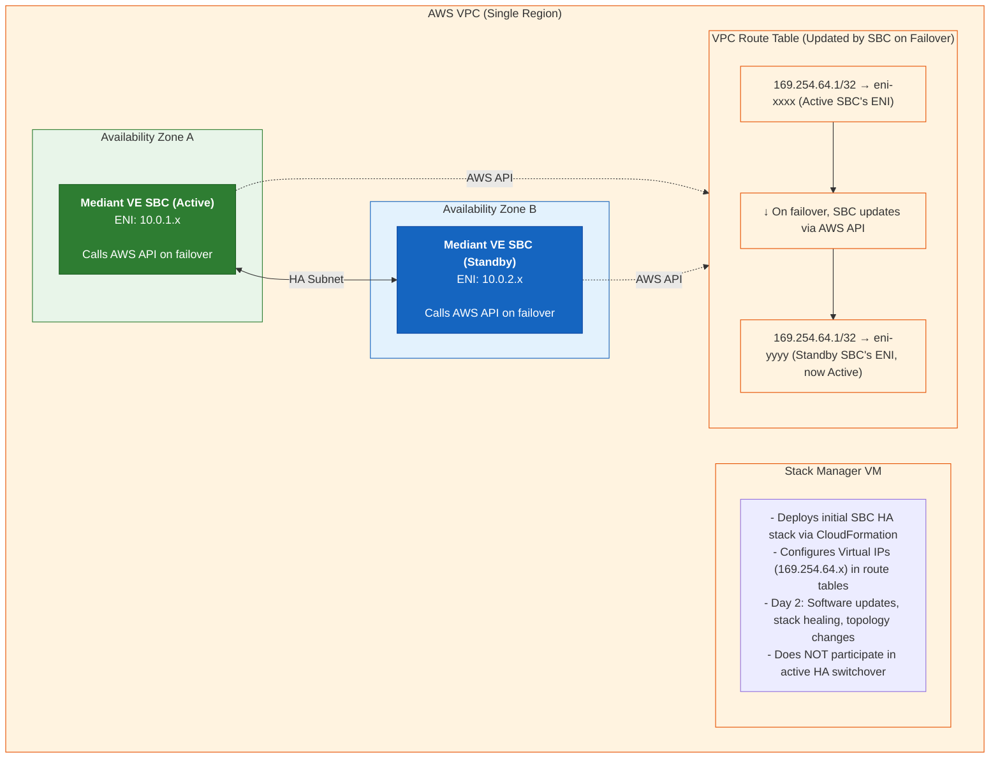
```mermaid
flowchart TB
    subgraph VPC["AWS VPC (Single Region)"]
        subgraph AZA["Availability Zone A"]
            SBC_Active["<b>Mediant VE SBC (Active)</b><br/>ENI: 10.0.1.x<br/><br/>Calls AWS API on failover"]
        end

        subgraph AZB["Availability Zone B"]
            SBC_Standby["<b>Mediant VE SBC (Standby)</b><br/>ENI: 10.0.2.x<br/><br/>Calls AWS API on failover"]
        end

        SBC_Active <-->|"HA Subnet"| SBC_Standby

        subgraph SM["Stack Manager VM"]
            SM_Details["- Deploys initial SBC HA stack via CloudFormation<br/>- Configures Virtual IPs (169.254.64.x) in route tables<br/>- Day 2: Software updates, stack healing, topology changes<br/>- Does NOT participate in active HA switchover"]
        end

        subgraph RT["VPC Route Table (Updated by SBC on Failover)"]
            RT_Before["169.254.64.1/32 → eni-xxxx (Active SBC's ENI)"]
            RT_Arrow["↓ On failover, SBC updates via AWS API"]
            RT_After["169.254.64.1/32 → eni-yyyy (Standby SBC's ENI, now Active)"]
            RT_Before --> RT_Arrow --> RT_After
        end

        SBC_Active -.->|"AWS API"| RT
        SBC_Standby -.->|"AWS API"| RT
    end

    style SBC_Active fill:#2e7d32,stroke:#1b5e20,color:#ffffff
    style SBC_Standby fill:#1565c0,stroke:#0d47a1,color:#ffffff
    style AZA fill:#e8f5e9,stroke:#2e7d32
    style AZB fill:#e3f2fd,stroke:#1565c0
    style VPC fill:#fff3e0,stroke:#e65100
    style SM fill:#fff3e0,stroke:#e65100
    style RT fill:#fff3e0,stroke:#e65100
    style RT_Before fill:#fff3e0,stroke:#e65100
    style RT_Arrow fill:#fff3e0,stroke:#e65100
    style RT_After fill:#fff3e0,stroke:#e65100
```

### HA Scope Clarification

**Important:** This deployment uses HA **within a single VPC across two Availability Zones only**. We are NOT implementing:
- Cross-VPC HA
- Cross-region HA for SBCs
- AWS Transit Gateway for Virtual IP routing between VPCs

The Virtual IP addresses are used for failover routing **within the same VPC**, where the route table is updated to point traffic to the newly active SBC's ENI.

### API Access Requirements

#### Stack Manager API Access
The Stack Manager requires **internet access** (via Internet Gateway or NAT Gateway) to communicate with AWS APIs for initial deployment and Day 2 operations:
- EC2 API
- CloudFormation API
- IAM API
- Elastic Load Balancing API (if using NLB)

#### SBC API Access (Critical for HA Failover)
The SBCs require **internet access from the HA subnet** to communicate with AWS APIs during failover. The SBCs themselves call AWS APIs to update route tables and move Virtual IPs during switchover:
- EC2 API (route table manipulation, ENI management)

**Important:** The HA subnet must have a route to AWS API endpoints, either via:
- NAT Gateway (recommended for private subnets)
- VPC Endpoints for EC2 (PrivateLink)
- Internet Gateway (if using public IPs on HA interfaces - not recommended)

---

## 3. Architecture Overview

### Non-Production Environment (Australia Region Only)

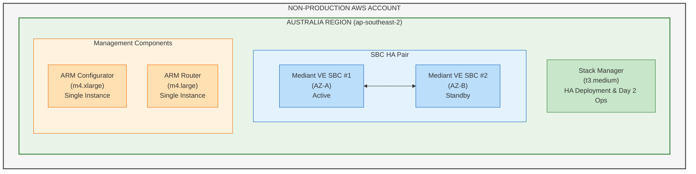
```mermaid
flowchart TB
    subgraph NONPROD["NON-PRODUCTION AWS ACCOUNT"]
        subgraph AUS_NP["AUSTRALIA REGION (ap-southeast-2)"]
            subgraph HA_NP["SBC HA Pair"]
                SBC1_NP["Mediant VE SBC #1<br/>(AZ-A)<br/>Active"]
                SBC2_NP["Mediant VE SBC #2<br/>(AZ-B)<br/>Standby"]
                SBC1_NP <--> SBC2_NP
            end
            SM_NP["Stack Manager<br/>(t3.medium)<br/>HA Deployment & Day 2 Ops"]
            subgraph MGMT_NP["Management Components"]
                ARM_CFG_NP["ARM Configurator<br/>(m4.xlarge)<br/>Single Instance"]
                ARM_RTR_NP["ARM Router<br/>(m4.large)<br/>Single Instance"]
            end
        end
    end

    style NONPROD fill:#f5f5f5,stroke:#333,stroke-width:2px
    style AUS_NP fill:#e8f4e8,stroke:#2e7d32,stroke-width:2px
    style HA_NP fill:#e3f2fd,stroke:#1565c0,stroke-width:1px
    style MGMT_NP fill:#fff3e0,stroke:#ef6c00,stroke-width:1px
    style SBC1_NP fill:#bbdefb,stroke:#1565c0
    style SBC2_NP fill:#bbdefb,stroke:#1565c0
    style SM_NP fill:#c8e6c9,stroke:#2e7d32
    style ARM_CFG_NP fill:#ffe0b2,stroke:#ef6c00
    style ARM_RTR_NP fill:#ffe0b2,stroke:#ef6c00
```

**Total VMs: 5**
- 2x SBC (HA pair)
- 1x Stack Manager
- 1x ARM Configurator
- 1x ARM Router

### Production Environment

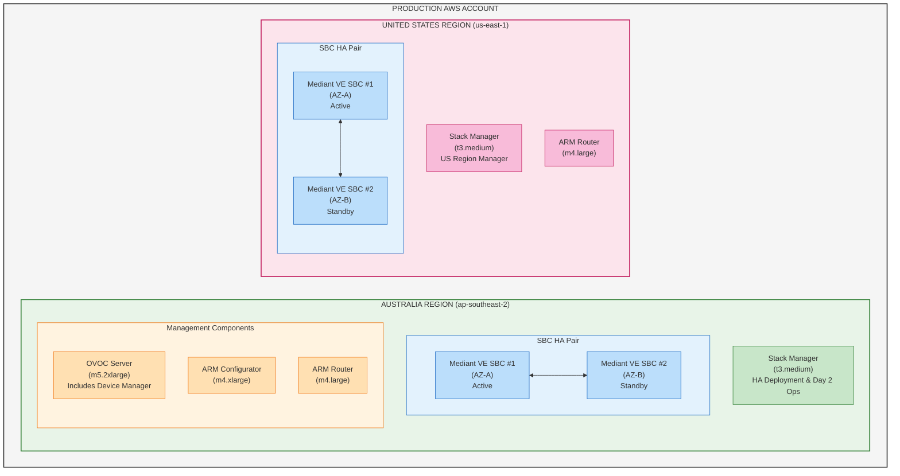
```mermaid
flowchart TB
    subgraph PROD["PRODUCTION AWS ACCOUNT"]
        subgraph AUS_P["AUSTRALIA REGION (ap-southeast-2)"]
            subgraph HA_AUS["SBC HA Pair"]
                SBC1_AUS["Mediant VE SBC #1<br/>(AZ-A)<br/>Active"]
                SBC2_AUS["Mediant VE SBC #2<br/>(AZ-B)<br/>Standby"]
                SBC1_AUS <--> SBC2_AUS
            end
            SM_AUS["Stack Manager<br/>(t3.medium)<br/>HA Deployment & Day 2 Ops"]
            subgraph MGMT_AUS["Management Components"]
                OVOC["OVOC Server<br/>(m5.2xlarge)<br/>Includes Device Manager"]
                ARM_CFG_AUS["ARM Configurator<br/>(m4.xlarge)"]
                ARM_RTR_AUS["ARM Router<br/>(m4.large)"]
            end
        end
        subgraph US_P["UNITED STATES REGION (us-east-1)"]
            subgraph HA_US["SBC HA Pair"]
                SBC1_US["Mediant VE SBC #1<br/>(AZ-A)<br/>Active"]
                SBC2_US["Mediant VE SBC #2<br/>(AZ-B)<br/>Standby"]
                SBC1_US <--> SBC2_US
            end
            SM_US["Stack Manager<br/>(t3.medium)<br/>US Region Manager"]
            ARM_RTR_US["ARM Router<br/>(m4.large)"]
        end
    end

    style PROD fill:#f5f5f5,stroke:#333,stroke-width:2px
    style AUS_P fill:#e8f4e8,stroke:#2e7d32,stroke-width:2px
    style US_P fill:#fce4ec,stroke:#c2185b,stroke-width:2px
    style HA_AUS fill:#e3f2fd,stroke:#1565c0,stroke-width:1px
    style HA_US fill:#e3f2fd,stroke:#1565c0,stroke-width:1px
    style MGMT_AUS fill:#fff3e0,stroke:#ef6c00,stroke-width:1px
    style SBC1_AUS fill:#bbdefb,stroke:#1565c0
    style SBC2_AUS fill:#bbdefb,stroke:#1565c0
    style SBC1_US fill:#bbdefb,stroke:#1565c0
    style SBC2_US fill:#bbdefb,stroke:#1565c0
    style SM_AUS fill:#c8e6c9,stroke:#2e7d32
    style SM_US fill:#f8bbd9,stroke:#c2185b
    style OVOC fill:#ffe0b2,stroke:#ef6c00
    style ARM_CFG_AUS fill:#ffe0b2,stroke:#ef6c00
    style ARM_RTR_AUS fill:#ffe0b2,stroke:#ef6c00
    style ARM_RTR_US fill:#f8bbd9,stroke:#c2185b
```

**Total AUS VMs: 6**
- 2x SBC (HA pair)
- 1x Stack Manager
- 1x OVOC (includes Device Manager)
- 1x ARM Configurator
- 1x ARM Router

**Total US VMs: 4**
- 2x SBC (HA pair)
- 1x Stack Manager
- 1x ARM Router

**PRODUCTION TOTAL: 10 VMs**
---

## 4. Component Specifications

### Mediant Virtual Edition (VE) SBC

| Specification | Details |
|--------------|---------|
| **Purpose** | Session Border Controller for SIP trunking, security, media handling |
| **HA Mode** | 1+1 Active/Standby across Availability Zones (within single VPC) |
| **Minimum Version for Cross-AZ HA** | Version 7.4.500 |
| **Deployment Method** | Via Stack Manager (required for multi-AZ HA) |

#### Recommended EC2 Instance Types

| Use Case | Instance Type | vCPUs | Memory | Notes |
|----------|--------------|-------|--------|-------|
| Without Transcoding | m5.large | 2 | 8 GiB | Basic SIP proxy |
| Without Transcoding (Higher capacity) | r4.large | 2 | 15.25 GiB | Memory optimized (r4 is previous-generation; consider r5 or r6i for better price-performance) |
| With Transcoding | c5.2xlarge | 8 | 16 GiB | Compute optimized for DSP |
| With Transcoding (High capacity) | c5.9xlarge | 36 | 72 GiB | High session count with transcoding |

#### Network Interfaces Required (per SBC)

| Interface | Purpose | Subnet Type |
|-----------|---------|-------------|
| eth0 | Management (OVOC, ARM, SSH, HTTPS) | Management Subnet |
| eth1 | LAN/Internal (Downstream SBCs, PBX, SIP Providers) | Internal Subnet |
| eth2 | WAN/External (Microsoft Teams Direct Routing, Public SIP) | DMZ/External Subnet |
| eth3 | HA Communication + AWS API Access | HA Subnet (dedicated) |

#### SBC IAM Role Requirements

The SBCs require an IAM role to call AWS APIs during HA failover. The SBC directly manipulates route tables to redirect traffic during switchover.

```json
{
    "Version": "2012-10-17",
    "Statement": [
        {
            "Effect": "Allow",
            "Action": [
                "ec2:DescribeRouteTables",
                "ec2:CreateRoute",
                "ec2:ReplaceRoute",
                "ec2:DeleteRoute",
                "ec2:DescribeNetworkInterfaces",
                "ec2:DescribeInstances"
            ],
            "Resource": "*"
        }
    ]
}
```

**Note:** The HA subnet must have connectivity to AWS API endpoints (via NAT Gateway or VPC Endpoint) for failover to function correctly.

### Stack Manager Specifications

| Specification | Details |
|--------------|---------|
| **Purpose** | HA cluster deployment, lifecycle management, Day 2 operations |
| **EC2 Instance Type** | t3.medium |
| **Storage** | 8 GiB gp3 (default) |
| **Deployment** | One per region where SBC HA is deployed |
| **Lifecycle** | Retained ongoing for Day 2 operations (low cost) |

#### Critical Requirements

- **Must reside in the same VPC** as the SBC instances it manages
- **Requires internet access** (via IGW or NAT Gateway) for AWS API calls
- **IAM Role** with EC2, CloudFormation, IAM, and optionally ELB permissions

#### Operational Notes

- **Does not participate in HA failover** - SBCs handle switchover directly via AWS APIs
- **Can be decommissioned** after initial deployment if Day 2 operations are not required
- **Recommended to retain** - low cost (t3.medium) and useful for software updates, stack healing, and configuration changes
- See [Cyber Security Variation](#cyber-security-variation-stack-manager-component) section for security details

### AudioCodes Routing Manager (ARM) Specifications

| Component | Instance Type | vCPUs | Memory | Quantity |
|-----------|--------------|-------|--------|----------|
| **Configurator** | m4.xlarge | 4 | 16 GiB | 1 (single instance) |
| **Router** | m4.large | 2 | 8 GiB | 1+ per region |

> **Note:** m4 is a previous-generation instance family. If AudioCodes AMI compatibility permits, consider m5 or m6i equivalents for better price-performance.

#### Deployment Requirements

- **All ARM VMs must be in the same VPC and subnet**
- Configurator: Single instance only (centralized in AUS)
- Router: Deploy one per region for local routing decisions

### AudioCodes One Voice Operations Center (OVOC) Specifications

| Profile | Instance Type | vCPUs | Memory | Storage |
|---------|--------------|-------|--------|---------|
| **Low Profile** | m5.2xlarge | 8 | 32 GiB | 500 GB GP3 SSD |
| **High Profile** | m5.4xlarge | 16 | 64 GiB | 2 TB GP3 SSD |

#### Includes

- Device Manager functionality (manages IP phones and SBCs)
- Quality of Experience monitoring
- Network topology management
- **Microsoft Teams Call Quality Dashboard integration**

### Compute Requirements Summary (from Design Document)

| Application | Resource | Instance Type | Memory | Recommended Disk Space | Processors |
|---|---|---|---|---|---|
| **VM for Mediant VE Proxy SBC (HA Pair)** | AWS | m5n.large | 8 GiB | 20 GB | 2 vCPU |
| **VM for Stack Manager** | AWS | t3.medium | 4 GiB | 10 GB | 2 vCPU |
| **OVOC** | AWS | m5.4xlarge | 64 GiB | AWS EBS: GP3 SSD 2 TB | 16 vCPUs |
| **ARM Configurator** | AWS | m4.xlarge | 16 GiB | 100 GB | 4 vCPUs |
| **ARM Router** | AWS | m4.large | 8 GiB | 80 GB | 2 vCPUs |

> **Notes:**
>
> - The Mediant VE Proxy SBC instance type (m5n.large) is selected for its enhanced networking performance, which is critical for real-time voice media processing.
> - The Stack Manager (t3.medium) is a lightweight management component but is mandatory for initial HA deployment and Day 2 operations.
> - OVOC (One Voice Operations Center) requires substantial resources due to its role in centralised monitoring, analytics, and quality-of-experience reporting across all SBC instances.
> - ARM (AudioCodes Routing Manager) consists of two components: the Configurator (management and policy engine) and the Router (real-time call routing decisions). Both must be deployed for full ARM functionality.
> - All AWS instances should be deployed with appropriate EBS volume types and IOPS provisioning based on workload requirements. GP3 SSD is recommended as the baseline storage tier.

---

## 5. AWS Infrastructure Requirements

### VPC Configuration

#### Per Region Requirements

| Resource | Requirement | Notes |
|----------|-------------|-------|
| VPC | 1 per region | Dedicated or shared |
| Subnets | Minimum 2 per AZ (Main + HA) | Plus optional additional subnets |
| Internet Gateway or NAT Gateway | Required | For Stack Manager API access |
| Route Tables | One per subnet minimum | Stack Manager will modify these |

### Subnet Design

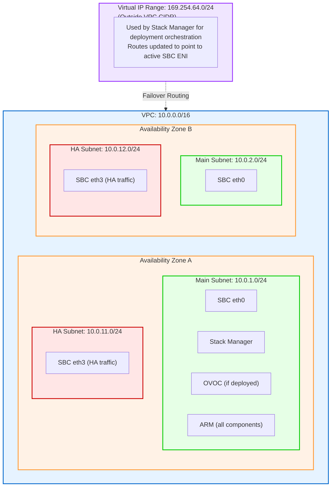
```mermaid
flowchart TB
    subgraph VIP["Virtual IP Range: 169.254.64.0/24<br/>(Outside VPC CIDR)"]
        direction LR
        VIP_DESC["Used by Stack Manager for deployment orchestration<br/>Routes updated to point to active SBC ENI"]
    end

    subgraph VPC["VPC: 10.0.0.0/16"]
        direction LR
        subgraph AZA["Availability Zone A"]
            subgraph MainA["Main Subnet: 10.0.1.0/24"]
                SBC_A["SBC eth0"]
                SM["Stack Manager"]
                OVOC["OVOC (if deployed)"]
                ARM["ARM (all components)"]
            end
            subgraph HAA["HA Subnet: 10.0.11.0/24"]
                SBC_HA_A["SBC eth3 (HA traffic)"]
            end
        end
        subgraph AZB["Availability Zone B"]
            subgraph MainB["Main Subnet: 10.0.2.0/24"]
                SBC_B["SBC eth0"]
            end
            subgraph HAB["HA Subnet: 10.0.12.0/24"]
                SBC_HA_B["SBC eth3 (HA traffic)"]
            end
        end
    end

    VIP -.->|"Failover Routing"| VPC

    style VPC fill:#e6f3ff,stroke:#0066cc,stroke-width:2px
    style AZA fill:#fff2e6,stroke:#ff9933,stroke-width:2px
    style AZB fill:#fff2e6,stroke:#ff9933,stroke-width:2px
    style MainA fill:#e6ffe6,stroke:#00cc00,stroke-width:2px
    style MainB fill:#e6ffe6,stroke:#00cc00,stroke-width:2px
    style HAA fill:#ffe6e6,stroke:#cc0000,stroke-width:2px
    style HAB fill:#ffe6e6,stroke:#cc0000,stroke-width:2px
    style VIP fill:#f0e6ff,stroke:#9933ff,stroke-width:2px
```

### Security Groups

#### Stack Manager Security Group

| Direction | Protocol | Port | Source/Destination | Purpose |
|-----------|----------|------|-------------------|---------|
| Inbound | TCP | 22 | Admin CIDR | SSH Management |
| Inbound | TCP | 443 | Admin CIDR | HTTPS Management |
| Outbound | TCP | 443 | 0.0.0.0/0 | AWS API Access |
| Outbound | All | All | VPC CIDR | SBC Communication |

#### SBC Security Group

| Direction | Protocol | Port | Source/Destination | Purpose |
|-----------|----------|------|-------------------|---------|
| Inbound | TCP | 22 | Admin CIDR | SSH |
| Inbound | TCP | 80/443 | Admin CIDR | Web Management |
| Inbound | TCP/UDP | 5060/5061 | SIP Endpoints | SIP Signalling |
| Inbound | UDP | 6000-65535 | Media Sources | RTP Media |
| Inbound | All | All | HA Subnet CIDR | HA Communication |
| Outbound | All | All | 0.0.0.0/0 | All traffic |

#### ARM Security Group

| Direction | Protocol | Port | Source/Destination | Purpose |
|-----------|----------|------|-------------------|---------|
| Inbound | TCP | 22 | Admin CIDR | SSH |
| Inbound | TCP | 80/443 | Enterprise CIDR | HTTP/HTTPS |
| Inbound | All | All | VPC CIDR | Internal communication |
| Outbound | All | All | 0.0.0.0/0 | All traffic |

#### OVOC Security Group

| Direction | Protocol | Port | Source/Destination | Purpose |
|-----------|----------|------|-------------------|---------|
| Inbound | TCP | 22 | Admin CIDR | SSH |
| Inbound | TCP | 443 | Admin CIDR | HTTPS Web UI |
| Inbound | UDP | 162 | SBC CIDR | SNMP Traps |
| Inbound | UDP | 1161 | SBC CIDR | Keep-alive (NAT traversal) |
| Inbound | TCP | 5001 | SBC CIDR | QoE Reporting |
| Outbound | TCP | 443 | 0.0.0.0/0 | Microsoft Graph API |
| Outbound | All | All | VPC CIDR | Internal traffic |

---

## 6. Microsoft Entra ID Integration

### Overview

All AudioCodes components require integration with Microsoft Entra ID (formerly Azure AD) for:
- User authentication (OAuth 2.0)
- Microsoft Teams Direct Routing
- Call quality data retrieval
- User directory information

### Required App Registrations Summary

| App Registration | Used By | Purpose |
|-----------------|---------|---------|
| AudioCodes-OVOC-Teams-Integration | OVOC | Teams QoE data, user information |
| AudioCodes-ARM-WebUI | ARM | Web UI authentication |
| AudioCodes-ARM-REST-API | ARM | REST API authentication |
| AudioCodes-SBC-DirectRouting | SBC | Teams Direct Routing SBA (if applicable) |
| AudioCodes-SBC-Management | Proxy SBC | Web UI OAuth authentication (see [Section 10.4](#104-sbc-management-authentication)) |

---

### App Registration 1: OVOC Teams Integration

**Purpose:** Enables OVOC to retrieve Microsoft Teams call quality data and user information via Microsoft Graph API.

#### Registration Steps

1. Navigate to **Azure Portal** > **Microsoft Entra ID** > **App registrations** > **New registration**
2. Configure:
   - **Name:** `AudioCodes-OVOC-Teams-Integration`
   - **Supported account types:** Accounts in this organizational directory only (Single tenant)
   - **Redirect URI:** Leave blank (not required for application permissions)
3. Click **Register**

#### Credentials to Capture

| Credential | Location | Usage |
|------------|----------|-------|
| Application (Client) ID | Overview blade | OVOC configuration |
| Directory (Tenant) ID | Overview blade | OVOC configuration |
| Client Secret | Certificates & secrets blade | OVOC configuration |

#### Client Secret Creation

1. Navigate to **Certificates & secrets** > **Client secrets** > **New client secret**
2. Description: `OVOC-Teams-QoE-Integration`
3. Expiry: Select appropriate expiry (recommend 24 months with calendar reminder)
4. **IMPORTANT:** Copy the secret value immediately - it cannot be retrieved later

#### API Permissions Required

| API | Permission | Type | Purpose |
|-----|------------|------|---------|
| Microsoft Graph | `CallRecords.Read.All` | Application | Read all call records (CDR/QoE) |
| Microsoft Graph | `User.Read.All` | Application | Read user profiles |

#### Grant Admin Consent

1. Navigate to **API permissions**
2. Click **Grant admin consent for [Tenant Name]**
3. Verify both permissions show green checkmarks under "Status"

#### OVOC Configuration

Configure in OVOC under **System** > **Administration** > **External Servers** > **Microsoft 365**:

| Field | Value |
|-------|-------|
| Tenant ID | `<Directory (Tenant) ID>` |
| Client ID | `<Application (Client) ID>` |
| Client Secret | `<Secret Value>` |

---

### App Registration 2: ARM Web UI Authentication

**Purpose:** Enables OAuth 2.0 authentication for ARM web interface users.

#### Registration Steps

1. Navigate to **Azure Portal** > **Microsoft Entra ID** > **App registrations** > **New registration**
2. Configure:
   - **Name:** `AudioCodes-ARM-WebUI`
   - **Supported account types:** Accounts in this organizational directory only
   - **Redirect URI:** `https://<ARM-FQDN>/ARM/armui/login`
3. Click **Register**

#### Authentication Configuration

1. Navigate to **Authentication**
2. Under **Implicit grant and hybrid flows**, enable:
   - [x] Access tokens
   - [x] ID tokens

#### API Permissions Required

| API | Permission | Type | Purpose |
|-----|------------|------|---------|
| Microsoft Graph | `User.Read` | Delegated | Sign in and read user profile |
| Microsoft Graph | `User.Read.All` | Application | Read all users' full profiles |
| Microsoft Graph | `Group.Read.All` | Application | Read all groups |
| Microsoft Graph | `Application.Read.All` | Application | Read all applications |

#### Create App Roles

Navigate to **App roles** > **Create app role** for each role:

| Display Name | Value | Description |
|--------------|-------|-------------|
| Security Administrator | `SecurityAdmin` | Full administrative access |
| Administrator | `Admin` | Standard administrative access |
| Monitor | `Monitor` | Read-only monitoring access |

#### Enterprise Application Assignment

1. Navigate to **Enterprise applications** > **AudioCodes-ARM-WebUI**
2. Under **Users and groups**, assign users/groups to appropriate roles

---

### App Registration 3: ARM REST API Authentication

**Purpose:** Enables service-to-service authentication for ARM REST API calls.

#### Registration Steps

1. Navigate to **Azure Portal** > **Microsoft Entra ID** > **App registrations** > **New registration**
2. Configure:
   - **Name:** `AudioCodes-ARM-REST-API`
   - **Supported account types:** Accounts in this organizational directory only
   - **Redirect URI:** Leave blank
3. Click **Register**

#### API Permissions Required

| API | Permission | Type | Purpose |
|-----|------------|------|---------|
| AudioCodes-ARM-WebUI | `user_impersonation` | Delegated | Access ARM API |

#### Client Credentials

Create a client secret as described above for API authentication.

#### Token Endpoint

```
POST https://login.microsoftonline.com/{TenantID}/oauth2/v2.0/token
Content-Type: application/x-www-form-urlencoded

grant_type=client_credentials
&client_id={ARM-REST-API-ClientID}
&client_secret={ARM-REST-API-Secret}
&scope=api://{ARM-WebUI-ClientID}/.default
```

---

### App Registration 4: SBC Teams Direct Routing (If Using SBA)

**Purpose:** Required if using Survivable Branch Appliance (SBA) functionality with Teams Direct Routing.

#### Registration Steps

1. Navigate to **Azure Portal** > **Microsoft Entra ID** > **App registrations** > **New registration**
2. Configure:
   - **Name:** `AudioCodes-SBC-DirectRouting`
   - **Supported account types:** Accounts in this organizational directory only
   - **Redirect URI:** `https://login.microsoftonline.com/common/oauth2/nativeclient`
3. Click **Register**

#### Authentication Configuration

1. Navigate to **Authentication**
2. Under **Implicit grant and hybrid flows**, enable:
   - [x] Access tokens
   - [x] ID tokens

#### API Permissions Required

| API | Permission | Type | Purpose |
|-----|------------|------|---------|
| Skype and Teams Tenant Admin API | `application_access_custom_sba_appliance` | Application | SBA appliance access |

**Note:** Admin consent is required for this permission.

---

## 7. Microsoft Graph API Permissions

### Complete Permissions Matrix

| Component | API | Permission | Type | Admin Consent | Purpose |
|-----------|-----|------------|------|---------------|---------|
| **OVOC** | Microsoft Graph | `CallRecords.Read.All` | Application | Required | Teams call quality data |
| **OVOC** | Microsoft Graph | `User.Read.All` | Application | Required | User profile information |
| **ARM** | Microsoft Graph | `User.Read` | Delegated | Not Required | User sign-in |
| **ARM** | Microsoft Graph | `User.Read.All` | Application | Required | Read all user profiles |
| **ARM** | Microsoft Graph | `Group.Read.All` | Application | Required | Group membership for RBAC |
| **ARM** | Microsoft Graph | `Application.Read.All` | Application | Required | App role retrieval |
| **SBC** | Skype and Teams Tenant Admin | `application_access_custom_sba_appliance` | Application | Required | SBA functionality |

### Graph API Endpoints Used

| Component | Endpoint | Purpose |
|-----------|----------|---------|
| OVOC | `https://graph.microsoft.com/v1.0/communications/callRecords` | Call records subscription |
| OVOC | `https://graph.microsoft.com/v1.0/users` | User information |
| ARM | `https://graph.microsoft.com/v1.0/me` | Current user profile |
| ARM | `https://graph.microsoft.com/v1.0/users` | User directory |
| ARM | `https://graph.microsoft.com/v1.0/groups` | Group membership |

### OVOC Teams Integration Requirements

#### Prerequisites

1. **OVOC Version:** 8.0 or later (8.0.114+ recommended)
2. **License:** Active "Analytics" license for Teams QoE monitoring
3. **Certificate:** OVOC must have a **valid public CA certificate** (not self-signed)
4. **Network:** Outbound HTTPS (443) to Microsoft Graph API endpoints
5. **FQDN:** Static public IP and properly configured FQDN (e.g., `ovoc.yourdomain.com`)

#### Data Retrieved from Microsoft

| Data Type | Graph API | Retention |
|-----------|-----------|-----------|
| Call Detail Records (CDR) | CallRecords API | Per OVOC retention policy |
| Call Quality Metrics (QoE) | CallRecords API | Per OVOC retention policy |
| User Display Names | Users API | Cached |
| User Principal Names | Users API | Cached |

---

## 8. Microsoft Teams Direct Routing Requirements

### Certificate Requirements

| Requirement | Details |
|-------------|---------|
| **Certificate Authority** | Must be signed by a CA in the [Microsoft Trusted Root Certificate Program](https://docs.microsoft.com/en-us/security/trusted-root/participants-list) |
| **Subject Name (CN) or SAN** | Must contain the SBC FQDN (e.g., `sbc.yourdomain.com`) |
| **Extended Key Usage** | Must include Client Authentication EKU (enforcement timeline evolving -- verify against latest Microsoft Message Center announcements) |
| **TLS Version** | TLS 1.2 minimum (TLS 1.3 recommended) |
| **Mutual TLS (mTLS)** | Required for SBC-to-Teams connectivity |

### Approved Certificate Authorities

- DigiCert
- GlobalSign
- Comodo/Sectigo
- Entrust
- GoDaddy

**Note:** Self-signed certificates are NOT supported.

### DNS Requirements

| Record Type | Name | Value | Purpose |
|------------|------|-------|---------|
| A | `sbc.yourdomain.com` | `<SBC Public IP>` | SBC endpoint resolution |

**Domain Registration:** The domain used for the SBC FQDN must be registered and verified in your Microsoft 365 tenant.

### Microsoft SIP Endpoints

The SBC connects outbound to these Microsoft endpoints (allow in firewall):

| FQDN | Port | Protocol | Purpose |
|------|------|----------|---------|
| `sip.pstnhub.microsoft.com` | 5061 | TLS | Primary SIP endpoint |
| `sip2.pstnhub.microsoft.com` | 5061 | TLS | Secondary SIP endpoint |
| `sip3.pstnhub.microsoft.com` | 5061 | TLS | Tertiary SIP endpoint |

### Microsoft 365 Admin Roles Required

| Role | Purpose |
|------|---------|
| **Global Administrator** | Grant admin consent for app registrations |
| **Teams Administrator** | Configure Direct Routing, voice policies |
| **Teams Communications Administrator** | Manage calling policies |

### PowerShell Configuration Requirements

#### Required Modules

```powershell
# Install MicrosoftTeams module
Install-Module -Name MicrosoftTeams -Force -AllowClobber

# Connect to Teams (interactive)
Connect-MicrosoftTeams

# Or connect with service principal (for automation)
Connect-MicrosoftTeams -TenantId "<TenantId>" -ApplicationId "<AppId>" -CertificateThumbprint "<Thumbprint>"
```

#### Key PowerShell Commands

```powershell
# Register SBC in Teams
New-CsOnlinePSTNGateway -Fqdn "sbc.yourdomain.com" -SipSignalingPort 5061 -Enabled $true

# View registered SBCs
Get-CsOnlinePSTNGateway

# Create voice routing policy
New-CsOnlineVoiceRoutingPolicy -Identity "AU-VoicePolicy" -OnlinePstnUsages @{Add="AU-Usage"}

# Enable user for Direct Routing
Set-CsPhoneNumberAssignment -Identity user@domain.com -PhoneNumber "+61XXXXXXXXX" -PhoneNumberType DirectRouting
```

---

## 9. SBC Provisioning

### 9.1 Proxy SBC Provisioning (AWS)

The Proxy SBC is deployed as an AudioCodes Mediant VE (Virtual Edition) SBC instance within AWS. Prior to provisioning, the following deployment prerequisites must be satisfied.

#### Deployment Prerequisites

| # | Prerequisite | Details | Notes |
|---|---|---|---|
| 1 | **Public Elastic IP and FQDN** | An Elastic IP (EIP) must be allocated and mapped to the SBC WAN interface. A publicly resolvable FQDN must be configured with a DNS A-record pointing to the EIP. | The FQDN is used by Microsoft Teams Direct Routing for SIP connectivity. The A-record must resolve to the EIP at all times, including after HA failover. |
| 2 | **Public TLS Certificate** | A TLS certificate issued by a trusted public Certificate Authority (CA) must be installed on the SBC. The certificate Common Name (CN) or Subject Alternative Name (SAN) must match the FQDN. | Microsoft Teams Direct Routing mandates a trusted CA-issued certificate. Self-signed certificates are not supported. The certificate must include the full chain (root and intermediate CAs). |
| 3 | **AWS Networking Readiness** | Security Groups must be configured to permit SIP signalling and RTP media traffic. An Internet Gateway (IGW) or NAT Gateway must be in place to allow outbound and inbound connectivity as required. | Signalling ports (TCP/TLS 5061) and media ports (UDP 6000-49999, as defined by the configured media realm ranges in Section 14.3) must be explicitly allowed. Security Group rules must accommodate both Microsoft Teams media relay ranges and on-premises connectivity. |
| 4 | **NTP Server** | A reachable NTP source must be configured and accessible from the SBC. | NTP synchronisation is required for SBC operational stability, accurate logging, certificate validation, and call detail record timestamps. AWS provides an internal NTP service at 169.254.169.123, or an external NTP server may be used. |
| 5 | **HA Pair Setup** | The Active SBC instance must be deployed in Availability Zone A (AZ-A) and the Standby SBC instance in Availability Zone B (AZ-B). | This determines the failover sequence. The Active instance processes all signalling and media traffic under normal operation. The Standby instance assumes the Active role upon detection of a failure condition. |
| 6 | **VIP and Subnet IPs** | A shared LAN Virtual IP (VIP) must be allocated alongside individual IP addresses for each instance across the HA, Management, Internal (LAN), and External (WAN) subnets. | The VIP is reused post-failover to maintain seamless connectivity for internal-facing services. During failover, the Elastic IP shifts from the Active to the Standby instance to maintain external reachability. |
| 7 | **Finalized Certified AudioCodes VE SBC Model** | The deployed SBC must be a certified AudioCodes Mediant VE SBC model that is compatible with both AWS and Microsoft Teams Direct Routing. The minimum required software version is **7.4.500**. | Refer to the AudioCodes and Microsoft compatibility matrices to confirm the selected model and firmware version are certified for Teams Direct Routing. Running a version below 7.4.500 is not supported for this deployment. |

### 9.2 Downstream SBC Provisioning (Physical)

The Downstream SBC is a physical **AudioCodes Mediant 800C** SBC appliance deployed at remote branch sites. The Mediant 800C is a modular branch appliance designed for enterprise edge deployments, providing the following capabilities:

- **PSTN Interfaces:** Optional dual or single E1/T1 PRI interface modules for legacy PSTN trunk connectivity.
- **Analogue Interfaces:** Optional FXS (Foreign Exchange Station) and FXO (Foreign Exchange Office) analogue modules for connecting analogue endpoints (telephones, fax machines) and analogue PSTN lines.
- **Network Interfaces:** Redundant Gigabit Ethernet (GE) network interfaces for LAN and WAN connectivity, supporting link-level resilience.
- **Power Supply:** Dual AC power supplies for hardware-level power redundancy.

The Mediant 800C supports full SBC and VoIP gateway functionality, enabling:

- **SIP-to-PSTN Interworking:** The appliance acts as a media gateway, converting SIP-based VoIP calls to TDM-based PSTN calls (and vice versa) over the connected E1/T1 PRI or analogue interfaces.
- **Secure Connection to Central Proxy SBC:** The Downstream SBC establishes a secure SIP trunk (TLS/SRTP) back to the centralised Proxy SBC in AWS, ensuring that all branch-originated calls are routed through the controlled, policy-enforced core infrastructure.

### 9.3 High Availability Configuration

#### 9.3.1 Proxy SBC HA Provisioning

The Proxy SBC is deployed in a **Multi-AZ High Availability (HA)** configuration within a single AWS VPC. The design principles and requirements are as follows:

- **Multi-AZ HA Deployment:** Two SBC instances are deployed in an Active/Standby configuration across two different Availability Zones within the same AWS Region. This provides resilience against single-AZ failures.
- **Subnet Connectivity:** Each SBC instance connects to four distinct subnets:
  - **HA Subnet** -- Used for heartbeat communication between the Active and Standby instances.
  - **Management Subnet** -- Used for SBC administration (SSH, HTTPS, SNMP, QoE) and internal SIP connectivity.
  - **Internal (LAN) Subnet** -- Used for private/internal-facing SIP signalling and media traffic (e.g., towards on-premises infrastructure via AWS Direct Connect or Transit Gateway).
  - **External (WAN) Subnet** -- Used for public-facing SIP signalling and media traffic (e.g., towards Microsoft Teams Direct Routing).
- **Unique IP Addresses:** Every SBC instance uses unique IP addresses for each of its network interfaces. No IP address is shared between the Active and Standby instances at the interface level.
- **Elastic IP Handling:** Elastic IPs are assigned to the Active instance's WAN interface. During a failover event, the Elastic IP is automatically moved to the Standby instance, which then assumes the Active role. This ensures that the public-facing FQDN continues to resolve to the correct instance without DNS changes.
- **Virtual IP (VIP) Handling:** Virtual IPs are allocated from the **169.254.64.0/24** range, which must fall outside the VPC CIDR block. These VIPs are used for private VPC connectivity (LAN-side). During a switchover, the VPC routing table entries are updated to point to the newly Active instance, ensuring continued reachability of the VIP.
- **AWS EC2 API Interaction:** The Active instance handles Elastic IP and Virtual IP reassignment by interacting with AWS EC2 APIs over the HA subnet. Appropriate IAM roles and permissions must be configured to allow these API calls.
- **Stack Manager (MANDATORY):** The AudioCodes Stack Manager is a mandatory component. It deploys SBC stacks via AWS CloudFormation and handles initial HA deployment, topology updates, and Day 2 operations (software upgrades, stack maintenance). During failover, the SBCs themselves update VPC route tables by calling AWS EC2 APIs directly to redirect traffic to the newly Active instance. The Stack Manager must be deployed and operational before the SBC HA pair is provisioned.
- **HA Scope:** HA is supported within a **single VPC** across **two Availability Zones only**. Cross-VPC HA and cross-Region HA are **not supported**.

##### Subnet Requirements

| Subnet | Purpose |
|---|---|
| **HA Subnet** (one per AZ) | Dedicated subnet for HA heartbeat and synchronisation traffic between the Active and Standby SBC instances. Each AZ has its own HA subnet. |
| **Main Subnet** (Management) | Used for SBC administration access (SSH, HTTPS, SNMP, QoE) and internal SIP connectivity. |
| **Virtual IP Subnet** | The Virtual IP must be allocated from a subnet that does not overlap with any existing subnets in the VPC or connected networks. The VIP subnet must be routable within the AWS VPC. |

##### Connectivity

- **AWS Direct Connect** is assumed as the primary connectivity method between on-premises infrastructure and the AWS environment.
- **AWS Transit Gateway** is used for on-premises-to-AWS connectivity and inter-VPC connectivity, providing a centralised routing hub.

##### AWS Regions

| Region Code | Location |
|---|---|
| **ap-southeast-2** | Australia (Sydney) |
| **us-east-1** | United States (N. Virginia) |

##### Active/Standby Parameter Comparison

The following table summarises the parameter assignments for the Active and Standby SBC instances:

| Parameter | Active SBC | Standby SBC |
|---|---|---|
| **Availability Zone** | e.g. ap-southeast-2a | e.g. ap-southeast-2b |
| **Instance Role** | Active | Standby |
| **Elastic IP (WAN)** | Associated | Moves here on failover |
| **Virtual IP (LAN)** | -- | Same VIP (used after failover) |
| **HA Subnet IP** | X.X.X.X | X.X.X.X |
| **Mgmt Subnet IP** | X.X.X.X | X.X.X.X |
| **Internal Subnet IP** | X.X.X.X | X.X.X.X |
| **External Subnet IP** | X.X.X.X | X.X.X.X |

> **Note:** The "X.X.X.X" placeholders must be replaced with the actual IP addresses allocated during the provisioning phase. Each instance must have unique IP addresses for all subnets. The Elastic IP and Virtual IP are shared resources that move between instances during failover.

#### 9.3.2 Proxy SBC HA Configuration

The following HA parameters must be configured on each Proxy SBC instance to enable Active/Standby operation:

| Parameter | Value | Description |
|---|---|---|
| **revertive-mode** (Pre-empt mode) | Off | When the preferred Active instance recovers from a failure, it will **not** automatically resume the Active role. Instead, the recovered instance remains in Standby until a manual switchover or subsequent failure event. This prevents unnecessary service disruption caused by repeated role changes. |
| **priority** | 10 | Determines the priority for assuming the Active role. A lower numeric value indicates a higher priority. The instance with the lowest priority value will be preferred as the Active instance during initial startup or contention scenarios. |
| **remote-address** | \<IP Address\> | The heartbeat/management IP address of the remote (peer) SBC instance used for HA synchronisation and health monitoring. This must be the HA subnet IP of the peer SBC. |
| **redundant-unit-id-name** | \<Name\> | The logical identifier of the remote (peer) SBC unit. Used to identify the partner SBC in the HA pair for configuration synchronisation and failover coordination. |
| **unit-id-name** | \<Name\> | The logical name of the local SBC unit. Used to uniquely identify this SBC instance within the HA pair. |

#### 9.3.3 Downstream SBC HA Provisioning

The Downstream SBC (AudioCodes Mediant 800C) supports High Availability through the deployment of two physical devices at each branch site. The HA provisioning model operates as follows:

- **Maintenance Interface:** The two Mediant 800C devices are connected to each other via a dedicated **Maintenance interface**. This interface is used exclusively for HA heartbeat communication, configuration synchronisation, and software version alignment between the two units.
- **Unique Maintenance IP:** Each device is assigned a unique IP address on the Maintenance interface to enable peer-to-peer HA communication.
- **HA Stand-alone Mode:** When only one device is powered on and operational, it operates in **HA Stand-alone** mode. In this state, the single device handles all signalling, media, and gateway functions independently.
- **HA Redundant State:** When the second device is connected and powered on, it enters the **HA Redundant** state. Upon entering this state, it automatically synchronises its configuration and software version with the Active device to ensure consistency.
- **Interface Behaviour:**
  - **Active Device:** All network interfaces (LAN, WAN, PSTN) are enabled and processing traffic.
  - **Redundant Device:** Only the Maintenance interface is active. All other interfaces remain in a disabled state to prevent traffic duplication or conflicts.
- **Failover Behaviour:** Upon detection of a failure on the Active device (e.g., hardware fault, software crash, interface failure), the Redundant device transitions to the Active state. All interfaces on the formerly Redundant device are enabled, and it assumes full responsibility for call processing and gateway functions.

#### 9.3.4 Downstream SBC HA Configuration

The HA configuration parameters for the Downstream SBC (Mediant 800C) are identical to those defined for the Proxy SBC. The same parameter set applies:

| Parameter | Value | Description |
|---|---|---|
| **revertive-mode** (Pre-empt mode) | Off | When the preferred Active instance recovers from a failure, it will **not** automatically resume the Active role. Instead, the recovered instance remains in Standby until a manual switchover or subsequent failure event. This prevents unnecessary service disruption caused by repeated role changes. |
| **priority** | 10 | Determines the priority for assuming the Active role. A lower numeric value indicates a higher priority. The instance with the lowest priority value will be preferred as the Active instance during initial startup or contention scenarios. |
| **remote-address** | \<IP Address\> | The heartbeat/management IP address of the remote (peer) SBC instance used for HA synchronisation and health monitoring. This must be the Maintenance interface IP of the peer device. |
| **redundant-unit-id-name** | \<Name\> | The logical identifier of the remote (peer) SBC unit. Used to identify the partner device in the HA pair for configuration synchronisation and failover coordination. |
| **unit-id-name** | \<Name\> | The logical name of the local SBC unit. Used to uniquely identify this device within the HA pair. |

> **Note:** While the parameter names and values are consistent between the Proxy and Downstream SBC HA configurations, the underlying transport differs. The Proxy SBC uses the HA subnet in AWS for heartbeat communication, whereas the Downstream SBC uses the dedicated physical Maintenance interface.

### 9.4 Compute Requirements

The following table details the compute resource requirements for all components in the AudioCodes SBC deployment:

| Application | Resource | Instance Type | Memory | Recommended Disk Space | Processors |
|---|---|---|---|---|---|
| **VM for Mediant VE Proxy SBC (HA Pair)** | AWS | m5n.large | 8 GiB | 20 GB | 2 vCPU |
| **VM for Stack Manager** | AWS | t3.medium | 4 GiB | 10 GB | 2 vCPU |
| **OVOC** | AWS | m5.4xlarge | 64 GiB | AWS EBS: GP3 SSD 2 TB | 16 vCPUs |
| **ARM Configurator** | AWS | m4.xlarge | 16 GiB | 100 GB | 4 vCPUs |
| **ARM Router** | AWS | m4.large | 8 GiB | 80 GB | 2 vCPUs |

> **Notes:**
>
> - The Mediant VE Proxy SBC instance type (m5n.large) is selected for its enhanced networking performance, which is critical for real-time voice media processing.
> - The Stack Manager (t3.medium) is a lightweight management component but is mandatory for initial HA deployment and Day 2 operations.
> - OVOC (One Voice Operations Center) requires substantial resources due to its role in centralised monitoring, analytics, and quality-of-experience reporting across all SBC instances.
> - ARM (AudioCodes Routing Manager) consists of two components: the Configurator (management and policy engine) and the Router (real-time call routing decisions). Both must be deployed for full ARM functionality.
> - All AWS instances should be deployed with appropriate EBS volume types and IOPS provisioning based on workload requirements. GP3 SSD is recommended as the baseline storage tier.

---

## 10. Security Controls

### 10.1 Administrative Access Controls

- Enforce TLS 1.2+ for all management (HTTPS, SSH) and SIP signalling, using certificates from approved CAs and disabling weak ciphers and protocols.
- Restrict management access (Web/SSH/SNMP) to dedicated admin subnets or jump hosts using firewall policies and SBC management-access control lists.
- Disable or block all unused services and network ports (e.g., HTTP, TFTP, FTP, Telnet, unused SIP transport) and allow only explicitly required signalling/media ranges.
- Enable SBC VoIP firewall / classification protection features to rate limit malformed SIP, block scans, and protect from DoS/registration attacks.
- Change default Admin/User credentials and, where possible, rename default usernames; enforce password complexity and expiry using the SBC password policy parameters.
- Integrate management authentication with corporate LDAP/AD or RADIUS so roles are mapped from directory groups (e.g., NOC Monitor, Voice Admin, Sec Admin). See [Section 10.4: SBC Management Authentication](#104-sbc-management-authentication) for detailed configuration.
- Restrict Security Administrator role to a minimal number of users; use separate named accounts (no shared logins) and enable account lockout on failed login thresholds.
- Limit per-role Web page/CLI permissions so Monitor is strictly read only and day-to-day operations use Admin, reserving Security Admin for security and system-wide changes.

### 10.2 Role Hierarchy

AudioCodes SBCs implement a built-in role hierarchy for administrative access control:

| Role | Description |
|---|---|
| **Security Administrator** | Full security and configuration control. Has access to all system functions including security settings, certificate management, and user administration. |
| **Administrator** | Configuration and operations access. Can modify SBC configuration, manage routing, and perform operational tasks but cannot modify security settings or user accounts. |
| **Monitor** | Read-only access. Can view configuration, status, and logs but cannot make any changes to the system. |

### 10.3 Hardening and Default Account Management

- Immediately change all factory default accounts (Admin/Admin, User/User) and any vendor/maintenance accounts, document new credentials in the organisation's password vault.
- Enable password complexity enforcement and minimum length; configure password validity period and inactivity lockout to meet corporate policy.
- Disable or remove any unused local user accounts; if external auth (LDAP/RADIUS) is in place, keep only a single local break glass account stored offline.
- Disable legacy/weak management protocols (Telnet, HTTP, SNMPv1) and use only HTTPS, SSH, and SNMPv3 with strong credentials and, where supported, encryption.
- Keep SBC software at a vendor-supported release; apply security patches per change process and review AudioCodes security/hardening guidelines at each upgrade.

### 10.4 SBC Management Authentication

This section describes the authentication architecture for SBC management access, implementing a split identity model where Proxy SBCs (AWS) authenticate against Microsoft Entra ID and Downstream SBCs (on-premises) authenticate against on-premises Active Directory.

#### Authentication Architecture Overview

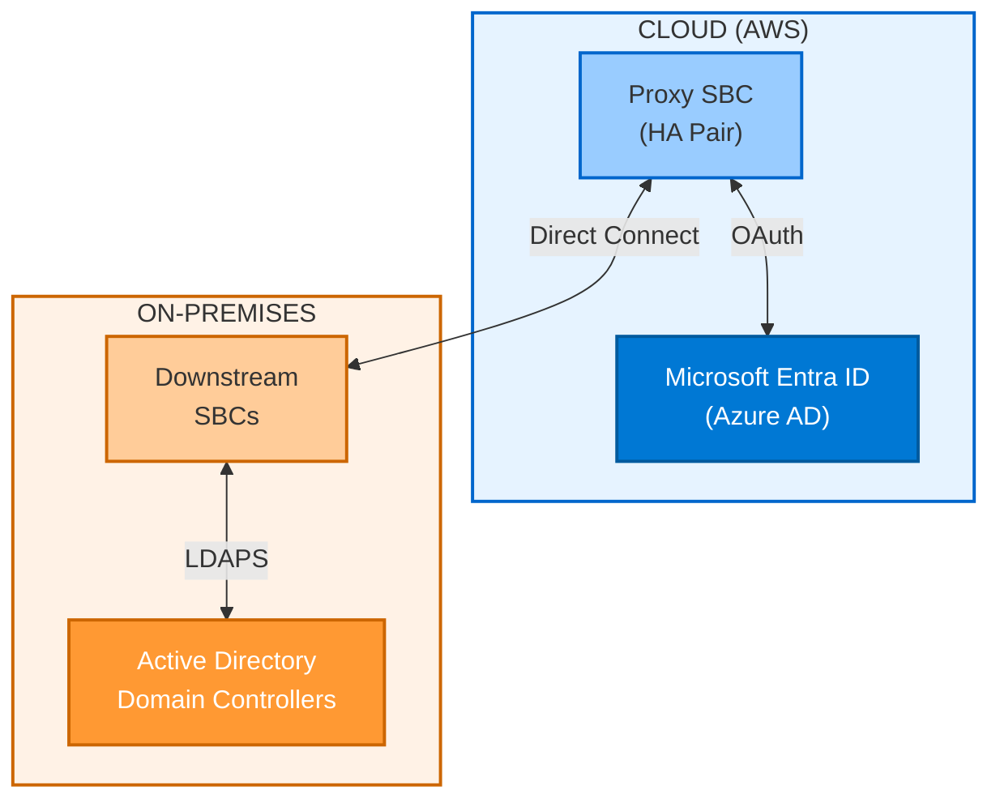
```mermaid
flowchart TB
    subgraph cloud["CLOUD (AWS)"]
        style cloud fill:#e6f3ff,stroke:#0066cc,stroke-width:2px

        proxy["Proxy SBC<br/>(HA Pair)"]
        entra["Microsoft Entra ID<br/>(Azure AD)"]

        proxy <-->|"OAuth"| entra
    end

    subgraph onprem["ON-PREMISES"]
        style onprem fill:#fff2e6,stroke:#cc6600,stroke-width:2px

        downstream["Downstream<br/>SBCs"]
        ad["Active Directory<br/>Domain Controllers"]

        downstream <-->|"LDAPS"| ad
    end

    proxy <-->|"Direct Connect"| downstream

    style proxy fill:#99ccff,stroke:#0066cc,stroke-width:2px
    style entra fill:#0078d4,stroke:#005a9e,stroke-width:2px,color:#fff
    style downstream fill:#ffcc99,stroke:#cc6600,stroke-width:2px
    style ad fill:#ff9933,stroke:#cc6600,stroke-width:2px,color:#fff
```

**Rationale for Split Identity Model:**

| Component | Identity Provider | Rationale |
|-----------|------------------|-----------|
| Proxy SBC (AWS) | Microsoft Entra ID | Cloud-native authentication; internet-accessible management; aligns with Teams Direct Routing integration |
| Downstream SBC (On-prem) | On-premises Active Directory | Offline resilience during cloud or WAN outages; local authentication ensures continued management access |

#### Proxy SBC: Microsoft Entra ID (OAuth 2.0) Configuration

The Proxy SBC uses OAuth 2.0 authentication via Microsoft Entra ID for web-based management access. This requires a dedicated App Registration separate from other AudioCodes component registrations.

##### App Registration: SBC Management

1. Navigate to **Azure Portal** > **Microsoft Entra ID** > **App registrations** > **New registration**
2. Configure:
   - **Name:** `AudioCodes-SBC-Management`
   - **Supported account types:** Accounts in this organizational directory only (Single tenant)
   - **Redirect URI:** Web - `https://<proxy-sbc-fqdn>/api/v1/auth/oauth2/callback`
3. Click **Register**

##### Credentials to Capture

| Credential | Location | Usage |
|------------|----------|-------|
| Application (Client) ID | Overview blade | SBC OAuth configuration |
| Directory (Tenant) ID | Overview blade | SBC OAuth configuration |
| Client Secret | Certificates & secrets blade | SBC OAuth configuration |

##### Client Secret Creation

1. Navigate to **Certificates & secrets** > **Client secrets** > **New client secret**
2. Description: `SBC-Management-OAuth`
3. Expiry: Select appropriate expiry (recommend 24 months with calendar reminder)
4. **IMPORTANT:** Copy the secret value immediately - it cannot be retrieved later

##### Token Configuration

1. Navigate to **Token configuration** > **Add optional claim**
2. Token type: **ID**
3. Select claims: `email`, `preferred_username`, `groups`
4. Click **Add**

##### Entra ID Security Groups for Role Mapping

Create the following security groups in Microsoft Entra ID for SBC role assignment:

| Entra ID Group | SBC Role | Description |
|----------------|----------|-------------|
| `SG-SBC-SecurityAdmin` | Security Administrator | Full security and configuration control |
| `SG-SBC-Admin` | Administrator | Configuration and operations access |
| `SG-SBC-Monitor` | Monitor | Read-only access to configuration and status |

##### SBC OAuth Configuration

Configure OAuth on the Proxy SBC via **Setup** > **Administration** > **Web & CLI** > **OAuth Settings**:

| Parameter | Value |
|-----------|-------|
| OAuth Mode | Enabled |
| Provider | Azure AD |
| Client ID | `<Application (Client) ID>` |
| Client Secret | `<Client Secret Value>` |
| Tenant ID | `<Directory (Tenant) ID>` |
| Redirect URI | `https://<proxy-sbc-fqdn>/api/v1/auth/oauth2/callback` |

##### SBC Group-to-Role Mapping

Configure role mapping via **Setup** > **Administration** > **Web & CLI** > **Authentication Servers** > **OAuth Group Mapping**:

| Group Object ID | Assigned Role |
|-----------------|---------------|
| `<SG-SBC-SecurityAdmin Object ID>` | Security Administrator |
| `<SG-SBC-Admin Object ID>` | Administrator |
| `<SG-SBC-Monitor Object ID>` | Monitor |

> **Note:** Use the Entra ID Group Object ID (GUID), not the display name.

#### Downstream SBC: On-Premises Active Directory (LDAPS) Configuration

Downstream SBCs authenticate against on-premises Active Directory Domain Controllers using LDAPS (LDAP over TLS on port 636). This ensures continued management access during cloud outages or Direct Connect failures.

##### Prerequisites

- Active Directory Domain Controllers with LDAPS enabled (port 636)
- Valid TLS certificate on Domain Controllers (see Certificate Requirements below)
- Service account for LDAP bind operations
- AD security groups for role mapping

##### LDAPS Certificate Requirements

| Requirement | Details |
|-------------|---------|
| Certificate Type | Server authentication certificate on each Domain Controller |
| Subject/SAN | Must include DC FQDN (e.g., `dc01.corp.example.com`) |
| Trust Chain | SBC must trust the issuing CA (import root/intermediate CA certificates) |
| Key Usage | Digital Signature, Key Encipherment |
| Extended Key Usage | Server Authentication (1.3.6.1.5.5.7.3.1) |

##### Importing CA Certificates to SBC

1. Navigate to **Setup** > **IP Network** > **Security** > **TLS Contexts**
2. Select the management TLS context
3. Under **Trusted Root Certificates**, click **Import**
4. Upload the root CA certificate (and intermediate if applicable)
5. Verify the certificate appears in the trusted list

##### LDAP Server Configuration

Configure LDAP on the Downstream SBC via **Setup** > **Administration** > **Web & CLI** > **Authentication Servers** > **LDAP**:

| Parameter | Value |
|-----------|-------|
| LDAP Mode | Enabled |
| Server Type | Microsoft Active Directory |
| Primary Server | `ldaps://dc01.corp.example.com:636` |
| Secondary Server | `ldaps://dc02.corp.example.com:636` |
| Bind DN | `CN=svc-sbc-ldap,OU=Service Accounts,DC=corp,DC=example,DC=com` |
| Bind Password | `<Service Account Password>` |
| Base DN | `DC=corp,DC=example,DC=com` |
| User Search Filter | `(&(objectClass=user)(sAMAccountName=%s))` |
| Connection Security | LDAPS (TLS) |
| Verify Server Certificate | Enabled |

##### Service Account Requirements

| Requirement | Details |
|-------------|---------|
| Account Type | Domain user account (not a computer account) |
| Permissions | Read access to user objects and group membership |
| Password Policy | Non-expiring password or managed rotation |
| Naming Convention | `svc-sbc-ldap-<site>` (e.g., `svc-sbc-ldap-sydney`) |
| OU Placement | Dedicated Service Accounts OU |

> **Security Note:** The bind account requires only read permissions. Do not grant write or administrative privileges.

##### Active Directory Security Groups for Role Mapping

Create the following security groups in Active Directory for SBC role assignment:

| AD Group | SBC Role | Description |
|----------|----------|-------------|
| `SBC-SecurityAdmin-<Site>` | Security Administrator | Full security and configuration control |
| `SBC-Admin-<Site>` | Administrator | Configuration and operations access |
| `SBC-Monitor-<Site>` | Monitor | Read-only access to configuration and status |

> **Note:** Site-specific groups (e.g., `SBC-Admin-Sydney`) allow granular access control per location.

##### SBC Group-to-Role Mapping

Configure role mapping via **Setup** > **Administration** > **Web & CLI** > **Authentication Servers** > **LDAP Group Mapping**:

| AD Group DN | Assigned Role |
|-------------|---------------|
| `CN=SBC-SecurityAdmin-Sydney,OU=SBC Groups,DC=corp,DC=example,DC=com` | Security Administrator |
| `CN=SBC-Admin-Sydney,OU=SBC Groups,DC=corp,DC=example,DC=com` | Administrator |
| `CN=SBC-Monitor-Sydney,OU=SBC Groups,DC=corp,DC=example,DC=com` | Monitor |

##### Multiple Domain Controller Configuration

For redundancy, configure both primary and secondary LDAP servers pointing to different Domain Controllers:

| Configuration | Primary DC | Secondary DC |
|---------------|------------|--------------|
| Sydney Site | `dc01-syd.corp.example.com` | `dc02-syd.corp.example.com` |
| Melbourne Site | `dc01-mel.corp.example.com` | `dc02-mel.corp.example.com` |

The SBC will automatically failover to the secondary server if the primary becomes unavailable.

#### Emergency Access: Break Glass Accounts

Local break glass accounts provide emergency access when identity providers are unavailable. For break glass account configuration and procedures, see [Section 17: Break Glass Accounts](#17-break-glass-accounts).

**When to use break glass accounts:**

- Microsoft Entra ID unavailable (Proxy SBC)
- Active Directory Domain Controllers unreachable (Downstream SBC)
- OAuth or LDAP misconfiguration preventing authentication
- Network connectivity issues to identity providers

#### Network and Security Requirements

##### Firewall Rules

Ensure the following firewall rules are in place (see [Section 16: Firewall Rules](#16-firewall-rules) for complete rule sets):

| Source | Destination | Port | Protocol | Purpose |
|--------|-------------|------|----------|---------|
| Proxy SBC | Microsoft Entra ID (Internet) | 443 | TCP/HTTPS | OAuth token requests |
| Downstream SBC | Domain Controllers | 636 | TCP/LDAPS | LDAP authentication |

##### Entra ID Network Endpoints

The Proxy SBC requires outbound HTTPS access to Microsoft Entra ID endpoints:

| Endpoint | Purpose |
|----------|---------|
| `login.microsoftonline.com` | OAuth authentication |
| `graph.microsoft.com` | Group membership queries (if configured) |

##### LDAPS Network Path Security

| Requirement | Details |
|-------------|---------|
| Encryption | TLS 1.2 minimum (LDAPS enforces encryption) |
| Network Segmentation | Management interface should be on dedicated management VLAN |
| Firewall | Permit only SBC management IP to DC LDAPS port |

---

## 11. SBC Network Configuration

### 11.1 Physical Connectivity

#### SBC Configuration Concept in Teams Direct Routing

In the Teams Direct Routing Enterprise Model, the Proxy SBC connects Microsoft Teams Phone System to the PSTN and downstream SBC infrastructure. The SBC maintains separate network interfaces for internal (LAN) connectivity toward downstream SBCs, third-party PBX systems and external (WAN) connectivity toward Microsoft Teams and PSTN providers. Management and HA interfaces operate on dedicated subnets for administrative access and failover coordination respectively.

#### Proxy SBC Virtual Ports

The following interfaces are enabled on the Proxy SBC:

| Interface | Status  |
|-----------|---------|
| GE_1      | Enabled |
| GE_2      | Enabled |
| GE_3      | Enabled |
| GE_4      | Enabled |
| GE_5      | Enabled |
| GE_6      | Enabled |
| GE_7      | Enabled |
| GE_8      | Enabled |

In AWS, AudioCodes physical ports (GE1-GE8) are virtualized and mapped to Elastic Network Interfaces (ENIs). Each ENI connects to a specific VPC subnet, acting like a virtual switch port, receiving its own private IP (with optional Elastic IP for public access). Since ports are grouped into Ethernet Groups for redundancy (GE1+GE5 for Management, GE2+GE6 for Internal, GE3+GE7 for External, GE4+GE8 for HA), four ENIs are created - one per Ethernet Group - for logical separation and redundancy at cloud level. Security Groups and routing tables control traffic flow.

#### Downstream SBC Physical Ports

The following interfaces are configured on the Downstream SBC:

| Interface | Status  |
|-----------|---------|
| GE_1      | Enabled |
| GE_2      | Enabled |
| GE_3      | Enabled |
| GE_4      | Enabled |

On Mediant 800, front-panel GE/FE ports are mapped to Physical Ports and grouped into Ethernet Groups for redundancy or single-port operation. Groups can be single-port or two-port for L2 redundancy (active/standby or active/active). All ports share the same MAC address - redundant ports should connect to different switches to avoid MAC flaps. For simple setups without VLAN tagging, configure upstream switch ports as access ports.

#### Downstream SBC with LBO Physical Ports

The physical port configuration for the Downstream SBC with LBO is identical to that described for the Downstream SBC Physical Ports above.

### 11.2 Logical Connectivity

#### Ethernet Groups

Ethernet Groups are used to define logical groupings of physical or virtual ports for the purposes of traffic management and routing. By grouping ports together, the SBC can provide link-level redundancy and separate traffic domains (management, signalling, media, HA) across distinct network segments.

#### Proxy SBC Ethernet Groups

| Ethernet Group | Member Ports |
|----------------|--------------|
| Group 1        | GE_1, GE_5   |
| Group 2        | GE_2, GE_6   |
| Group 3        | GE_3, GE_7   |
| Group 4        | GE_4, GE_8   |

#### Downstream SBC Ethernet Groups

| Ethernet Group | Member Ports |
|----------------|--------------|
| Group 1        | GE_1         |
| Group 2        | GE_2         |
| Group 3        | GE_3         |

#### Downstream SBC with LBO Ethernet Groups

The Ethernet Group configuration for the Downstream SBC with LBO is identical to that described for the Downstream SBC Ethernet Groups above.

### 11.3 Ethernet Device Configuration

The Ethernet Device table defines the logical network interfaces on the AudioCodes SBC, mapping each to an underlying physical port group and VLAN assignment. Proper separation of management, signalling/media, and high-availability traffic is critical for security, performance, and resilience.

#### Proxy SBC Ethernet Device Configuration

The Proxy SBC requires four logical Ethernet interfaces to support management, internal (LAN-side) signalling and media, external (WAN-side/DMZ) signalling and media toward Microsoft Teams, and high-availability synchronisation between the HA pair.

| Interface Name         | Underlying Interface | VLAN ID  |
|------------------------|----------------------|----------|
| Management             | Group_1              | VLAN ID1 |
| Internal (LAN)         | Group_2              | VLAN ID1 |
| External (WAN)         | Group_3              | VLAN ID1 |
| HA (High Availability) | Group_4              | VLAN ID1 |

**Design Notes:**

- A single VLAN is used for trusted traffic (Management, Internal, and HA interfaces) with differentiation achieved through the use of different SIP listening ports on each interface. This simplifies the network topology while maintaining logical separation of traffic types.
- External/untrusted traffic destined for or originating from the DMZ (i.e., Microsoft Teams Direct Routing) must traverse a separate physical or logical interface (External/WAN) to enforce security zone boundaries.
- If the internal and external interfaces connect through **different physical switches**, they should be assigned to different physical ports on the SBC, each connected to the appropriate switch and VLAN.
- If the internal and external interfaces connect through the **same physical switch infrastructure**, VLAN segmentation must be used to enforce traffic isolation between the trusted (internal) and untrusted (external/DMZ) zones. Appropriate firewall or ACL policies must be applied at the switch or upstream firewall to control inter-VLAN traffic.
- The HA interface is dedicated to heartbeat and state synchronisation traffic between the active and standby SBC nodes and must not carry any signalling or media traffic.

#### Downstream SBC Ethernet Device Configuration

The Downstream SBC operates entirely within the trusted internal network and does not require a WAN-facing interface. It connects upstream to the Proxy SBC and downstream to registered endpoints on the LAN. Three logical interfaces are required: Management, Internal (LAN), and HA.

| Interface Name         | Underlying Interface | VLAN ID  |
|------------------------|----------------------|----------|
| Management             | Group_1              | VLAN ID1 |
| Internal (LAN)         | Group_2              | VLAN ID1 |
| HA (High Availability) | Group_3              | VLAN ID1 |

**Design Notes:**

- Since the Downstream SBC does not terminate any external/untrusted connections, no External (WAN) interface is required.
- All signalling and media traffic between the Downstream SBC and the Proxy SBC traverses the Internal (LAN) interface.
- The HA interface provides heartbeat and state synchronisation between the active and standby Downstream SBC nodes.

#### Downstream SBC with LBO Ethernet Device Configuration

The Downstream SBC with Local Breakout (LBO) shares the same Ethernet Device configuration as the standard Downstream SBC. The LBO functionality is achieved through additional SIP interface and routing configuration rather than additional physical or logical Ethernet interfaces.

| Interface Name         | Underlying Interface | VLAN ID  |
|------------------------|----------------------|----------|
| Management             | Group_1              | VLAN ID1 |
| Internal (LAN)         | Group_2              | VLAN ID1 |
| HA (High Availability) | Group_3              | VLAN ID1 |

**Design Notes:**

- The PSTN connectivity for Local Breakout is provided via the Internal (LAN) interface using a dedicated SIP signalling interface and media realm, as detailed in subsequent sections.

### 11.4 IP Interfaces

The IP Interfaces table defines the Layer 3 addressing and application type for each logical interface on the SBC. Each IP interface is bound to a specific Ethernet Device and serves a designated application role (OAMP, Media + Control, or Maintenance/HA).

#### Proxy SBC IP Interfaces

The Proxy SBC requires four IP interfaces corresponding to the four Ethernet Devices.

| Index | Application Types | Interface Mode | IP Address                | Gateway                   | DNS            | Interface Name  | Ethernet Device |
|-------|-------------------|----------------|---------------------------|---------------------------|----------------|-----------------|-----------------|
| 0     | OAMP              | IPv4 Manual    | X.X.X.X                   | X.X.X.X                   | X.X.X.X        | Management      | Management      |
| 1     | Media + Control   | IPv4 Manual    | X.X.X.X                   | X.X.X.X                   | X.X.X.X        | Internal (LAN)  | Internal (LAN)  |
| 2     | Media + Control   | IPv4 Manual    | X.X.X.X (DMZ IP)          | X.X.X.X (Router IP)       | As per ISP     | External (WAN)  | External (WAN)  |
| 3     | Maintenance       | IPv4 Manual    | X.X.X.X                   | X.X.X.X                   | X.X.X.X        | HA              | HA              |

**Design Notes:**

- **Index 0 (OAMP):** The Operations, Administration, Maintenance, and Provisioning interface is used for SBC management access (Web GUI, CLI, SNMP, syslog). This interface must be reachable from the network management systems.
- **Index 1 (Internal LAN - Media + Control):** Carries SIP signalling and RTP media for internal/trusted trunk connections including Downstream SBCs, third-party PBX systems, and PSTN SIP trunk providers connected on the LAN side.
- **Index 2 (External WAN - Media + Control):** Carries SIP signalling (TLS) and SRTP media for the Microsoft Teams Direct Routing connection. The IP address is the DMZ-facing address, the gateway is the DMZ router/firewall IP, and the DNS server is provided by the ISP or is the enterprise DNS server capable of resolving Microsoft 365 FQDNs.
- **Index 3 (HA - Maintenance):** Dedicated to HA heartbeat and state synchronisation. The Maintenance application type ensures this interface is used exclusively for HA purposes.

#### Downstream SBC IP Interfaces

The Downstream SBC requires three IP interfaces. No External (WAN) interface is configured as the Downstream SBC does not connect directly to Microsoft Teams or any external/DMZ network.

| Index | Application Types | Interface Mode | IP Address | Gateway  | DNS      | Interface Name  | Ethernet Device |
|-------|-------------------|----------------|------------|----------|----------|-----------------|-----------------|
| 0     | OAMP              | IPv4 Manual    | X.X.X.X    | X.X.X.X  | X.X.X.X  | Management      | Management      |
| 1     | Media + Control   | IPv4 Manual    | X.X.X.X    | X.X.X.X  | X.X.X.X  | Internal (LAN)  | Internal (LAN)  |
| 2     | Maintenance       | IPv4 Manual    | X.X.X.X    | X.X.X.X  | X.X.X.X  | HA              | HA              |

**Design Notes:**

- All SIP signalling and RTP media between the Downstream SBC and the Proxy SBC, as well as between the Downstream SBC and registered endpoints, is carried over the Internal (LAN) interface (Index 1).
- The OAMP interface (Index 0) provides management access to the Downstream SBC.
- The HA interface (Index 2) supports high-availability synchronisation between the active and standby nodes.

#### Downstream SBC with LBO IP Interfaces

The Downstream SBC with Local Breakout (LBO) uses the same IP Interface configuration as the standard Downstream SBC. The PSTN local breakout connectivity is achieved by configuring additional SIP signalling interfaces and media realms on the existing Internal (LAN) IP interface, rather than by adding a separate IP interface.

| Index | Application Types | Interface Mode | IP Address | Gateway  | DNS      | Interface Name  | Ethernet Device |
|-------|-------------------|----------------|------------|----------|----------|-----------------|-----------------|
| 0     | OAMP              | IPv4 Manual    | X.X.X.X    | X.X.X.X  | X.X.X.X  | Management      | Management      |
| 1     | Media + Control   | IPv4 Manual    | X.X.X.X    | X.X.X.X  | X.X.X.X  | Internal (LAN)  | Internal (LAN)  |
| 2     | Maintenance       | IPv4 Manual    | X.X.X.X    | X.X.X.X  | X.X.X.X  | HA              | HA              |

---

## 12. TLS Certificate Configuration

This section details the TLS certificate configuration required for secure SIP connectivity between the Proxy SBC and Microsoft Teams Direct Routing. Microsoft Teams requires mutual TLS (MTLS) authentication on the SIP signalling path, which necessitates a trusted TLS certificate on the SBC signed by a publicly trusted Certificate Authority (CA).

> **Note:** TLS certificate configuration for Microsoft Teams Direct Routing is **only applicable to Proxy SBCs**. Downstream SBCs communicate with the Proxy SBC over the internal network using unencrypted SIP (UDP) and do not require TLS certificates for Teams connectivity.

### 12.1 TLS Context Configuration

A dedicated TLS Context named "Teams" is created on each Proxy SBC to hold the certificate and trust chain used for the Microsoft Teams Direct Routing SIP TLS connection.

#### Parameters

| Parameter                  | Value         |
|----------------------------|---------------|
| Index                      | 1             |
| Name                       | Teams         |
| TLS Version                | TLSv1.2       |
| TLS Cipher Suite           | Default       |
| OCSP Server                | Default       |
| OCSP Default Response      | Default       |
| Mutual TLS (MTLS)          | Default       |
| Session Resumption         | Default       |
| Renegotiation              | Default       |

#### Configuration Steps

1. **Create the TLS Context:**
   - Navigate to **Setup > IP Network > Security > TLS Contexts** on the SBC Web GUI.
   - Click **New** and configure the TLS Context with the parameters defined in the table above.
   - Set the **TLS Version** to **TLSv1.2** (minimum version required by Microsoft Teams).
   - All other parameters should remain at their default values unless specific security policies dictate otherwise.
   - Click **Apply**.

2. **Generate a Certificate Signing Request (CSR):**
   - Within the newly created "Teams" TLS Context, navigate to the **Certificate** section.
   - Click **Generate CSR** and fill in the required fields as detailed in Section 12.2.

3. **Deploy Certificates:**
   - After receiving the signed certificate from the CA, upload the server certificate, intermediate certificate(s), and trusted root certificate(s) as detailed in Sections 12.2 and 12.3.

### 12.2 Certificate Signing Request (CSR)

The CSR must be generated with the following field values to ensure compatibility with Microsoft Teams Direct Routing and the enterprise PKI infrastructure.

#### CSR Fields

| CSR Field                        | Required Value                                                                 |
|----------------------------------|--------------------------------------------------------------------------------|
| Common Name (CN)                 | sbc-proxy.domain.com                                                           |
| Subject Alternative Names (SANs) | Primary SBC FQDN + all required aliases (e.g., sbc-proxy-01.domain.com)        |
| Organization (O)                 | Organization Name                                                              |
| Organizational Unit (OU)         | As per organization                                                            |
| Country (C)                      | Country Code (e.g., AU, US)                                                    |
| State/Province (ST)              | As per site location                                                           |
| Locality (L)                     | As per site location                                                           |
| Key Length                       | 2048-bit RSA                                                                   |

**Important:** The Common Name (CN) and Subject Alternative Names (SANs) must exactly match the FQDN(s) configured in the Microsoft Teams Direct Routing voice route and PSTN gateway configuration in the Microsoft Teams Admin Center. Any mismatch will cause TLS negotiation failures and call routing failures.

#### Generation and Deployment Steps

1. **Generate the CSR** on the SBC within the "Teams" TLS Context by navigating to the Certificate section and clicking **Generate CSR**. Populate all fields as specified in the table above.
2. **Download the CSR** file from the SBC by clicking **Download CSR**.
3. **Submit the CSR** to the enterprise Certificate Authority (CA) or Public Key Infrastructure (PKI) team for signing. The CA must be a publicly trusted CA recognised by Microsoft (e.g., DigiCert, GlobalSign, Comodo/Sectigo, etc.). Internal/private CAs are not accepted by Microsoft Teams.
4. **Obtain the signed certificate** from the CA. Ensure you also obtain the full certificate chain including:
   - The signed server certificate (for the SBC FQDN)
   - All intermediate CA certificate(s)
   - The root CA certificate
5. **Upload the signed server certificate** to the SBC: Navigate to the "Teams" TLS Context > Certificate section > Click **Upload Certificate** and upload the signed server certificate file.
6. **Upload the intermediate CA certificate(s):** Navigate to the "Teams" TLS Context > Trusted Root Certificates section > Click **Upload** and upload each intermediate CA certificate.
7. **Upload the root CA certificate:** Upload the root CA certificate to the Trusted Root Certificates section as well.
8. **Verify the certificate chain:** After uploading, verify the certificate status shows as valid and the full chain is trusted by navigating to the TLS Context and reviewing the Certificate Information.

### 12.3 Deploying Trusted Root Certificates for MTLS

For mutual TLS (MTLS) authentication with Microsoft Teams, the SBC must trust the root CA certificates used by Microsoft to sign its SIP TLS certificates. Microsoft currently uses DigiCert as its certificate provider. The following root certificates must be downloaded and uploaded to the "Teams" TLS Context on each Proxy SBC.

#### Required Root and Intermediate Certificates

| Certificate Name                              | Purpose                                      |
|-----------------------------------------------|----------------------------------------------|
| DigiCert Global Root G2                       | Root CA trust anchor for Microsoft SIP certs |
| DigiCert Global Root G3                       | Included as a precautionary measure; DigiCert Global Root G2 is the confirmed active root CA for Teams SIP |
| Baltimore CyberTrust Root                     | Expired May 2025; retain only if required for backward compatibility with older configurations |
| DigiCert intermediate certificates (as needed)| Intermediate CA certificates in the chain    |

#### Deployment Steps

1. **Download** the DigiCert Global Root G2 and DigiCert Global Root G3 root certificates from the DigiCert website (https://www.digicert.com/kb/digicert-root-certificates.htm) in PEM or DER format.
2. **Download** any additional intermediate certificates published by Microsoft for Teams Direct Routing SIP TLS connectivity.
3. **Upload all DigiCert root and intermediate certificates** to the SBC:
   - Navigate to **Setup > IP Network > Security > TLS Contexts**.
   - Select the "Teams" TLS Context.
   - Go to the **Trusted Root Certificates** section.
   - Click **Upload** and upload each root and intermediate certificate file.
4. **Verify** that all uploaded certificates appear in the Trusted Root Certificates list and their validity dates are current.
5. **Test MTLS connectivity** by initiating a test call through Microsoft Teams Direct Routing and verifying that the TLS handshake completes successfully (check the SBC syslog for TLS handshake events).

> **Note:** Microsoft may update its certificate chain periodically. Monitor Microsoft 365 Message Center and Microsoft documentation for any certificate rotation announcements and update the SBC trusted root certificates accordingly.

---

## 13. Media Configuration

### 13.1 NTP Server Configuration

Network Time Protocol (NTP) synchronisation is essential for all SBCs to ensure accurate timestamps for call detail records (CDRs), syslog messages, TLS certificate validation, and HA synchronisation. All SBCs (Proxy, Downstream, and Downstream with LBO) must be configured to synchronise with the enterprise NTP server.

| Parameter          | Value    |
|--------------------|----------|
| NTP Server Address | X.X.X.X  |
| NTP Auth Mode      | None     |

**Configuration Path:** Setup > Administration > Time & Date > NTP Server Address.

> **Note:** Ensure the NTP server is reachable from the SBC Management interface. If the NTP server resides on a different network segment, verify that appropriate routing and firewall rules are in place. A time drift of more than a few seconds can cause TLS certificate validation failures with Microsoft Teams and inconsistencies in CDR and syslog records.

### 13.2 Media Realm Configuration

Media Realms define the RTP port ranges and interface bindings for media (audio) traffic on the SBC. Each Media Realm is associated with a specific IP interface and allocates a pool of RTP ports for media sessions. Separate Media Realms are configured for internal and external traffic to ensure proper media routing and firewall rule alignment.

#### Proxy SBC Media Realm

The Proxy SBC requires three Media Realms to handle media for internal trunk traffic, Microsoft Teams (external) traffic, and PSTN carrier traffic respectively.

| Index | Name                 | Interface       | RTP Start Port | Number of Media Session Legs | RTP End Port (Calculated) |
|-------|----------------------|-----------------|----------------|------------------------------|---------------------------|
| 0     | Internal_Media_Realm | Internal (LAN)  | XXXX           | 1000                         | XXXX + 1999               |
| 1     | M365_Media_Realm     | External (WAN)  | XXXX           | 1000                         | XXXX + 1999               |
| 2     | PSTN_Media_Realm     | Internal (LAN)  | XXXX           | 1000                         | XXXX + 1999               |

**Design Notes:**

- **Internal_Media_Realm (Index 0):** Used for RTP media sessions between the Proxy SBC and internal entities such as Downstream SBCs, third-party PBX systems, and registered endpoints. Bound to the Internal (LAN) interface.
- **M365_Media_Realm (Index 1):** Dedicated to RTP/SRTP media sessions between the Proxy SBC and Microsoft Teams (via the External/WAN/DMZ interface). This realm is bound to the External (WAN) interface so that media traffic egresses through the DMZ. Firewall rules must permit the configured RTP port range on this interface.
- **PSTN_Media_Realm (Index 2):** Used for RTP media sessions between the Proxy SBC and the PSTN SIP trunk provider. Bound to the Internal (LAN) interface. A separate Media Realm is used (rather than sharing Internal_Media_Realm) to maintain distinct port ranges for troubleshooting and capacity management.
- **Media Session Legs:** Each Media Realm is configured with 1000 media session legs. Each call consumes two legs (one for each direction), so each realm supports approximately 500 concurrent calls. Adjust this value based on expected call volumes and SBC licensing.
- **RTP Port Range:** The RTP Start Port should be selected to avoid conflicts with other services. Each Media Realm requires a contiguous range of ports equal to twice the number of media session legs (e.g., 1000 legs = 2000 ports). Ensure that the port ranges for all Media Realms on the same interface do not overlap.

#### Downstream SBC Media Realm

The standard Downstream SBC requires only a single Media Realm for internal media traffic, as it does not connect to external networks or PSTN carriers directly.

| Index | Name                 | Interface       | RTP Start Port | Number of Media Session Legs |
|-------|----------------------|-----------------|----------------|------------------------------|
| 0     | Internal_Media_Realm | Internal (LAN)  | XXXX           | 1000                         |

**Design Notes:**

- All media between the Downstream SBC and the Proxy SBC, as well as between the Downstream SBC and registered endpoints, uses this single Internal Media Realm.

#### Downstream SBC with LBO Media Realm

The Downstream SBC with Local Breakout requires two Media Realms: one for internal traffic toward the Proxy SBC and registered endpoints, and one for PSTN media traffic via the local SIP trunk.

| Index | Name                 | Interface       | RTP Start Port | Number of Media Session Legs |
|-------|----------------------|-----------------|----------------|------------------------------|
| 0     | Internal_Media_Realm | Internal (LAN)  | XXXX           | 1000                         |
| 1     | PSTN_Media_Realm     | Internal (LAN)  | XXXX           | 1000                         |

**Design Notes:**

- **Internal_Media_Realm (Index 0):** Handles media for calls between the Downstream SBC and the Proxy SBC, as well as registered endpoints.
- **PSTN_Media_Realm (Index 1):** Handles media for calls that break out locally to the PSTN via the directly connected SIP trunk provider. A dedicated Media Realm ensures port range separation from internal media traffic.

### 13.3 Coder Groups

The default Coder Group (`AudioCodersGroups_0`) is used across all SBC roles and is configured with the following considerations:

**Codec Considerations:**

- **Preferred Codecs:** The Coder Group should include codecs in order of preference based on audio quality and bandwidth requirements. Typical codec priority order: G.711 A-law, G.711 Mu-law, G.729, Opus (if supported).

**SDP Negotiation Notes:**

- The SBC performs SDP offer/answer negotiation independently on each call leg. The Coder Group defines the codecs offered by the SBC on each leg, and the SBC selects the best matching codec based on the remote party's capabilities and the configured priority.
- If no common codec can be negotiated between the SBC and a remote party, the call attempt fails with a SIP 488 (Not Acceptable Here) or 606 (Not Acceptable) response. The Coder Group should include a broad enough set of codecs to ensure interoperability with all connected systems while maintaining acceptable audio quality.

**Transcoding Notes:**

- If the codecs negotiated on the two legs of a call differ (e.g., G.711 on the PSTN leg and Opus on the Teams leg), the SBC performs real-time transcoding between the two codecs. Transcoding consumes additional DSP resources and should be minimized where possible by aligning codec preferences across trunk endpoints.

> **Note:** The specific codec list and priority order within the Coder Group are configured during implementation based on the capabilities of each connected system and the bandwidth available on each network segment. Refer to the implementation worksheet for site-specific codec configurations.

---

## 14. SIP Signalling Configuration

### 14.1 SIP Signalling Interfaces

SIP Signalling Interfaces define the listening addresses, ports, and transport protocols for SIP signalling on each SBC. Each SIP Interface is bound to a specific IP interface and Media Realm, and controls how the SBC receives and sends SIP messages on that interface.

#### Proxy SBC SIP Interfaces

The Proxy SBC requires three SIP Interfaces: one for internal SIP trunk signalling, one for PSTN SIP trunk signalling, and one for Microsoft Teams Direct Routing (external TLS).

| Index | Name            | Network Interface | Application Type | UDP Port | TCP Port | TLS Port | Enable TCP Keepalive | Classification Failure Response Type | Media Realm          | TLS Context Name |
|-------|-----------------|-------------------|------------------|----------|----------|----------|----------------------|--------------------------------------|----------------------|-------------------|
| 0     | Internal (LAN)  | Internal (LAN)    | SBC              | XXXX     | 0        | 0        | Disable              | 500                                  | Internal_Media_Realm | --                |
| 1     | PSTN            | Internal (LAN)    | SBC              | XXXX     | 0        | 0        | Disable              | 500                                  | PSTN_Media_Realm     | --                |
| 2     | External (WAN)  | External (WAN)    | SBC              | 0        | 0        | 5061     | Enable               | 0                                    | M365_Media_Realm     | Teams             |

**Design Notes:**

- **Index 0 -- Internal (LAN):** Listens on a UDP port for SIP signalling from Downstream SBCs, third-party PBX systems, and other internal trunk endpoints. TCP and TLS are disabled (port 0) as internal signalling uses UDP. Classification Failure Response is set to 500 (Server Internal Error) to reject unclassified calls gracefully.
- **Index 1 -- PSTN:** Listens on a separate UDP port on the Internal (LAN) interface for SIP signalling from the PSTN SIP trunk provider. Using a different port from the Internal (LAN) SIP Interface allows the SBC to distinguish PSTN traffic from other internal trunk traffic. Classification Failure Response is set to 500.
- **Index 2 -- External (WAN):** Listens on TLS port 5061 for SIP signalling from Microsoft Teams Direct Routing. UDP and TCP are disabled (port 0) as Microsoft Teams requires TLS exclusively. TCP Keepalive is **enabled** to maintain persistent TCP/TLS connections with Microsoft Teams. Classification Failure Response is set to **0** (no response) as a Denial-of-Service (DoS) mitigation measure -- unclassified SIP messages from the external interface are silently dropped rather than responded to, preventing reconnaissance and amplification attacks. The TLS Context is set to "Teams" to use the certificate configured in Section 12.

#### Downstream SBC SIP Interfaces

The Downstream SBC requires a single SIP Interface for internal signalling with the Proxy SBC and registered endpoints.

| Index | Name            | Network Interface | Application Type | UDP Port | TCP Port | TLS Port | Enable TCP Keepalive | Classification Failure Response Type | Media Realm          | TLS Context Name |
|-------|-----------------|-------------------|------------------|----------|----------|----------|----------------------|--------------------------------------|----------------------|-------------------|
| 0     | Internal (LAN)  | Internal (LAN)    | SBC              | XXXX     | 0        | 0        | Disable              | 500                                  | Internal_Media_Realm | --                |

#### Downstream SBC with LBO SIP Interfaces

The Downstream SBC with LBO requires two SIP Interfaces: one for internal signalling (toward the Proxy SBC and registered endpoints) and one for PSTN signalling (toward the local SIP trunk provider).

| Index | Name            | Network Interface | Application Type | UDP Port | TCP Port | TLS Port | Enable TCP Keepalive | Classification Failure Response Type | Media Realm          | TLS Context Name |
|-------|-----------------|-------------------|------------------|----------|----------|----------|----------------------|--------------------------------------|----------------------|-------------------|
| 0     | Internal (LAN)  | Internal (LAN)    | SBC              | XXXX     | 0        | 0        | Disable              | 500                                  | Internal_Media_Realm | --                |
| 1     | PSTN            | Internal (LAN)    | SBC              | XXXX     | 0        | 0        | Disable              | 500                                  | PSTN_Media_Realm     | --                |

### 14.2 Proxy Sets

Proxy Sets define logical groupings of destination SIP entities (proxy servers, SBCs, PBXs, SIP trunk providers) and their associated connectivity parameters including keep-alive mechanisms, hot-swap failover, and load balancing behavior. Each Proxy Set is associated with a SIP Interface and optionally a TLS Context.

#### Proxy SBC Proxy Sets

The Proxy SBC maintains Proxy Sets for all trunk destinations in the architecture.

| Index | Name                             | SBC IPv4 SIP Interface | TLS Context Name      | Proxy Keep-Alive   | Proxy Hot Swap | Proxy Load Balancing Method |
|-------|----------------------------------|------------------------|-----------------------|---------------------|----------------|-----------------------------|
| 1     | Teams Direct Routing             | External (WAN)         | Teams                 | Using-OPTIONS       | Enable         | Random-Weights              |
| 2     | Prod_Downstream SBC              | Internal (LAN)         | --                    | Using-OPTIONS       | Enable         | --                          |
| 3     | 3rd Party PBX & Radio Systems    | Internal (LAN)         | --                    | Using-OPTIONS       | Enable         | --                          |
| 4     | SIP Provider AU                  | Internal (LAN)         | --                    | Using-OPTIONS       | Enable         | --                          |
| 5     | SIP Provider US                  | Internal (LAN)         | --                    | Using-OPTIONS       | Enable         | --                          |
| 6     | Proxy-to-Proxy                   | Internal (LAN)         | --                    | Using-OPTIONS       | Enable         | --                          |

**Design Notes:**

- **Teams Direct Routing (Index 1):** Uses the External (WAN) SIP Interface and the "Teams" TLS Context for secure SIP connectivity to Microsoft Teams. Load Balancing Method is set to **Random-Weights** to distribute calls across the Microsoft Teams SIP proxies. Proxy Hot Swap is enabled for automatic failover.
- **Prod_Downstream SBC (Index 2):** Routes signalling to the downstream SBC cluster via the Internal (LAN) interface. SIP OPTIONS-based keep-alive monitors the health of each downstream SBC. Hot Swap is enabled for failover between downstream SBC nodes.
- **3rd Party PBX & Radio Systems (Index 3):** Proxy Set for legacy PBX systems and radio/emergency communication systems.
- **SIP Provider AU (Index 4):** Proxy Set for the Australian SIP trunk provider connected to the Australian Proxy SBC. Provides regional PSTN breakout for Australian traffic via the local carrier.
- **SIP Provider US (Index 5):** Proxy Set for the US SIP trunk provider connected to the US Proxy SBC. Provides regional PSTN breakout for US traffic via the local carrier.
- **Proxy-to-Proxy (Index 6):** Enables signalling between the two Proxy SBCs (e.g., AU Proxy to US Proxy) for inter-region call routing and failover.
- **Proxy Keep-Alive (Using-OPTIONS):** All Proxy Sets use SIP OPTIONS messages as keep-alive probes to continuously monitor the availability of each target entity. If an entity fails to respond to OPTIONS, the SBC marks it as unavailable and triggers Hot Swap failover.

Each Proxy Set contains one or more **Proxy Address entries** (not shown in this table) that define the specific IP addresses or FQDNs, ports, and priority/weight of each target entity within the Proxy Set. These are configured in the Proxy Address table associated with each Proxy Set.

#### Downstream SBC Proxy Sets

The Downstream SBC requires a single Proxy Set pointing to the upstream Proxy SBC.

| Index | Name       | SBC IPv4 SIP Interface | TLS Context Name | Proxy Keep-Alive | Proxy Hot Swap | Proxy Load Balancing Method |
|-------|------------|------------------------|-------------------|-------------------|----------------|-----------------------------|
| 1     | Proxy_SBC  | Internal (LAN)         | --                | Using-OPTIONS     | Enable         | --                          |

#### Downstream SBC with LBO Proxy Sets

The Downstream SBC with LBO requires two Proxy Sets: one for the upstream Proxy SBC and one for the local PSTN SIP trunk provider.

| Index | Name          | SBC IPv4 SIP Interface | TLS Context Name | Proxy Keep-Alive | Proxy Hot Swap | Proxy Load Balancing Method |
|-------|---------------|------------------------|-------------------|-------------------|----------------|-----------------------------|
| 1     | PSTN (Telco)  | Internal (LAN)         | --                | Using-OPTIONS     | Enable         | --                          |
| 2     | Proxy_SBC     | Internal (LAN)         | --                | Using-OPTIONS     | Enable         | --                          |

---

## 15. Routing Configuration

### 15.1 IP Profiles

IP Profiles define per-trunk signalling and media behavior, including codec group assignment, media security settings, and handling of SIP REFER, 3xx redirect, and REPLACES methods. Each IP Profile is associated with one or more IP Groups to apply the profile's settings to all calls on that trunk.

#### Proxy SBC IP Profiles

The Proxy SBC uses multiple IP Profiles to apply trunk-specific signalling and media behavior.

| Profile Name                          | Coders Group         | Media Security Behavior | Remote REFER Behavior | Remote 3XX Behavior | Remote REPLACES Behavior |
|---------------------------------------|----------------------|-------------------------|-----------------------|---------------------|--------------------------|
| Proxy_Downstream_Internal_Profile     | AudioCodersGroups_0  | Not Secured             | Handle Locally        | Handle Locally      | Handle Locally           |
| Teams Direct Routing Profile          | AudioCodersGroups_0  | Secured                 | Handle Locally        | Handle Locally      | Handle Locally           |
| PSTN_Profile                          | AudioCodersGroups_0  | Not Secured             | Handle Locally        | Handle Locally      | Handle Locally           |
| 3rd Party PBX Profile                 | AudioCodersGroups_0  | Not Secured             | Handle Locally        | Handle Locally      | Handle Locally           |
| Registered Endpoints Profile          | AudioCodersGroups_0  | Not Secured             | Handle Locally        | Handle Locally      | Handle Locally           |

**Design Notes:**

- **Proxy_Downstream_Internal_Profile:** Applied to internal trunks between the Proxy SBC and Downstream SBCs, as well as the Proxy-to-Proxy trunk. Media security is set to "Not Secured" as internal traffic does not require SRTP encryption.
- **Teams Direct Routing Profile:** Applied to the Microsoft Teams Direct Routing trunk. Media Security Behavior is set to **Secured**, which forces the SBC to use SRTP for all media sessions on this trunk. Microsoft Teams requires SRTP for media encryption. The SBC terminates SRTP on the Teams side and bridges to RTP on the internal side (or vice versa).
- **PSTN_Profile:** Applied to PSTN SIP trunk connections. Media is "Not Secured" (standard RTP) as most PSTN carriers do not support SRTP.
- **3rd Party PBX Profile:** Applied to legacy PBX and radio system trunks. Media is "Not Secured".
- **Registered Endpoints Profile:** Applied to locally registered SIP endpoints. Media is "Not Secured".
- **Remote REFER/3XX/REPLACES -- Handle Locally:** All IP Profiles are configured to handle REFER, 3xx redirect, and REPLACES messages locally on the SBC. This means the SBC intercepts these messages and performs the call transfer, redirect, or replacement on behalf of the endpoints, rather than forwarding the messages transparently. This ensures consistent behavior regardless of endpoint capabilities and provides the SBC with full visibility and control over call transfers and redirects.

#### Downstream SBC IP Profiles

The Downstream SBC uses two IP Profiles: one for the upstream trunk to the Proxy SBC and one for registered endpoints.

| Profile Name                          | Coders Group         | Media Security Behavior | Remote REFER Behavior | Remote 3XX Behavior | Remote REPLACES Behavior |
|---------------------------------------|----------------------|-------------------------|-----------------------|---------------------|--------------------------|
| Proxy_SBC_Internal_Profile            | AudioCodersGroups_0  | Not Secured             | Handle Locally        | Handle Locally      | Handle Locally           |
| Registered Endpoints Profile          | AudioCodersGroups_0  | Not Secured             | Handle Locally        | Handle Locally      | Handle Locally           |

#### Downstream SBC with LBO IP Profiles

The Downstream SBC with LBO requires three IP Profiles: one for the upstream Proxy SBC trunk, one for the local PSTN trunk, and one for registered endpoints.

| Profile Name                          | Coders Group         | Media Security Behavior | Remote REFER Behavior | Remote 3XX Behavior | Remote REPLACES Behavior |
|---------------------------------------|----------------------|-------------------------|-----------------------|---------------------|--------------------------|
| PSTN_Profile                          | AudioCodersGroups_0  | Not Secured             | Handle Locally        | Handle Locally      | Handle Locally           |
| Proxy_SBC_Internal_Profile            | AudioCodersGroups_0  | Not Secured             | Handle Locally        | Handle Locally      | Handle Locally           |
| Registered Endpoints Profile          | AudioCodersGroups_0  | Not Secured             | Handle Locally        | Handle Locally      | Handle Locally           |

### 15.2 IP Groups

IP Groups are the primary logical entity in the AudioCodes SBC architecture that ties together a Proxy Set, Media Realm, IP Profile, and TLS Context into a cohesive trunk definition. Each IP Group represents a specific trunk or endpoint group and is referenced by routing rules, classification rules, and message manipulation rules.

#### Proxy SBC IP Groups

The Proxy SBC maintains IP Groups for all trunk destinations in the architecture.

| IP-Group Name                | Proxy Set Name                    | Media Realm Name     | IP Profile Name                       | TLS Context           |
|------------------------------|-----------------------------------|----------------------|---------------------------------------|-----------------------|
| Teams Direct Routing Trunk   | Teams Direct Routing              | M365_Media_Realm     | Teams Direct Routing Profile          | Teams                 |
| Downstream SBC Trunk         | Prod_Downstream SBC            | Internal_Media_Realm | Proxy_Downstream_Internal_Profile     | Default               |
| 3rd Party PBX Trunk          | 3rd Party PBX & Radio Systems     | Internal_Media_Realm | Proxy_Downstream_Internal_Profile     | Default               |
| SIP Provider AU Trunk        | SIP Provider AU                   | PSTN_Media_Realm     | PSTN_Profile                          | Default               |
| SIP Provider US Trunk        | SIP Provider US                   | PSTN_Media_Realm     | PSTN_Profile                          | Default               |
| User                         | Registered Endpoints              | Internal_Media_Realm | Registered Endpoints Profile          | Default               |
| Proxy-to-Proxy Trunk         | Proxy-to-Proxy                    | Internal_Media_Realm | Proxy_Downstream_Internal_Profile     | Default               |

**Design Notes:**

- **Teams Direct Routing Trunk:** Uses the M365_Media_Realm (bound to the External/WAN interface), the Teams Direct Routing IP Profile (with SRTP enabled), and the "Teams" TLS Context for secure SIP signalling.
- **Downstream SBC Trunk:** Connects the Proxy SBC to the downstream SBC cluster using internal media and signalling.
- **3rd Party PBX Trunk:** Aggregates connectivity to legacy PBX and radio/emergency systems.
- **SIP Provider AU Trunk:** Uses the dedicated PSTN_Media_Realm and PSTN_Profile for Australian regional PSTN breakout. Configured on the Australian Proxy SBC to route outbound calls to the Australian carrier.
- **SIP Provider US Trunk:** Uses the dedicated PSTN_Media_Realm and PSTN_Profile for US regional PSTN breakout. Configured on the US Proxy SBC to route outbound calls to the US carrier.
- **User:** Represents locally registered SIP endpoints on the Proxy SBC.
- **Proxy-to-Proxy Trunk:** Enables inter-region signalling between the AU and US Proxy SBCs.
- **TLS Context:** Only the Teams Direct Routing Trunk uses a dedicated TLS Context ("Teams"). All other trunks use the "Default" TLS Context (which may have no certificate configured, as they use unencrypted SIP).

#### Downstream SBC IP Groups

The Downstream SBC maintains two IP Groups: one for the upstream Proxy SBC trunk and one for registered endpoints.

| IP-Group Name          | Proxy Set Name | Media Realm Name     | IP Profile Name                | TLS Context |
|------------------------|----------------|----------------------|--------------------------------|-------------|
| Proxy SBC Trunk        | Proxy_SBC      | Internal_Media_Realm | Proxy_SBC_Internal_Profile     | Default     |
| Registered Endpoints   | --             | Internal_Media_Realm | Registered Endpoints Profile   | Default     |

#### Downstream SBC with LBO IP Groups

The Downstream SBC with LBO adds a PSTN (Telco) Trunk IP Group to the standard Downstream SBC configuration.

| IP-Group Name          | Proxy Set Name | Media Realm Name     | IP Profile Name                | TLS Context |
|------------------------|----------------|----------------------|--------------------------------|-------------|
| Proxy SBC Trunk        | Proxy_SBC      | Internal_Media_Realm | Proxy_SBC_Internal_Profile     | Default     |
| Registered Endpoints   | --             | Internal_Media_Realm | Registered Endpoints Profile   | Default     |
| PSTN (Telco) Trunk     | PSTN (Telco)   | PSTN_Media_Realm     | PSTN_Profile                   | Default     |

### 15.3 Message Manipulation Rules

Message Manipulation Rules enable the SBC to modify SIP message headers during call processing. This is required to ensure proper interoperability between Microsoft Teams and other SIP entities, particularly for call transfer (REFER) and redirect (3xx) scenarios where SIP header values must be adjusted.

#### Manipulation Sets

| Manipulation Set Name | Purpose                                                                                              |
|-----------------------|------------------------------------------------------------------------------------------------------|
| REFER_Modify PAI      | Modifies the P-Asserted-Identity (PAI) header in SIP REFER messages to ensure correct caller identity is presented to the transfer target. |
| 3xx_Modify PAI        | Modifies the P-Asserted-Identity (PAI) header in SIP 3xx redirect responses to ensure correct caller identity is maintained during call redirects. |

#### Rule Assignment Notes

- Message Manipulation Rules are assigned to specific IP Groups for inbound and/or outbound message processing.
- The **REFER_Modify PAI** rule set is assigned to the relevant IP Groups (e.g., Teams Direct Routing Trunk, PSTN Trunk) on the **outbound** message manipulation to ensure that REFER messages sent to these trunks contain the correct PAI header.
- The **3xx_Modify PAI** rule set is assigned to the relevant IP Groups on the **inbound** message manipulation to intercept and modify 3xx responses received from these trunks.
- The specific header manipulation logic (e.g., copying the Referred-By header value to the PAI header, or extracting the redirect target from the Contact header) is defined within each Manipulation Set using the SBC's Message Manipulation scripting syntax.

> **Note:** The detailed Message Manipulation Rule syntax and logic are configured during implementation and may vary based on the specific interoperability requirements discovered during integration testing. The rules documented here represent the baseline configuration; additional rules may be added as needed.

### 15.4 Classification Rules

Classification Rules allow the SBC to identify and classify incoming SIP messages from external (untrusted) sources and assign them to the correct IP Group. This is critical for security and proper call routing on interfaces that do not have implicit trust (i.e., the External/WAN interface).

> **Note:** Classification Rules are **applicable to Microsoft Teams connectivity from Proxy SBCs only**. Internal SIP interfaces use Proxy Set-based classification (where the source IP is matched against the Proxy Set addresses) and do not require explicit Classification Rules.

#### Classification Rules for Teams IP Ranges

The following Classification Rules are configured on the Proxy SBC to identify and authorize SIP traffic from Microsoft Teams. Microsoft Teams Direct Routing uses a range of source IP address subnets; all must be classified to the Teams Direct Routing Trunk IP Group.

| Index | Name            | Source SIP Interface | Source IP Address | Destination Host | Action Type | Source IP Group              |
|-------|-----------------|----------------------|-------------------|------------------|-------------|------------------------------|
| 0     | Teams_52_112    | Teams                | 52.112.*.*        | XXXX             | Allow       | Teams Direct Routing Trunk   |
| 1     | Teams_52_113    | Teams                | 52.113.*.*        | XXXX             | Allow       | Teams Direct Routing Trunk   |
| 2     | Teams_52_114    | Teams                | 52.114.*.*        | XXXX             | Allow       | Teams Direct Routing Trunk   |
| 3     | Teams_52_115    | Teams                | 52.115.*.*        | XXXX             | Allow       | Teams Direct Routing Trunk   |
| 4     | Teams_52_122    | Teams                | 52.122.*.*        | XXXX             | Allow       | Teams Direct Routing Trunk   |
| 5     | Teams_52_123    | Teams                | 52.123.*.*        | XXXX             | Allow       | Teams Direct Routing Trunk   |

#### Design Notes

- **Source SIP Interface:** All rules reference the "Teams" SIP Interface (External/WAN), meaning they only apply to SIP messages arriving on the external TLS interface.
- **Source IP Address:** The IP address ranges correspond to Microsoft's published IP ranges for Teams media and signalling. These ranges include:
  - 52.112.0.0/14 (covers 52.112.*.* through 52.115.*.*)
  - 52.122.0.0/15 (covers 52.122.*.* and 52.123.*.*)
- **Destination Host:** Set to the SBC's external FQDN or the placeholder `XXXX` to be populated during implementation.
- **Action Type:** "Allow" permits the classified traffic and assigns it to the specified Source IP Group.
- **Source IP Group:** All classified Microsoft Teams traffic is assigned to the "Teams Direct Routing Trunk" IP Group, which applies the Teams-specific IP Profile (with SRTP), Media Realm (External/WAN), and TLS Context.

> **Important:** Microsoft may update its IP address ranges. Always refer to the latest Microsoft 365 URLs and IP address ranges documentation (https://learn.microsoft.com/en-us/microsoft-365/enterprise/urls-and-ip-address-ranges) and update the Classification Rules accordingly. Consider using broader subnet-based rules rather than individual /16 entries where Microsoft's published ranges permit, to reduce the number of rules and simplify maintenance.

Any SIP message arriving on the External (WAN) SIP Interface that does not match a Classification Rule is rejected based on the Classification Failure Response Type configured on the SIP Interface (set to 0/silent drop for DoS mitigation, as defined in Section 14.1).

### 15.5 IP-to-IP Call Routing Rules

IP-to-IP Call Routing Rules define the call routing logic on the SBC, determining how incoming calls on one IP Group are routed to the appropriate destination IP Group based on configurable matching criteria such as source IP Group, called number (destination URI), calling number (source URI), and other SIP header fields.

The AudioCodes SBC uses an **Alternative Routing Method (ARM)** that supports sophisticated routing logic including:

- **Primary and alternative route selection** with automatic failover to alternative routes on call failure.
- **Dial plan normalization** to transform called and calling numbers between different numbering formats (e.g., E.164 to local, local to E.164) using Calling and Called Number Manipulation rules.
- **Translation rules** for modifying SIP headers, URIs, and other call attributes during routing.

#### Supported Routing Scenarios

The ARM routing logic on each SBC role supports the following connectivity scenarios:

| Source Entity                         | Destination Entity                    | SBC Role     |
|---------------------------------------|---------------------------------------|--------------|
| Microsoft Teams                       | Regional SIP Provider (AU/US)        | Proxy SBC    |
| Microsoft Teams                       | Downstream SBC / Registered Endpoints | Proxy SBC    |
| Microsoft Teams                       | 3rd Party PBX / Radio Systems        | Proxy SBC    |
| SIP Provider AU                       | Microsoft Teams                       | AU Proxy SBC |
| SIP Provider US                       | Microsoft Teams                       | US Proxy SBC |
| SIP Provider (AU/US)                  | Downstream SBC / Registered Endpoints | Proxy SBC    |
| Downstream SBC                        | Microsoft Teams (via Proxy)           | Proxy SBC    |
| Downstream SBC                        | Regional SIP Provider (via Proxy)    | Proxy SBC    |
| 3rd Party PBX / Radio Systems        | Microsoft Teams                       | Proxy SBC    |
| 3rd Party PBX / Radio Systems        | Regional SIP Provider (AU/US)        | Proxy SBC    |
| Proxy SBC (AU)                        | Proxy SBC (US) and vice versa        | Proxy SBC    |
| Registered Endpoints                  | Proxy SBC (upstream)                 | Downstream   |
| Proxy SBC                             | Registered Endpoints                 | Downstream   |
| Registered Endpoints                  | PSTN (local breakout)               | Downstream LBO |
| PSTN (local)                          | Registered Endpoints                 | Downstream LBO |
| Registered Endpoints                  | Proxy SBC (upstream)                 | Downstream LBO |
| Proxy SBC                             | Registered Endpoints                 | Downstream LBO |

#### Dial Plan Normalization Notes

- **Calling Number Manipulation:** Applied to outbound calls to transform the calling party number (ANI/CLI) to the format expected by the destination entity (e.g., E.164 format for PSTN, SIP URI format for Teams).
- **Called Number Manipulation:** Applied to transform the called party number (DNIS) to the format expected by the destination entity (e.g., stripping or adding country codes, translating extension numbers to DDI numbers).
- **Translation Rules:** Additional SIP header and URI manipulations applied during routing to ensure interoperability between different SIP implementations (e.g., modifying the Request-URI host part, adjusting SIP headers for specific endpoint requirements).

**Routing Logic on ARM:**

The routing rules are evaluated in index order (top-down) and the first matching rule is applied. Each rule specifies:

1. **Match Criteria:** Source IP Group, destination number pattern (prefix/regex), source number pattern, SIP header values.
2. **Route Action:** Destination IP Group, call attributes (e.g., alternative route index, cost group).
3. **Manipulation:** Calling/called number manipulation set references for number translation during routing.
4. **Alternative Routes:** Index references to alternative routing rules that are invoked if the primary route fails (e.g., SIP 4xx/5xx response or timeout).

> **Note:** The complete IP-to-IP Call Routing table with all rules, number patterns, manipulation references, and alternative route indices is defined in the site-specific implementation worksheet and is configured during the SBC deployment phase. The routing logic is validated during integration testing with all connected systems (Microsoft Teams, regional SIP providers, PBX, and radio systems) to ensure correct call routing, number presentation, and failover behavior. Each regional Proxy SBC (AU/US) routes PSTN-bound calls to its respective regional SIP provider for local carrier breakout.

---

## 16. Firewall Rules

This section details all firewall rules required for the AudioCodes SBC solution components. Rules are organized by device role and integration point.

### 16.1 Proxy SBC Firewall Rules

#### Device Administration via OVOC

| Service | Direction | Protocol | Source | Src Port | Destination | Dst Port | Remark |
|---------|-----------|----------|--------|----------|-------------|----------|--------|
| SNMP (Trap) | SBC → OVOC | UDP | SBC Management Interface IP | 161 | OVOC IP | 162 | |
| SNMP (Trap) | OVOC → SBC | UDP | OVOC IP | 1161 | SBC Management Interface IP | 161 | |
| SNMP (Keep-Alive) | SBC → OVOC | UDP | SBC Management Interface IP | 161 | OVOC IP | 1161 | |
| QoE Reporting | SBC → OVOC | TCP (TLS) | SBC Management Interface IP | Any | OVOC IP | 5001 | |
| Device Management | OVOC → SBC | TCP | OVOC IP | Any | SBC Management Interface IP | 443 | |
| Device Management | SBC → OVOC | TCP | SBC Management Interface IP | Any | OVOC IP | 443 | |
| NTP | SBC → OVOC | UDP/TCP | SBC Management Interface IP | Any | OVOC IP | 123 | |

#### Management via Jump Server

| Service | Direction | Protocol | Source | Src Port | Destination | Dst Port | Remark |
|---------|-----------|----------|--------|----------|-------------|----------|--------|
| SSH | Jump server → SBC | TCP | Jump server IP / Management Subnet | Any | SBC Management Interface IP | 22 | |
| HTTPS | Jump server → SBC | TCP | Jump server IP / Management Subnet | Any | SBC Management Interface IP | 443 | |
| LDAP(s) | SBC → LDAP | TCP | SBC Management Interface IP | Any | LDAP server | 636 | |
| Debug Recording | SBC → Jump server | UDP | SBC Management Interface IP | Any | Jump server IP / Management Subnet | 925 | |
| Syslog | SBC → Jump server | UDP | SBC Management Interface IP | Any | Jump server IP / Management Subnet | 514 | |
| CDR | SBC → CDR server | TCP | SBC Management Interface IP | Any | CDR server | 22 | |

#### Functional

| Service | Direction | Protocol | Source | Src Port | Destination | Dst Port | Remark |
|---------|-----------|----------|--------|----------|-------------|----------|--------|
| NTP | SBC → NTP Server | UDP/TCP | SBC Management Interface IP | Any | NTP server | 123 | |
| DNS | SBC → DNS Server | UDP/TCP | SBC Management Interface IP | Any | DNS server | 53 | |

#### Teams Direct Routing

| Service | Direction | Protocol | Source | Src Port | Destination | Dst Port | Remark |
|---------|-----------|----------|--------|----------|-------------|----------|--------|
| Teams Direct Routing | Teams → SBC | TCP | 52.112.0.0/14, 52.122.0.0/15 | 1024-65535 | SBC Public IP Address | 5061 | SIP Signalling |
| | SBC → Teams | TCP | SBC Public IP Address | 1024-65535 | 52.112.0.0/14, 52.122.0.0/15 | 5061 | SIP Signalling |
| | Teams → SBC | UDP | 52.112.0.0/14, 52.120.0.0/14 | 3478-3481, 49152-53247 | SBC Public IP Address | 20000-29999 | Media |
| | SBC → Teams | UDP | SBC Public IP Address | 20000-29999 | 52.112.0.0/14, 52.120.0.0/14 | 3478-3481, 49152-53247 | Media |

#### Integration with SIP Provider AU (Australian Proxy SBC)

| Service | Direction | Protocol | Source | Src Port | Destination | Dst Port | Remark |
|---------|-----------|----------|--------|----------|-------------|----------|--------|
| Integration with SIP Provider AU | SBC → SIP Provider AU | UDP/TCP | AU Proxy SBC Internal IP Address | Any | SIP Provider AU IP/s | 5060, 5061 | SIP Signalling |
| | SBC → SIP Provider AU | UDP | AU Proxy SBC Internal IP Address | 40000-49999 | SIP Provider AU IP/s | Any | Media |

#### Integration with SIP Provider US (US Proxy SBC)

| Service | Direction | Protocol | Source | Src Port | Destination | Dst Port | Remark |
|---------|-----------|----------|--------|----------|-------------|----------|--------|
| Integration with SIP Provider US | SBC → SIP Provider US | UDP/TCP | US Proxy SBC Internal IP Address | Any | SIP Provider US IP/s | 5060, 5061 | SIP Signalling |
| | SBC → SIP Provider US | UDP | US Proxy SBC Internal IP Address | 40000-49999 | SIP Provider US IP/s | Any | Media |

#### Integration with Downstream SBC

| Service | Direction | Protocol | Source | Src Port | Destination | Dst Port | Remark |
|---------|-----------|----------|--------|----------|-------------|----------|--------|
| Integration with Downstream SBC | Sites → SBC | UDP | Downstream SBC IPs | Any | SBC Internal IP Address | 5060 | SIP Signalling |
| | SBC → Sites | UDP | SBC Internal IP Address | Any | Downstream SBC IPs | 5060 | SIP Signalling |
| | Sites → SBC | UDP | Downstream SBC IPs | Any | SBC Internal IP Address | 10000-19999 | Media |
| | SBC → Sites | UDP | SBC Internal IP Address | 10000-19999 | Downstream SBC IPs | Any | Media |

#### Integration with Other Proxy SBC

| Service | Direction | Protocol | Source | Src Port | Destination | Dst Port | Remark |
|---------|-----------|----------|--------|----------|-------------|----------|--------|
| Integration with Other Proxy SBC | Sites → SBC | TCP | Other Proxy SBC IPs | Any | SBC Internal IP Address | 5060, 5061 | SIP Signalling |
| | SBC → Sites | TCP | SBC Internal IP Address | Any | Other Proxy SBC IPs | 5060, 5061 | SIP Signalling |
| | Sites → SBC | UDP | Other Proxy SBC IPs | Any | SBC Internal IP Address | 10000-19999 | Media |
| | SBC → Sites | UDP | SBC Internal IP Address | 10000-19999 | Other Proxy SBC IPs | Any | Media |

#### ARM Integration

| Service | Direction | Protocol | Source | Src Port | Destination | Dst Port | Remark |
|---------|-----------|----------|--------|----------|-------------|----------|--------|
| ARM Integration | ARM → SBC | TCP | ARM Configurator IP, ARM Router IP | Any | SBC IP | 443 | |
| | SBC → ARM | TCP | SBC IP | Any | ARM Configurator IP, ARM Router IP | 443 | |

#### Teams - LMO Flows

| Service | Direction | Protocol | Source | Src Port | Destination | Dst Port | Remark |
|---------|-----------|----------|--------|----------|-------------|----------|--------|
| Teams - LMO Flows | Endpoints → Proxy SBC | UDP | Endpoints (Teams soft clients, IP Phones) | 3478-3481, 49152-53247 | SBC IP | 30000-39999 | Media |
| | Proxy SBC → Endpoints | UDP | SBC IP | 30000-39999 | Endpoints (Teams soft clients, IP Phones) | 3478-3481, 49152-53247 | Media |

#### Integration with SIP Generic Endpoints

| Service | Direction | Protocol | Source | Src Port | Destination | Dst Port | Remark |
|---------|-----------|----------|--------|----------|-------------|----------|--------|
| SIP Generic Endpoint | SIP Generic Endpoint → SBC | TCP/UDP | Downstream SBC IPs | Any | SBC Internal IP Address | 5060-5069 | SIP Signalling |
| | SBC → SIP Generic Endpoint | TCP/UDP | SBC Internal IP Address | Any | Downstream SBC IPs | 5060-5069 | SIP Signalling |
| | SIP Generic Endpoint → SBC | UDP | Downstream SBC IPs | Any | SBC Internal IP Address | 30000-39999 | Media |
| | SBC → SIP Generic Endpoint | UDP | SBC Internal IP Address | 30000-39999 | Downstream SBC IPs | Any | Media |

### 16.2 OVOC Firewall Rules

#### Device Administration via OVOC

| Service | Direction | Protocol | Source | Src Port | Destination | Dst Port | Remark |
|---------|-----------|----------|--------|----------|-------------|----------|--------|
| SNMP (Trap) | SBC → OVOC | UDP | SBC Management Interface IP | 161 | OVOC IP | 162 | |
| SNMP (Trap) | OVOC → SBC | UDP | OVOC IP | 1161 | SBC Management Interface IP | 161 | |
| SNMP (Keep-Alive) | SBC → OVOC | UDP | SBC Management Interface IP | 161 | OVOC IP | 1161 | |
| QoE Reporting | SBC → OVOC | TCP (TLS) | SBC Management Interface IP | Any | OVOC IP | 5001 | |
| Device Management | OVOC → SBC | TCP | OVOC IP | Any | SBC Management Interface IP | 443 | |
| Device Management | SBC → OVOC | TCP | SBC Management Interface IP | Any | OVOC IP | 443 | |
| NTP | SBC → OVOC | UDP/TCP | SBC Management Interface IP | Any | OVOC IP | 123 | |

#### Management

| Service | Direction | Protocol | Source | Src Port | Destination | Dst Port | Remark |
|---------|-----------|----------|--------|----------|-------------|----------|--------|
| SSH | Jump server → OVOC | TCP | Jump server IP / Management Subnet | Any | OVOC IP | 22 | |
| HTTPS | Jump server → OVOC | TCP | Jump server IP / Management Subnet | Any | OVOC IP | 443 | |
| LDAP(s) | OVOC → LDAP | TCP | OVOC IP | Any | LDAP server | 636 | |
| Client PCs | Client PC → OVOC | TCP | Client IP | Any | OVOC IP | 22, 443 | |
| Syslog | OVOC → Syslog server | UDP/TCP | OVOC IP | Any | Syslog Server / Jump server | 514 | |
| Debug Recording | OVOC → Syslog server | UDP/TCP | OVOC IP | Any | Syslog Server / Jump server | 925 | |

#### Device Manager Functionality

| Service | Direction | Protocol | Source | Src Port | Destination | Dst Port | Remark |
|---------|-----------|----------|--------|----------|-------------|----------|--------|
| HTTPS | Endpoints ↔ OVOC Device Manager | TCP | Endpoints | Any | OVOC IP | 443 | |
| HTTPS | OVOC → AudioCodes ShareFile | TCP | OVOC IP | Any | docs.sharefile.com | 443 | |

#### Functional

| Service | Direction | Protocol | Source | Src Port | Destination | Dst Port | Remark |
|---------|-----------|----------|--------|----------|-------------|----------|--------|
| NTP | OVOC → NTP Server | UDP/TCP | OVOC IP | Any | NTP server | 123 | |
| DNS | OVOC → DNS Server | UDP/TCP | OVOC IP | Any | DNS server | 53 | |
| Alarm forwarding | OVOC → 3rd party | UDP/TCP | OVOC IP | 161 | 3rd Party SNMP receiver | 162 | |
| Email forwarding | OVOC → Mail server | TCP | OVOC IP | Any | Mail server | 25 | |
| Teams QoE integration | Microsoft Teams → OVOC | TCP | Microsoft 365 IPs (see MS docs) | Any | OVOC IP | 443 | Call notifications. Ref: https://learn.microsoft.com/en-us/microsoft-365/enterprise/urls-and-ip-address-ranges |
| | OVOC → Microsoft | TCP | OVOC IP | Any | login.microsoftonline.com | 443 | Azure AD authentication |
| | OVOC → Microsoft | TCP | OVOC IP | Any | graph.microsoft.com | 443 | Microsoft Graph API |

### 16.3 ARM Firewall Rules

#### Device Administration via OVOC

| Service | Direction | Protocol | Source | Src Port | Destination | Dst Port | Remark |
|---------|-----------|----------|--------|----------|-------------|----------|--------|
| SNMP (Trap) | ARM → OVOC | UDP | ARM Configurator IP | 161 | OVOC IP | 162 | |
| SNMP (Trap) | OVOC → ARM | UDP | OVOC IP | 1161 | ARM Configurator IP | 161 | |
| SNMP (Keep-Alive) | ARM → OVOC | UDP | ARM Configurator IP | 161 | OVOC IP | 1161 | |
| Device Management | OVOC → ARM | TCP | OVOC IP | Any | ARM Configurator IP | 443 | |
| Device Management | ARM → OVOC | TCP | ARM Configurator IP | Any | OVOC IP | 443 | |
| NTP | ARM → OVOC | UDP/TCP | ARM Configurator IP | Any | OVOC IP | 123 | |

#### Management

| Service | Direction | Protocol | Source | Src Port | Destination | Dst Port | Remark |
|---------|-----------|----------|--------|----------|-------------|----------|--------|
| SSH | Jump server → ARM | TCP | Jump server IP / Management Subnet | Any | ARM Configurator IP, ARM Router IP | 22 | |
| HTTPS | Jump server → ARM | TCP | Jump server IP / Management Subnet | Any | ARM Configurator IP, ARM Router IP | 443 | |
| LDAP(s) | ARM → LDAP | TCP | ARM Configurator IP | Any | LDAP server | 636 | |
| Client PCs | Client PC → ARM | TCP | Client IP | Any | ARM Configurator IP, ARM Router IP | 22, 443 | |
| Syslog | ARM → Syslog server | UDP/TCP | ARM Configurator IP, ARM Router IP | Any | Syslog Server / Jump server | 514 | |

#### ARM Application

| Service | Direction | Protocol | Source | Src Port | Destination | Dst Port | Remark |
|---------|-----------|----------|--------|----------|-------------|----------|--------|
| HTTPS/SSH/JMS | ARM Configurator → ARM Router | TCP | ARM Configurator IP | Any | ARM Router IP | 443, 22, 8080, 6379 | |
| HTTPS/SSH/JMS | ARM Router → ARM Configurator | TCP | ARM Router IP | Any | ARM Configurator IP | 443, 22, 8080, 6379 | |
| HTTPS | ARM Configurator → SBC | TCP | ARM Configurator IP, ARM Router IP | Any | SBC IP | 443 | |
| HTTPS | SBC → ARM | TCP | SBC IP | Any | ARM Configurator IP, ARM Router IP | 443 | |

#### Functional

| Service | Direction | Protocol | Source | Src Port | Destination | Dst Port | Remark |
|---------|-----------|----------|--------|----------|-------------|----------|--------|
| NTP | ARM → NTP Server | UDP/TCP | ARM Configurator IP, ARM Router IP | Any | NTP server | 123 | |
| DNS | ARM → DNS Server | UDP/TCP | ARM Configurator IP, ARM Router IP | Any | DNS server | 53 | |

### 16.4 Downstream SBC Firewall Rules

#### Device Administration via OVOC

| Service | Direction | Protocol | Source | Src Port | Destination | Dst Port | Remark |
|---------|-----------|----------|--------|----------|-------------|----------|--------|
| SNMP (Trap) | SBC → OVOC | UDP | SBC Management Interface IP | 161 | OVOC IP | 162 | |
| SNMP (Trap) | OVOC → SBC | UDP | OVOC IP | 1161 | SBC Management Interface IP | 161 | |
| SNMP (Keep-Alive) | SBC → OVOC | UDP | SBC Management Interface IP | 161 | OVOC IP | 1161 | |
| QoE Reporting | SBC → OVOC | TCP (TLS) | SBC Management Interface IP | Any | OVOC IP | 5001 | |
| Device Management | OVOC → SBC | TCP | OVOC IP | Any | SBC Management Interface IP | 443 | |
| Device Management | SBC → OVOC | TCP | SBC Management Interface IP | Any | OVOC IP | 443 | |
| NTP | SBC → OVOC | UDP/TCP | SBC Management Interface IP | Any | OVOC IP | 123 | |

#### Management via Jump Server

| Service | Direction | Protocol | Source | Src Port | Destination | Dst Port | Remark |
|---------|-----------|----------|--------|----------|-------------|----------|--------|
| SSH | Jump server → SBC | TCP | Jump server IP / Management Subnet | Any | SBC Management Interface IP | 22 | |
| HTTPS | Jump server → SBC | TCP | Jump server IP / Management Subnet | Any | SBC Management Interface IP | 443 | |
| LDAP(s) | SBC → LDAP | TCP | SBC Management Interface IP | Any | LDAP server | 636 | |
| Debug Recording | SBC → Jump server | UDP | SBC Management Interface IP | Any | Jump server IP / Management Subnet | 925 | |
| Syslog | SBC → Jump server | UDP | SBC Management Interface IP | Any | Jump server IP / Management Subnet | 514 | |
| CDR | SBC → CDR server | TCP | SBC Management Interface IP | Any | CDR server | 22 | |

#### Functional

| Service | Direction | Protocol | Source | Src Port | Destination | Dst Port | Remark |
|---------|-----------|----------|--------|----------|-------------|----------|--------|
| NTP | SBC → NTP Server | UDP/TCP | SBC Management Interface IP | Any | NTP server | 123 | |
| DNS | SBC → DNS Server | UDP/TCP | SBC Management Interface IP | Any | DNS server | 53 | |

#### Integration with PSTN SIP Provider (Applicable for SBCs with SIP trunks directly only)

| Service | Direction | Protocol | Source | Src Port | Destination | Dst Port | Remark |
|---------|-----------|----------|--------|----------|-------------|----------|--------|
| SIP Signalling | SBC → Telco Provider | UDP/TCP | SBC IP Address | Any | Telco Provider IP/s | To be confirmed with Telco | SIP Signalling |
| Media | SBC → Telco Provider | UDP | SBC IP Address | 40000-49999 | Telco Provider IP/s | Any | Media |

#### Integration with Proxy SBC

| Service | Direction | Protocol | Source | Src Port | Destination | Dst Port | Remark |
|---------|-----------|----------|--------|----------|-------------|----------|--------|
| SIP Signalling | Sites → Proxy SBC | UDP | Downstream SBC IPs | Any | Proxy SBC Internal IP Address | 5060 | SIP Signalling |
| SIP Signalling | Proxy SBC → Sites | UDP | Proxy SBC Internal IP Address | Any | Downstream SBC IPs | 5060 | SIP Signalling |
| Media | Sites → Proxy SBC | UDP | Downstream SBC IPs | Any | Proxy SBC Internal IP Address | 10000-19999 | Media |
| Media | Proxy SBC → Sites | UDP | Proxy SBC Internal IP Address | 10000-19999 | Downstream SBC IPs | Any | Media |

#### ARM Integration

| Service | Direction | Protocol | Source | Src Port | Destination | Dst Port | Remark |
|---------|-----------|----------|--------|----------|-------------|----------|--------|
| ARM Integration | ARM → SBC | TCP | ARM Configurator IP, ARM Router IP | Any | SBC IP | 443 | |
| | SBC → ARM | TCP | SBC IP | Any | ARM Configurator IP, ARM Router IP | 443 | |

#### Teams - LMO Flows

| Service | Direction | Protocol | Source | Src Port | Destination | Dst Port | Remark |
|---------|-----------|----------|--------|----------|-------------|----------|--------|
| Teams - LMO Flows | Endpoints → Downstream SBC | UDP | Endpoints (Teams soft clients, IP Phones) | 3478-3481, 49152-53247 | SBC IP | 30000-39999 | Media |
| | Downstream SBC → Endpoints | UDP | SBC IP | 30000-39999 | Endpoints (Teams soft clients, IP Phones) | 3478-3481, 49152-53247 | Media |

#### Integration with SIP Generic Endpoints

| Service | Direction | Protocol | Source | Src Port | Destination | Dst Port | Remark |
|---------|-----------|----------|--------|----------|-------------|----------|--------|
| SIP Generic Endpoint | SIP Generic Endpoint → SBC | TCP/UDP | SIP Generic Endpoint IPs | Any | SBC Internal IP Address | 5060-5069 | SIP Signalling |
| | SBC → SIP Generic Endpoint | TCP/UDP | SBC Internal IP Address | Any | SIP Generic Endpoint IPs | 5060-5069 | SIP Signalling |
| | SIP Generic Endpoint → SBC | UDP | SIP Generic Endpoint IPs | Any | SBC Internal IP Address | 30000-39999 | Media |
| | SBC → SIP Generic Endpoint | UDP | SBC Internal IP Address | 30000-39999 | SIP Generic Endpoint IPs | Any | Media |

### 16.5 SIP Generic Endpoint Firewall Rules

#### Device Manager Functionality

| Service | Direction | Protocol | Source | Src Port | Destination | Dst Port | Remark |
|---------|-----------|----------|--------|----------|-------------|----------|--------|
| HTTPS | Endpoints ↔ OVOC Device Manager | TCP | Endpoints | Any | OVOC IP | 443 | |
| HTTPS | Jump server → Endpoints | TCP | Jump server IP / Management Subnet | Any | Endpoints | 443, 22 | Manual management |

#### Functional

| Service | Direction | Protocol | Source | Src Port | Destination | Dst Port | Remark |
|---------|-----------|----------|--------|----------|-------------|----------|--------|
| NTP | Endpoints → NTP Server | UDP/TCP | Endpoints | Any | NTP server | 123 | |
| DNS | Endpoints → DNS Server | UDP/TCP | Endpoints | Any | DNS server | 53 | |
| LDAP(s) | Endpoints → LDAP | TCP | Endpoints | Any | LDAP server | 636 | |

#### Integration with SBC

| Service | Direction | Protocol | Source | Src Port | Destination | Dst Port | Remark |
|---------|-----------|----------|--------|----------|-------------|----------|--------|
| SIP Signalling | SIP Generic Endpoint → SBC | TCP/UDP | Endpoints | Any | SBC Internal IP Address | 5060-5069 | SIP Signalling |
| SIP Signalling | SBC → SIP Generic Endpoint | TCP/UDP | SBC Internal IP Address | Any | Endpoints | 5060-5069 | SIP Signalling |
| Media | SIP Generic Endpoint → SBC | UDP | Endpoints | Any | SBC Internal IP Address | 30000-39999 | Media |
| Media | SBC → SIP Generic Endpoint | UDP | SBC Internal IP Address | 30000-39999 | Endpoints | Any | Media |

### 16.6 Teams Endpoints Firewall Rules

#### Device Manager Functionality

| Service | Direction | Protocol | Source | Src Port | Destination | Dst Port | Remark |
|---------|-----------|----------|--------|----------|-------------|----------|--------|
| HTTPS | Endpoints ↔ OVOC Device Manager | TCP | Endpoints | Any | OVOC IP | 443 | For Teams phones only |
| HTTPS | Jump server → Endpoints | TCP | Jump server IP / Management Subnet | Any | Endpoints | 443, 22 | Manual management, Teams phones only |

#### Functional

| Service | Direction | Protocol | Source | Src Port | Destination | Dst Port | Remark |
|---------|-----------|----------|--------|----------|-------------|----------|--------|
| NTP | Endpoints → NTP Server | UDP/TCP | Endpoints | Any | NTP server | 123 | |
| DNS | Endpoints → DNS Server | UDP/TCP | Endpoints | Any | DNS server | 53 | |

#### Teams - LMO Flows

| Service | Direction | Protocol | Source | Src Port | Destination | Dst Port | Remark |
|---------|-----------|----------|--------|----------|-------------|----------|--------|
| Media | Endpoints → SBC | UDP | Endpoints (Teams soft clients, IP Phones) | 3478-3481, 49152-53247 | SBC IP | 30000-39999 | Media via Local Media Optimization |
| Media | SBC → Endpoints | UDP | SBC IP | 30000-39999 | Endpoints (Teams soft clients, IP Phones) | 3478-3481, 49152-53247 | Media via Local Media Optimization |

#### Microsoft Services

| Service | Direction | Protocol | Source | Src Port | Destination | Dst Port | Remark |
|---------|-----------|----------|--------|----------|-------------|----------|--------|
| HTTP/HTTPS | Endpoints → Microsoft | TCP | Endpoints | Any | Microsoft 365 IPs (see MS docs) | 80, 443 | Microsoft service connectivity. Ref: https://learn.microsoft.com/en-us/microsoft-365/enterprise/urls-and-ip-address-ranges |
| STUN/TURN | Endpoints → Microsoft | UDP | Endpoints | Any | 13.107.64.0/18, 52.112.0.0/14, 52.120.0.0/14 | 3478-3481 | Teams media relay. Ref: https://learn.microsoft.com/en-us/microsoftteams/get-clients |
| Endpoint-to-Endpoint Media | Endpoints ↔ Endpoints | UDP | Endpoints | 3478-3481, 49152-53247 | Endpoints | 3478-3481, 49152-53247 | Direct peer-to-peer media |

---

## 17. Break Glass Accounts

### Overview

Each AudioCodes workload **must** have a dedicated local break glass account for emergency access when:
- Microsoft Entra ID is unavailable
- OAuth authentication fails
- Identity provider integration is misconfigured
- Emergency maintenance is required

### Requirements

| Requirement | Details |
|-------------|---------|
| **Account Type** | Local account on each appliance |
| **Naming Convention** | `breakglass-<component>-<environment>` |
| **Password Policy** | Minimum 20 characters, complex |
| **Storage** | Secure secret repository of your choice |
| **Access** | Documented procedure, dual-control access |
| **Audit** | All usage must be logged and reviewed |

### Non-Production Environment Accounts

| Component | Username | Purpose |
|-----------|----------|---------|
| Stack Manager | `breakglass-stackmgr-nonprod` | Emergency Stack Manager access |
| SBC #1 (AZ-A) | `breakglass-sbc1-nonprod` | Emergency SBC access |
| SBC #2 (AZ-B) | `breakglass-sbc2-nonprod` | Emergency SBC access |
| ARM Configurator | `breakglass-armcfg-nonprod` | Emergency ARM Configurator access |
| ARM Router | `breakglass-armrtr-nonprod` | Emergency ARM Router access |

**Non-Production Total: 5 break glass accounts**

### Production Australia Accounts

| Component | Username | Purpose |
|-----------|----------|---------|
| Stack Manager | `breakglass-stackmgr-prod-aus` | Emergency Stack Manager access |
| SBC #1 (AZ-A) | `breakglass-sbc1-prod-aus` | Emergency SBC access |
| SBC #2 (AZ-B) | `breakglass-sbc2-prod-aus` | Emergency SBC access |
| OVOC | `breakglass-ovoc-prod` | Emergency OVOC access |
| ARM Configurator | `breakglass-armcfg-prod` | Emergency ARM Configurator access |
| ARM Router (AUS) | `breakglass-armrtr-prod-aus` | Emergency ARM Router access |

**Production AUS Total: 6 break glass accounts**

### Production United States Accounts

| Component | Username | Purpose |
|-----------|----------|---------|
| Stack Manager | `breakglass-stackmgr-prod-us` | Emergency Stack Manager access |
| SBC #1 (AZ-A) | `breakglass-sbc1-prod-us` | Emergency SBC access |
| SBC #2 (AZ-B) | `breakglass-sbc2-prod-us` | Emergency SBC access |
| ARM Router (US) | `breakglass-armrtr-prod-us` | Emergency ARM Router access |

**Production US Total: 4 break glass accounts**

### Password Storage

Store break glass credentials in a secure, access-controlled secret repository of your choice (e.g., enterprise password vault, secrets manager, or equivalent secure storage solution).

**Recommended folder/path structure:**

| Environment | Path/Folder |
|-------------|-------------|
| Non-Production | `/audiocodes/nonprod/` |
| Production - Australia | `/audiocodes/prod-aus/` |
| Production - United States | `/audiocodes/prod-us/` |

### Access Procedure

1. **Dual Control:** Two authorized personnel required to retrieve credentials
2. **Incident Ticket:** Create incident ticket before retrieval
3. **Time-Limited:** Credentials retrieved for specific maintenance window
4. **Audit Trail:** Log all access to secrets manager
5. **Post-Use:** Rotate password after each use (recommended)

### Password Rotation Schedule

| Frequency | Action |
|-----------|--------|
| Quarterly | Review break glass account status |
| Semi-Annually | Rotate all break glass passwords |
| After Each Use | Rotate used account password |
| Annually | Full break glass procedure test |

---

## 18. Deployment Methodology

### 8-Phase Deployment Sequence


```mermaid
flowchart TB
    subgraph Phase1["Phase 1: Infrastructure Preparation"]
        style Phase1 fill:#e3f2fd,stroke:#1976d2
        P1_1["1.1 Create VPC and Subnets<br/>(if not existing)"]
        P1_2["1.2 Create Internet Gateway<br/>/ NAT Gateway"]
        P1_3["1.3 Create Security Groups"]
        P1_4["1.4 Create IAM Role<br/>for Stack Manager"]
        P1_5["1.5 Create Key Pairs"]
        P1_6["1.6 Create Break Glass Accounts<br/>in Secret Repository"]
    end

    subgraph Phase2["Phase 2: Microsoft Entra ID Configuration"]
        style Phase2 fill:#e8f5e9,stroke:#388e3c
        P2_1["2.1 Create OVOC<br/>App Registration"]
        P2_2["2.2 Create ARM WebUI<br/>App Registration"]
        P2_3["2.3 Create ARM REST API<br/>App Registration"]
        P2_4["2.4 Create SBC App Registration<br/>(if SBA required)"]
        P2_5["2.5 Configure API Permissions"]
        P2_6["2.6 Grant Admin Consent"]
        P2_7["2.7 Document all<br/>credentials securely"]
    end

    subgraph Phase3["Phase 3: Stack Manager Deployment"]
        style Phase3 fill:#fff3e0,stroke:#f57c00
        P3_1["3.1 Deploy Stack Manager<br/>EC2 instance (t3.medium)"]
        P3_2["3.2 Attach IAM Role<br/>to Stack Manager"]
        P3_3["3.3 Configure Stack Manager<br/>networking"]
        P3_4["3.4 Configure break<br/>glass account"]
        P3_5["3.5 Verify AWS API<br/>connectivity"]
    end

    subgraph Phase4["Phase 4: SBC HA Deployment (via Stack Manager)"]
        style Phase4 fill:#fce4ec,stroke:#c2185b
        P4_1["4.1 Use Stack Manager<br/>to deploy SBC pair"]
        P4_2["4.2 Stack Manager creates<br/>CloudFormation stack"]
        P4_3["4.3 SBC instances<br/>deployed across AZs"]
        P4_4["4.4 Virtual IPs configured<br/>in route tables"]
        P4_5["4.5 Configure break glass<br/>accounts on both SBCs"]
        P4_6["4.6 Install TLS certificates<br/>for Teams Direct Routing"]
        P4_7["4.7 Verify HA<br/>failover functionality"]
    end

    subgraph Phase5["Phase 5: ARM Deployment"]
        style Phase5 fill:#f3e5f5,stroke:#7b1fa2
        P5_1["5.1 Deploy ARM Configurator<br/>(single instance)"]
        P5_2["5.2 Configure ARM OAuth<br/>with Entra ID"]
        P5_3["5.3 Configure ARM<br/>break glass account"]
        P5_4["5.4 Deploy ARM Router(s)"]
        P5_5["5.5 Configure ARM licensing"]
        P5_6["5.6 Integrate ARM with SBCs"]
    end

    subgraph Phase6["Phase 6: OVOC Deployment (Production only)"]
        style Phase6 fill:#e0f7fa,stroke:#0097a7
        P6_1["6.1 Deploy OVOC<br/>EC2 instance"]
        P6_2["6.2 Install public CA<br/>certificate on OVOC"]
        P6_3["6.3 Configure OVOC<br/>networking"]
        P6_4["6.4 Configure Microsoft<br/>Teams integration"]
        P6_5["6.5 Configure break<br/>glass account"]
        P6_6["6.6 Add SBCs to<br/>OVOC management"]
        P6_7["6.7 Verify Teams<br/>QoE data ingestion"]
    end

    subgraph Phase7["Phase 7: Teams Direct Routing Configuration"]
        style Phase7 fill:#fff8e1,stroke:#ffa000
        P7_1["7.1 Register SBC in<br/>Teams Admin Center"]
        P7_2["7.2 Configure voice<br/>routing policies"]
        P7_3["7.3 Configure PSTN usages"]
        P7_4["7.4 Assign phone numbers<br/>to users"]
        P7_5["7.5 Test end-to-end calling"]
    end

    subgraph Phase8["Phase 8: Validation"]
        style Phase8 fill:#efebe9,stroke:#5d4037
        P8_1["8.1 Test SBC HA failover"]
        P8_2["8.2 Test OAuth authentication<br/>for all components"]
        P8_3["8.3 Test break glass<br/>account access"]
        P8_4["8.4 Verify ARM<br/>routing functionality"]
        P8_5["8.5 Confirm OVOC visibility<br/>and Teams QoE data"]
        P8_6["8.6 Document final<br/>configuration"]
    end

    %% Phase connections
    Phase1 --> Phase2
    Phase2 --> Phase3
    Phase3 --> Phase4
    Phase4 --> Phase5
    Phase5 --> Phase6
    Phase6 --> Phase7
    Phase7 --> Phase8
```

### Deployment Methods by Component

| Component | Deployment Method | Source |
|-----------|------------------|--------|
| Stack Manager | AWS EC2 Console / CLI | AudioCodes AMI from AWS Marketplace |
| Mediant VE SBC | **Via Stack Manager only** (for HA) | Stack Manager orchestrates deployment |
| ARM Configurator | AWS EC2 Console using AudioCodes AMI | AWS Marketplace Community AMI |
| ARM Router | AWS EC2 Console using AudioCodes AMI | AWS Marketplace Community AMI |
| OVOC | AWS EC2 Console using AudioCodes AMI | AudioCodes provided AMI |

---

## 19. High Availability Considerations

### SBC HA Architecture

| Aspect | Configuration |
|--------|---------------|
| Mode | 1+1 Active/Standby |
| Scope | Within single VPC, across two Availability Zones |
| Failover Trigger | Health check failure, manual trigger |
| Failover Mechanism | SBC directly updates VPC route tables via AWS API |
| Call Handling | Active IP calls maintained; PSTN calls dropped |
| Virtual IP Range | 169.254.64.0/24 (default, outside VPC CIDR) |
| Heartbeat Network | Dedicated HA subnet between SBC instances |

> **CRITICAL: SBC IAM Role Required for HA Failover**
>
> SBCs **MUST** have an IAM role attached to call AWS APIs during failover. The SBCs directly manipulate VPC route tables to redirect traffic to the newly Active instance. **Without this IAM role, HA failover will NOT work.**
>
> **Required IAM Permissions:**
> - `ec2:CreateRoute` - Create new route table entries for VIP
> - `ec2:DeleteRoute` - Remove old route table entries
> - `ec2:ReplaceRoute` - Update existing route table entries
> - `ec2:DescribeRouteTables` - Query current route table state
> - `ec2:DescribeNetworkInterfaces` - Query ENI information
> - `ec2:DescribeInstances` - Query instance information
>
> **Network Requirement:** The HA subnet must have connectivity to AWS API endpoints (via NAT Gateway or VPC Endpoint for EC2). Without this connectivity, the SBC cannot call AWS APIs to perform route table updates.
>
> See [Section 20: IAM Permissions and Security](#20-iam-permissions-and-security) for the full IAM policy and creation steps.

### Prerequisites for HA Deployment

Before deploying an SBC HA pair, ensure all of the following requirements are met:

- [ ] **IAM Role Created** - SBC IAM role with route table manipulation permissions (see [Section 20](#20-iam-permissions-and-security))
- [ ] **IAM Role Attached** - Both SBC EC2 instances have the IAM role attached (typically done via Stack Manager during deployment)
- [ ] **HA Subnet Created** - Dedicated subnet for HA heartbeat communication between SBC instances
- [ ] **AWS API Connectivity** - HA subnet has outbound connectivity to AWS EC2 API endpoints (via NAT Gateway or VPC Endpoint)
- [ ] **Two Availability Zones** - SBC instances deployed in separate AZs within the same VPC
- [ ] **Virtual IP Allocated** - VIP from 169.254.64.0/24 range (must be outside VPC CIDR)
- [ ] **Route Tables Configured** - VPC route tables prepared for VIP routing
- [ ] **Stack Manager Deployed** - Required for initial HA cluster deployment (see [Section 21](#21-cyber-security-variation-stack-manager-component))

### What Happens During SBC Failover

1. **Active SBC fails** (detected via HA subnet heartbeat)
2. **Standby SBC detects failure** via HA heartbeat timeout
3. **Standby SBC calls AWS EC2 API** to update route table (requires IAM role)
4. **Virtual IP route** changed from failed SBC's ENI to standby SBC's ENI
5. **Elastic IP** (if used) reassigned to standby SBC
6. **Standby becomes Active** and starts serving traffic
7. **Active calls using IP** are maintained during failover
8. **PSTN calls in progress** are dropped and must be re-established

### ARM HA Architecture

| Aspect | Configuration |
|--------|---------------|
| Router Mode | Active-Active for Routers |
| Configurator Mode | Single instance (no HA) |
| Configurator Failure Handling | Routers continue with last known configuration |
| Router Failure Handling | Traffic redistributed to remaining routers |
| Database | Embedded in Configurator |

### SIP Trunk Connectivity in HA

This section explains how the HA SBC pair connects outbound to regional SIP providers and what happens during failover. Each region (AU/US) has its own SIP provider for local PSTN breakout.

#### Concept Overview

When configuring SIP trunks with regional SIP providers (e.g., SIP Provider AU for the Australian Proxy SBC, SIP Provider US for the US Proxy SBC), the SBC registers with and initiates outbound connections to the provider. The provider sees traffic originating from a **single Virtual IP (VIP)** address:

- The enterprise SBC initiates registration and maintains the SIP trunk connection to the provider
- Outbound SIP traffic from the SBC originates from the Virtual IP that "floats" between the Active and Standby SBCs
- The provider does not initiate connections to the SBC - the SBC maintains the registration
- Failover is transparent to the provider - the new Active SBC re-registers and resumes the connection

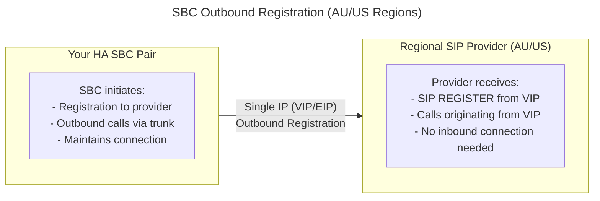
```mermaid
---
title: SBC Outbound Registration (AU/US Regions)
---
flowchart LR
    subgraph SBC["Your HA SBC Pair"]
        direction TB
        SBC_Init["SBC initiates:<br/>- Registration to provider<br/>- Outbound calls via trunk<br/>- Maintains connection"]
    end

    subgraph Provider["Regional SIP Provider (AU/US)"]
        direction TB
        Provider_Recv["Provider receives:<br/>- SIP REGISTER from VIP<br/>- Calls originating from VIP<br/>- No inbound connection needed"]
    end

    SBC -->|"Single IP (VIP/EIP)<br/>Outbound Registration"| Provider
```

**How the VIP Works**

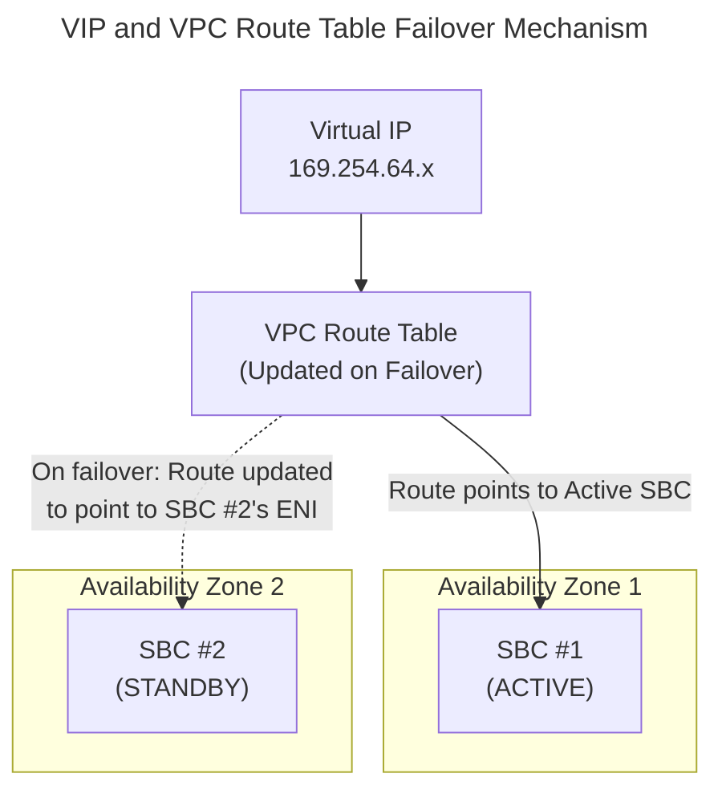
```mermaid
---
title: VIP and VPC Route Table Failover Mechanism
---
flowchart TB
    VIP["Virtual IP<br/>169.254.64.x"]
    RouteTable["VPC Route Table<br/>(Updated on Failover)"]

    subgraph AZ1["Availability Zone 1"]
        SBC1["SBC #1<br/>(ACTIVE)"]
    end

    subgraph AZ2["Availability Zone 2"]
        SBC2["SBC #2<br/>(STANDBY)"]
    end

    VIP --> RouteTable
    RouteTable -->|"Route points to Active SBC"| SBC1
    RouteTable -.->|"On failover: Route updated<br/>to point to SBC #2's ENI"| SBC2
```


#### Traffic Types and Failover Mechanisms

| Traffic Type | Direction | Source IP Type | Failover Mechanism | Provider Action Required |
|--------------|-----------|----------------|-------------------|-------------------------|
| **Internal (SBC to Regional SIP Provider via Direct Connect)** | SBC initiates outbound registration and calls to provider via Direct Connect or VPN | Virtual IP (169.254.x.x) on Internal interface | VPC route table updated to point VIP to new Active SBC's ENI; new Active SBC re-registers | None - transparent |
| **External (Teams from Internet)** | Microsoft Teams infrastructure from public internet | Elastic IP (public) on External interface | Elastic IP reassigned from failed SBC to Standby SBC | None - transparent |

**Note:** Both failover mechanisms are handled automatically by the SBC HA pair calling AWS APIs. The regional SIP provider experiences a brief interruption but does not need to take any action.

#### Information to Exchange with Your Regional SIP Provider

When onboarding a new SIP trunk with a regional SIP provider (SIP Provider AU or SIP Provider US), exchange the following information. The SBC will register with and initiate connections to the provider:

| Information | Value | Notes |
|-------------|-------|-------|
| **SBC Source IP Address** | Virtual IP on Internal interface (e.g., 169.254.64.10) | Provider should expect SIP REGISTER and calls from this IP |
| **Provider's SIP Server Address** | Provided by SIP Provider | The SBC will register to this address |
| **SIP Port** | 5060 (UDP/TCP) or 5061 (TLS) | Based on your security requirements |
| **Registration Credentials** | Username/password from provider | SBC uses these to authenticate with provider |
| **Transport Protocol** | UDP, TCP, or TLS | TLS recommended for security |
| **Codec Support** | G.711, G.729, etc. | As per your configuration |

**Important:** The SBC initiates registration and maintains the connection to the provider. The provider does not need to initiate inbound connections to the SBC. Provide the provider with the **Virtual IP** as the expected source address for SIP traffic.

#### Failover Behavior and Call Impact

Understanding what happens during failover helps set expectations with your regional SIP provider:

| Scenario | Behavior |
|----------|----------|
| **Active calls in progress (PSTN)** | Calls are **dropped** - SIP is not call-stateful across failover. Callers must redial. |
| **Active calls in progress (Teams IP)** | Calls may be **maintained** if using IP-based routing (Teams handles re-INVITE) |
| **New calls during failover** | Brief interruption (seconds) while route table updates; new calls then succeed |
| **New calls after failover** | Route seamlessly via the new Active SBC - no difference from caller perspective |
| **Regional SIP provider reconfiguration** | **Not required** - the new Active SBC re-registers with the provider using the same VIP |

**Key Point:** Communicate to your regional SIP provider that during rare failover events, there may be a brief interruption lasting a few seconds while the new Active SBC re-registers. Active PSTN calls will drop and need to be re-established. However, the provider does **not** need to take any action - the new Active SBC automatically re-registers and resumes normal operation.

#### HA Connectivity Architecture Diagram

The following diagram shows how different entities connect to the HA Proxy SBC pair, distinguishing between external (internet-facing) and internal (private network) connectivity. Note that each region (Australia/US) has its own Proxy SBC pair with regional SIP provider connectivity for PSTN breakout:

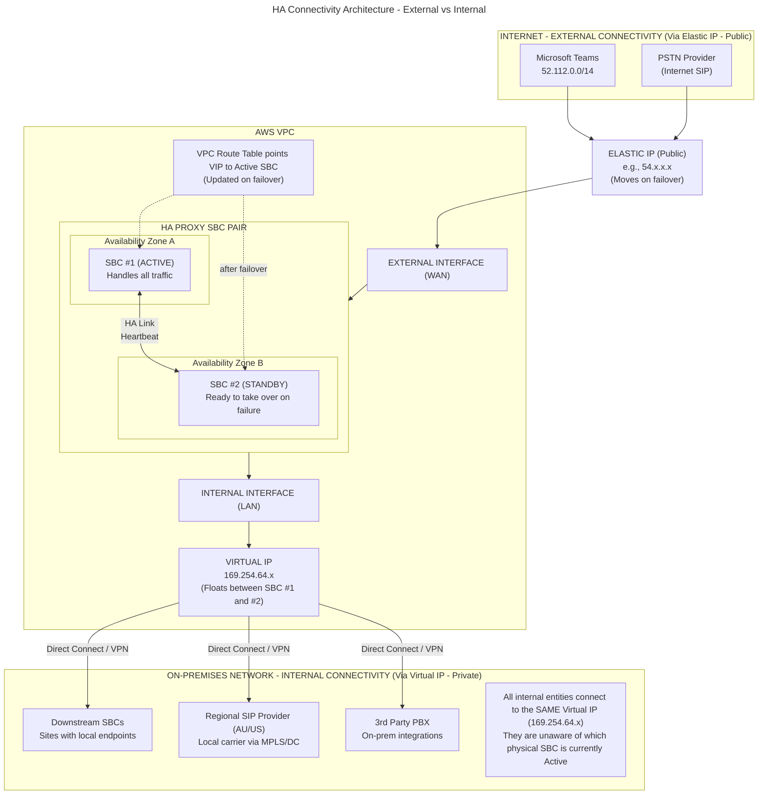
```mermaid
---
title: HA Connectivity Architecture - External vs Internal
---
flowchart TB
    subgraph INTERNET["INTERNET - EXTERNAL CONNECTIVITY (Via Elastic IP - Public)"]
        Teams["Microsoft Teams<br/>52.112.0.0/14"]
        PSTN_Internet["PSTN Provider<br/>(Internet SIP)"]
    end

    EIP["ELASTIC IP (Public)<br/>e.g., 54.x.x.x<br/>(Moves on failover)"]

    subgraph VPC["AWS VPC"]
        WAN["EXTERNAL INTERFACE (WAN)"]

        subgraph SBCPAIR["HA PROXY SBC PAIR"]
            subgraph AZA["Availability Zone A"]
                SBC1["SBC #1 (ACTIVE)<br/>Handles all traffic"]
            end
            subgraph AZB["Availability Zone B"]
                SBC2["SBC #2 (STANDBY)<br/>Ready to take over on failure"]
            end
            SBC1 <-->|"HA Link<br/>Heartbeat"| SBC2
        end

        LAN["INTERNAL INTERFACE (LAN)"]
        VIP["VIRTUAL IP<br/>169.254.64.x<br/>(Floats between SBC #1 and #2)"]

        RouteNote["VPC Route Table points VIP to Active SBC<br/>(Updated on failover)"]
    end

    subgraph ONPREM["ON-PREMISES NETWORK - INTERNAL CONNECTIVITY (Via Virtual IP - Private)"]
        DownstreamSBC["Downstream SBCs<br/>Sites with local endpoints"]
        RegionalSIP["Regional SIP Provider (AU/US)<br/>Local carrier via MPLS/DC"]
        PBX["3rd Party PBX<br/>On-prem integrations"]

        Note["All internal entities connect to the SAME Virtual IP (169.254.64.x)<br/>They are unaware of which physical SBC is currently Active"]
    end

    Teams --> EIP
    PSTN_Internet --> EIP
    EIP --> WAN
    WAN --> SBCPAIR
    SBCPAIR --> LAN
    LAN --> VIP
    VIP -->|"Direct Connect / VPN"| DownstreamSBC
    VIP -->|"Direct Connect / VPN"| RegionalSIP
    VIP -->|"Direct Connect / VPN"| PBX

    RouteNote -.-> SBC1
    RouteNote -.->|"after failover"| SBC2
```

#### Connectivity Summary by Entity Type

| Entity | Location | Connects To | IP Type | Interface | Failover Impact |
|--------|----------|-------------|---------|-----------|-----------------|
| Microsoft Teams | Internet | Elastic IP | Public | External (WAN) | EIP moves to new Active SBC |
| SIP Provider AU (Direct Connect) | On-premises | Virtual IP | Private (169.254.x.x) | Internal (LAN) | Route table updated |
| SIP Provider US (Direct Connect) | On-premises | Virtual IP | Private (169.254.x.x) | Internal (LAN) | Route table updated |
| Downstream SBCs | On-premises | Virtual IP | Private (169.254.x.x) | Internal (LAN) | Route table updated |
| 3rd Party PBX | On-premises | Virtual IP | Private (169.254.x.x) | Internal (LAN) | Route table updated |
| Registered Endpoints | On-premises | Virtual IP | Private (169.254.x.x) | Internal (LAN) | Route table updated |

**Key Design Points:**

1. **External entities** (Teams) connect via the **Elastic IP** on the WAN interface
2. **Internal entities** (downstream SBCs, regional SIP providers, PBX) connect via the **Virtual IP** on the LAN interface
3. **Regional SIP Providers:** Each Proxy SBC region has its own SIP provider for local PSTN breakout (SIP Provider AU for Australian Proxy SBC, SIP Provider US for US Proxy SBC)
4. **Both IP types "float"** - they move to the Active SBC automatically on failover
5. **No entity needs reconfiguration** - the destination IP remains the same regardless of which SBC is Active

### Voice Recording Considerations

When deploying SBCs with Microsoft Teams Direct Routing, organisations using existing voice recording solutions must consider the impact of media encryption on their recording infrastructure.

#### The Challenge

**Typical Voice Recorder Setup:**
- Uses **port mirroring** (SPAN) to capture IP-based RTP traffic
- Uses **analog taps** for traditional analog phones
- Passively captures traffic - needs to "see" unencrypted media

**The Problem:**
- Teams requires **SRTP** (encrypted media) between Teams and the Proxy SBC
- If internal legs are also encrypted, port mirroring captures encrypted data that cannot be decoded
- Port mirroring cannot decrypt SRTP without the session keys

**The Good News:**
- Many modern voice recorders support **SIPREC** (e.g., Eventide NexLog DX-Series, Verint, NICE, Red Box, ASC)
- SIPREC allows the SBC to send a decrypted media copy directly to the recorder
- Full SRTP encryption can be maintained on the network while still recording calls

#### Media Encryption by Segment

| Segment | Encryption | Configurable? | Notes |
|---------|------------|---------------|-------|
| Teams ↔ Proxy SBC | SRTP (mandatory) | No | Microsoft requirement |
| Proxy SBC ↔ Downstream SBC | RTP or SRTP | Yes | IP Profile setting |
| Downstream SBC ↔ IP Phones | RTP or SRTP | Yes | IP Profile setting |
| Proxy SBC ↔ PSTN Provider | Usually RTP | Depends on carrier | Most carriers don't support SRTP |

#### Option 1: Keep Internal Media as RTP (Unencrypted)

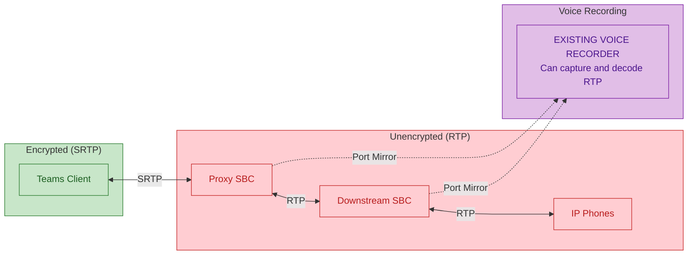
```mermaid
flowchart LR
    subgraph Encrypted["Encrypted (SRTP)"]
        style Encrypted fill:#c8e6c9,stroke:#2e7d32
        Teams["Teams Client"]
    end

    subgraph Unencrypted["Unencrypted (RTP)"]
        style Unencrypted fill:#ffcdd2,stroke:#c62828
        ProxySBC["Proxy SBC"]
        DownstreamSBC["Downstream SBC"]
        IPPhones["IP Phones"]
    end

    subgraph Recording["Voice Recording"]
        style Recording fill:#e1bee7,stroke:#7b1fa2
        Recorder["EXISTING VOICE RECORDER<br/>Can capture and decode RTP"]
    end

    Teams <-->|"SRTP"| ProxySBC
    ProxySBC <-->|"RTP"| DownstreamSBC
    DownstreamSBC <-->|"RTP"| IPPhones

    ProxySBC -.->|"Port Mirror"| Recorder
    DownstreamSBC -.->|"Port Mirror"| Recorder

    classDef encrypted fill:#c8e6c9,stroke:#2e7d32,color:#1b5e20
    classDef unencrypted fill:#ffcdd2,stroke:#c62828,color:#b71c1c
    classDef recorder fill:#e1bee7,stroke:#7b1fa2,color:#4a148c

    class Teams encrypted
    class ProxySBC,DownstreamSBC,IPPhones unencrypted
    class Recorder recorder
```

| Pros | Cons |
|------|------|
| Existing recorder works as-is with port mirroring | No encryption on internal network |
| Simplest option | Security team will likely object |
| No additional cost or config changes | Assumes internal network is "trusted" |

**When this works:** If the internal network is segmented, firewalled, and considered a trusted zone.

#### Option 2: SBC-Based Recording via SIPREC (Recommended)

If the existing voice recorder supports SIPREC (such as Eventide NexLog 740/840, Verint, NICE, Red Box, ASC), this is the recommended approach.

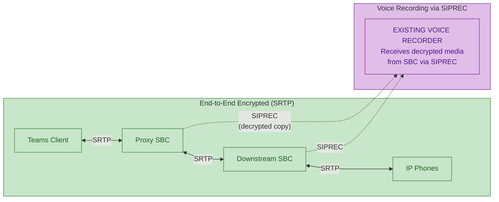
```mermaid
flowchart LR
    subgraph Encrypted["End-to-End Encrypted (SRTP)"]
        style Encrypted fill:#c8e6c9,stroke:#2e7d32
        Teams["Teams Client"]
        ProxySBC["Proxy SBC"]
        DownstreamSBC["Downstream SBC"]
        IPPhones["IP Phones"]
    end

    subgraph Recording["Voice Recording via SIPREC"]
        style Recording fill:#e1bee7,stroke:#7b1fa2
        Recorder["EXISTING VOICE RECORDER<br/>Receives decrypted media<br/>from SBC via SIPREC"]
    end

    Teams <-->|"SRTP"| ProxySBC
    ProxySBC <-->|"SRTP"| DownstreamSBC
    DownstreamSBC <-->|"SRTP"| IPPhones

    ProxySBC -.->|"SIPREC<br/>(decrypted copy)"| Recorder
    DownstreamSBC -.->|"SIPREC"| Recorder

    classDef encrypted fill:#c8e6c9,stroke:#2e7d32,color:#1b5e20
    classDef recorder fill:#e1bee7,stroke:#7b1fa2,color:#4a148c

    class Teams,ProxySBC,DownstreamSBC,IPPhones encrypted
    class Recorder recorder
```

| Pros | Cons |
|------|------|
| End-to-end SRTP maintained on network | SIPREC licensing may be required on recorder |
| SBC handles decryption and sends to recorder | Additional SBC configuration |
| Industry standard approach | Older recorder models may not support SIPREC |
| Selective recording possible | May need to confirm channel capacity |

**Prerequisites:**
1. Confirm existing voice recorder supports SIPREC
2. Confirm SIPREC is licensed/enabled on recorder
3. Confirm sufficient SIPREC channel capacity
4. Configure AudioCodes SBC as SIPREC client (SRC)

#### Option 3: Selective Encryption Based on Recording Needs

Use SBC Classification Rules to identify phones needing recording (by IP, User-Agent, number range) and apply RTP profile to those only, while other phones use SRTP.

| Pros | Cons |
|------|------|
| Balance security and compliance | Complex to manage |
| Only expose what needs recording | Classification rules needed on SBC |
| Security team gets encryption for most calls | Inconsistent security posture |

#### Option 4: Replace Existing Voice Recorder

If the current voice recorder doesn't support SIPREC, consider replacement with a SIPREC-capable recorder such as Eventide NexLog DX-Series, Verint, NICE, Red Box, or ASC.

#### Option 5: Microsoft Teams Native Recording + Existing Recorder for Legacy

Use Microsoft Compliance Recording (Purview or third-party policy-based) for Teams calls, while the existing recorder continues to capture PSTN/legacy calls via port mirroring.

| Pros | Cons |
|------|------|
| Uses native Teams compliance | Two recording systems to manage |
| Existing recorder continues for PSTN/legacy | Data in two places |
| No changes to existing recorder | Teams recording has data sovereignty considerations |

#### Voice Recording Decision Matrix

| Option | Encryption | Existing Recorder Works? | Cost | Complexity | Security Approved? |
|--------|------------|--------------------------|------|------------|---------------------|
| 1. RTP internally | Partial | Yes (port mirror) | None | Low | Unlikely |
| **2. SIPREC** | **Full SRTP** | **Yes (if SIPREC-capable)** | **Low-Medium** | **Medium** | **Yes** |
| 3. Selective | Mixed | For selected phones | Low | High | Partially |
| 4. Replace recorder | Full SRTP | N/A (new recorder) | High | High | Yes |
| 5. Teams native + existing | Full SRTP | For non-Teams only | Low | Medium | Yes |

#### Recommendation

**If the existing voice recorder supports SIPREC:** Option 2 (SIPREC) is recommended - full SRTP encryption on the network while the recorder receives decrypted media via SIPREC from the SBC.

**If the existing voice recorder does not support SIPREC:**
- Option 1 (RTP internally) if security accepts the risk
- Option 5 (Teams native + existing recorder for PSTN) as a hybrid approach
- Option 4 (Replace/upgrade recorder) for long-term compliance

---

## 20. IAM Permissions and Security

### Stack Manager IAM Policy

```json
{
    "Version": "2012-10-17",
    "Statement": [
        {
            "Effect": "Allow",
            "Action": [
                "ec2:*",
                "cloudformation:*",
                "cloudwatch:DeleteAlarms",
                "cloudwatch:PutMetricAlarm",
                "iam:PassRole",
                "iam:ListInstanceProfiles",
                "iam:CreateServiceLinkedRole"
            ],
            "Resource": "*"
        }
    ]
}
```

### SBC IAM Policy (Required for HA Failover)

The SBCs require their own IAM role to perform route table updates during HA failover. This is a more restrictive policy than the Stack Manager.

```json
{
    "Version": "2012-10-17",
    "Statement": [
        {
            "Effect": "Allow",
            "Action": [
                "ec2:DescribeRouteTables",
                "ec2:CreateRoute",
                "ec2:ReplaceRoute",
                "ec2:DeleteRoute",
                "ec2:DescribeNetworkInterfaces",
                "ec2:DescribeInstances"
            ],
            "Resource": "*"
        }
    ]
}
```

### IAM Role Creation Steps

#### Stack Manager Role

1. Navigate to **AWS IAM Console** > **Policies** > **Create Policy**
2. Select **JSON** tab and paste the Stack Manager policy above
3. Name the policy (e.g., `AudioCodes-StackManager-Policy`)
4. Click **Create Policy**
5. Navigate to **Roles** > **Create Role**
6. Select **EC2** as the trusted entity
7. Attach the policy created above
8. Name the role (e.g., `AudioCodes-StackManager-Role`)
9. Click **Create Role**
10. Attach this role to the Stack Manager EC2 instance via **Actions** > **Security** > **Modify IAM Role**

#### SBC Role

1. Navigate to **AWS IAM Console** > **Policies** > **Create Policy**
2. Select **JSON** tab and paste the SBC policy above
3. Name the policy (e.g., `AudioCodes-SBC-HA-Policy`)
4. Click **Create Policy**
5. Navigate to **Roles** > **Create Role**
6. Select **EC2** as the trusted entity
7. Attach the policy created above
8. Name the role (e.g., `AudioCodes-SBC-Role`)
9. Click **Create Role**
10. Attach this role to both SBC EC2 instances (typically done via Stack Manager during deployment)

---

## 21. Cyber Security Variation: Stack Manager Component

### Overview

The **AudioCodes Stack Manager** is a new infrastructure component introduced to support High Availability SBC deployments across multiple AWS Availability Zones. This section documents the security considerations, permissions, and risk assessment required for cyber security approval.

### Component Classification

| Attribute | Value |
|-----------|-------|
| **Component Type** | Management/Orchestration VM |
| **Vendor** | AudioCodes |
| **Deployment** | AWS EC2 (t3.medium) |
| **Network Zone** | Management Subnet |
| **Data Classification** | Infrastructure Management |
| **New Component** | Yes - Required for multi-AZ SBC HA deployment |

### Functional Description

The Stack Manager is a dedicated virtual machine that performs the following functions:

#### Primary Functions (Initial Deployment)
1. **CloudFormation Orchestration:** Creates and manages AWS CloudFormation stacks for SBC HA deployment
2. **Network Configuration:** Configures ENIs, security groups, and route table entries for Virtual IPs
3. **Virtual IP Allocation:** Allocates Virtual IPs from the 169.254.64.0/24 range for HA routing
4. **Instance Provisioning:** Deploys SBC EC2 instances with correct IAM roles and network attachments

#### Day 2 Operations (Ongoing Management)
1. **Software Updates:** Facilitates SBC software upgrades across the HA pair
2. **Stack Healing:** Repairs corrupted cloud resources or misconfigurations
3. **Topology Changes:** Manages changes to SBC cluster topology
4. **Configuration Backup:** Supports configuration backup and recovery operations

#### What Stack Manager Does NOT Do
- **Does NOT participate in active HA failover** - SBCs handle this directly via AWS API calls
- Does NOT process voice traffic or signalling
- Does NOT store call records or user data
- Does NOT require persistent connections to SBCs during normal operation

### IAM Permissions Required

The Stack Manager requires an IAM role with the following permissions:

```json
{
    "Version": "2012-10-17",
    "Statement": [
        {
            "Effect": "Allow",
            "Action": [
                "ec2:*",
                "cloudformation:*",
                "cloudwatch:DeleteAlarms",
                "cloudwatch:PutMetricAlarm",
                "iam:PassRole",
                "iam:ListInstanceProfiles",
                "iam:CreateServiceLinkedRole"
            ],
            "Resource": "*"
        }
    ]
}
```

#### Permission Justification

| Permission | Justification | Risk Level |
|------------|---------------|------------|
| `ec2:*` | Required to create/modify EC2 instances, ENIs, security groups, and route tables for SBC deployment | Medium |
| `cloudformation:*` | Required to create and manage CloudFormation stacks for infrastructure-as-code deployment | Medium |
| `cloudwatch:DeleteAlarms`, `cloudwatch:PutMetricAlarm` | Required to configure monitoring alarms for SBC health | Low |
| `iam:PassRole` | Required to assign IAM roles to SBC instances during deployment | Medium |
| `iam:ListInstanceProfiles` | Required to enumerate available instance profiles for SBC assignment | Low |
| `iam:CreateServiceLinkedRole` | Required to create service-linked roles for AWS services (e.g., ELB) | Low |

#### Scope Limitation Recommendations

For enhanced security posture, consider restricting the `ec2:*` permission to specific resource ARNs or tags:

```json
{
    "Effect": "Allow",
    "Action": [
        "ec2:*"
    ],
    "Resource": "*",
    "Condition": {
        "StringEquals": {
            "ec2:ResourceTag/Project": "AudioCodes-Voice"
        }
    }
}
```

### Network Security Requirements

#### Inbound Traffic

| Source | Protocol | Port | Purpose |
|--------|----------|------|---------|
| Admin CIDR | TCP | 22 | SSH Management |
| Admin CIDR | TCP | 443 | HTTPS Web Management |

#### Outbound Traffic

| Destination | Protocol | Port | Purpose |
|-------------|----------|------|---------|
| AWS API Endpoints | TCP | 443 | EC2, CloudFormation, IAM API calls |
| VPC CIDR | All | All | Communication with SBC instances |

#### Network Placement

- **Recommended:** Place in management subnet with NAT Gateway egress
- **Not Recommended:** Direct internet exposure via public IP
- **Alternative:** Use VPC Endpoints (PrivateLink) for AWS API access to eliminate internet egress requirement

### Security Considerations

#### Attack Surface Analysis

| Vector | Risk | Mitigation |
|--------|------|------------|
| Web Management Interface | Medium | Restrict to admin CIDR, use strong authentication |
| SSH Access | Medium | Key-based auth only, restrict to bastion/admin CIDR |
| IAM Role Compromise | High | Use least-privilege, enable CloudTrail logging |
| Network Exposure | Low | Private subnet, no public IP, security group restrictions |

#### Data Handling

| Data Type | Handled | Storage | Sensitivity |
|-----------|---------|---------|-------------|
| AWS API Credentials | Yes (via IAM Role) | None (instance metadata) | High |
| SBC Configuration | Yes (during deployment) | Temporary | Medium |
| Voice/Call Data | No | N/A | N/A |
| User PII | No | N/A | N/A |

#### Logging and Monitoring

| Log Type | Source | Retention Recommendation |
|----------|--------|-------------------------|
| AWS API Calls | CloudTrail | 90 days minimum |
| Stack Manager System Logs | EC2 instance | 30 days |
| CloudFormation Events | CloudFormation | 90 days |

### Compliance Considerations

#### SOC 2 Relevance
- Stack Manager has elevated AWS permissions - ensure access is restricted and logged
- Include in quarterly access reviews
- Document change management procedures for Stack Manager operations

#### PCI-DSS Relevance
- Stack Manager does not process, store, or transmit cardholder data
- Included in scope as supporting infrastructure if voice system handles payment card information

### Risk Assessment Summary

| Risk Category | Rating | Notes |
|---------------|--------|-------|
| **Confidentiality** | Low | Does not handle sensitive user/call data |
| **Integrity** | Medium | Has ability to modify infrastructure; changes are logged |
| **Availability** | Low | Not in critical path for call processing; SBCs handle failover independently |
| **Overall Risk** | Medium | Elevated AWS permissions require appropriate access controls |

### Approval Checklist

- [ ] IAM role created with documented permissions
- [ ] Security group restricts access to admin CIDR only
- [ ] CloudTrail logging enabled for AWS API calls
- [ ] Break glass account configured and documented
- [ ] Placed in private subnet with NAT Gateway egress
- [ ] Access restricted to authorized personnel only
- [ ] Included in vulnerability scanning scope
- [ ] Change management process documented

---

## 22. Licensing Considerations

### Mediant VE SBC Licensing

| Model | Description | Procurement | Notes |
|-------|-------------|-------------|-------|
| BYOL | Bring Your Own License | Purchase from AudioCodes, request via [BYOL form](https://online.audiocodes.com/aws-license) | License file applied to SBC |
| PAYG | Pay-As-You-Go | Consumed via AWS Marketplace billing | Hourly billing through AWS |
| Capacity | Session-based licensing | Based on concurrent sessions | Scale license with capacity needs |

### ARM Licensing

- Obtained directly from AudioCodes
- Configured via ARM Configurator web interface
- License types include:
  - **Base license:** Required for all deployments
  - **Router license:** Per-router licensing
  - **Advanced features:** Additional licensing for premium features

### OVOC Licensing

- Obtained directly from AudioCodes
- Based on number of managed devices
- License tiers:
  - **Device count:** Number of SBCs and endpoints managed
  - **Analytics license:** **Required for Teams QoE integration**
  - **Advanced reporting:** Optional enhanced reporting features

---

## 23. References and Documentation

### 23.1 Official AudioCodes Documentation

| Document | Version | URL |
|----------|---------|-----|
| Mediant VE SBC for AWS Installation Manual | 7.4 | [PDF](https://www.audiocodes.com/media/15887/mediant-virtual-edition-sbc-for-amazon-aws-installation-manual-ver-74.pdf) |
| Mediant VE SBC for AWS Installation Manual | 7.6 | [PDF](https://www.audiocodes.com/media/eiwnmvt1/mediant-virtual-edition-sbc-for-amazon-aws-installation-manual-ver-76.pdf) |
| Stack Manager User's Manual | 7.4 | [PDF](https://www.audiocodes.com/media/15907/stack-manager-for-mediant-ve-ce-sbc-users-manual-ver-74.pdf) |
| Stack Manager User's Manual | 7.6 | [PDF](https://www.audiocodes.com/media/etznhxaq/stack-manager-for-mediant-ve-ce-sbc-users-manual-ver-76.pdf) |
| ARM Installation Manual | 10.0 | [PDF](https://www.audiocodes.com/media/vgknljog/audiocodes-routing-manager-arm-installation-manual-ver-100.pdf) |
| ARM User's Manual | 9.8 | [Web](https://techdocs.audiocodes.com/arm/user-manual/version-980/) |
| ARM Azure AD Configuration | 10.0 | [Web](https://techdocs.audiocodes.com/arm/user-manual/version-10/Content/ARM%20UM/Configuring%20the%20ARM%20in%20the%20Azure%20Portal.htm) |
| OVOC IOM Manual | 8.2 | [PDF](https://www.audiocodes.com/media/zfkonbrb/one-voice-operations-center-iom-manual-ver-8-2.pdf) |
| OVOC Server Requirements | 8.4 | [Web](https://techdocs.audiocodes.com/one-voice-operations-center-ovoc/iom-manual/version-840/Content/OVOC%20IOM/OVOC%20Server%20Minimum%20Requirements.htm) |
| Configure Microsoft Graph API | - | [Web](https://techdocs.audiocodes.com/live/customer-all-um/Content/PS%20Installation/Step%202%20Configure%20Microsoft.htm) |
| SBC Teams Direct Routing Config | - | [PDF](https://www.audiocodes.com/media/13253/connecting-audiocodes-sbc-to-microsoft-teams-direct-routing-enterprise-model-configuration-note.pdf) |

### 23.2 Microsoft Documentation

| Document | URL |
|----------|-----|
| Plan Direct Routing | [Microsoft Learn](https://learn.microsoft.com/en-us/microsoftteams/direct-routing-plan) |
| Connect SBC to Direct Routing | [Microsoft Learn](https://learn.microsoft.com/en-us/microsoftteams/direct-routing-connect-the-sbc) |
| Configure Direct Routing | [Microsoft Learn](https://learn.microsoft.com/en-us/microsoftteams/direct-routing-configure) |
| Direct Routing SIP Protocol | [Microsoft Learn](https://learn.microsoft.com/en-us/microsoftteams/direct-routing-protocols-sip) |
| Enable Users for Direct Routing | [Microsoft Learn](https://learn.microsoft.com/en-us/microsoftteams/direct-routing-enable-users) |
| Teams Administrator Roles | [Microsoft Learn](https://learn.microsoft.com/en-us/microsoftteams/using-admin-roles) |
| Microsoft Graph CallRecords API | [Microsoft Learn](https://learn.microsoft.com/en-us/graph/api/resources/callrecords-api-overview) |
| Microsoft Trusted Root Certificate Program | [Microsoft Learn](https://docs.microsoft.com/en-us/security/trusted-root/participants-list) |

### 23.3 AudioCodes Product Pages

| Product | URL |
|---------|-----|
| Mediant VE SBC | [Product Page](https://www.audiocodes.com/solutions-products/products/session-border-controllers-sbcs/mediant-vese) |
| ARM | [Product Page](https://www.audiocodes.com/solutions-products/products/management-products-solutions/audiocodes-routing-manager) |
| OVOC | [Product Page](https://www.audiocodes.com/solutions-products/products/management-products-solutions/one-voice-operations-center) |
| Device Manager | [Product Page](https://www.audiocodes.com/solutions-products/products/management-products-solutions/device-manager) |

### 23.4 AWS Marketplace Links

| Product | URL |
|---------|-----|
| Mediant VE SBC (BYOL) | [AWS Marketplace](https://aws.amazon.com/marketplace/pp/prodview-lzov3dr64koi2) |
| Mediant VE SBC (PAYG) | [AWS Marketplace](https://aws.amazon.com/marketplace/pp/prodview-4wxi3q2ixfcz2) |
| Stack Manager | [AWS Marketplace](https://aws.amazon.com/marketplace/search/results?searchTerms=audiocodes+stack+manager) |
| ARM | [AWS Marketplace](https://aws.amazon.com/marketplace/search/results?searchTerms=audiocodes+arm) |

### 23.5 Third-Party References

| Source | Description | URL |
|--------|-------------|-----|
| Shawn Harry Blog | Enabling Teams QoE in OVOC | [Link](https://shawnharry.co.uk/2021/07/21/enabling-teams-qoe-reports-in-audiocodes-ovoc/) |
| CanUCThis | Installing OVOC Guide | [Link](https://canucthis.com/2021/02/installing-and-configuring-audiocodes-one-voice-operations-center-ovoc/) |
| Erik365 Blog | Teams Direct Routing Certificate Changes (2026) | [Link](https://erik365.blog/2025/12/18/upcoming-certificate-changes-for-microsoft-teams-direct-routing-and-operator-connect-june-2026/) |
| AudioCodes Community | AudioCodes Technical Forums | [Link](https://www.audiocodes.com/services-support/community) |

---

## Appendix A: Deployment Checklist

### Pre-Deployment

- [ ] AWS Account access confirmed
- [ ] VPC and subnet design finalized
- [ ] Security groups designed and documented
- [ ] IAM policy and role created for Stack Manager
- [ ] Key pairs created
- [ ] AudioCodes licensing obtained (or PAYG decision made)
- [ ] Public CA certificates procured for SBCs and OVOC
- [ ] Domain registered and verified in Microsoft 365 tenant
- [ ] DNS records planned

### Microsoft Entra ID Configuration

- [ ] OVOC App Registration created
- [ ] ARM WebUI App Registration created
- [ ] ARM REST API App Registration created
- [ ] SBC App Registration created (if SBA required)
- [ ] All API permissions configured
- [ ] Admin consent granted for all app registrations
- [ ] All credentials documented securely
- [ ] Client secret expiry dates calendared

### Break Glass Accounts

- [ ] Secret repository structure created
- [ ] All break glass accounts created on appliances
- [ ] All passwords stored securely in secret repository
- [ ] Access procedures documented
- [ ] Dual-control access configured
- [ ] Break glass account testing scheduled

### Component Deployment

- [ ] Stack Manager deployed and verified
- [ ] Stack Manager IAM role attached
- [ ] SBC HA pair deployed via Stack Manager
- [ ] TLS certificates installed on SBCs
- [ ] SBC HA failover tested
- [ ] ARM Configurator deployed
- [ ] ARM Configurator OAuth configured
- [ ] ARM Router(s) deployed
- [ ] ARM licensing applied
- [ ] OVOC deployed (production only)
- [ ] OVOC public certificate installed
- [ ] All break glass accounts tested

### Integration Verification

- [ ] OAuth authentication working for all components
- [ ] OVOC receiving Teams QoE data
- [ ] SBCs registered in Teams Admin Center
- [ ] Voice routing policies configured
- [ ] PSTN usages configured
- [ ] Test users enabled for Direct Routing
- [ ] End-to-end calling tested
- [ ] HA failover tested and documented
- [ ] Monitoring and alerting configured

---

## Appendix B: Credentials Reference Template

### App Registration Credentials

| App Registration | Tenant ID | Client ID | Secret Expiry | Notes |
|-----------------|-----------|-----------|---------------|-------|
| AudioCodes-OVOC-Teams-Integration | `________` | `________` | `________` | OVOC Teams QoE |
| AudioCodes-ARM-WebUI | `________` | `________` | `________` | ARM Web Interface |
| AudioCodes-ARM-REST-API | `________` | `________` | `________` | ARM API Access |
| AudioCodes-SBC-DirectRouting | `________` | `________` | `________` | SBA Functionality |

### Break Glass Account Reference

| Component | Environment | Username | Secret Path |
|-----------|-------------|----------|-------------|
| Stack Manager | Non-Prod | `breakglass-stackmgr-nonprod` | `/audiocodes/nonprod/breakglass-stackmgr-nonprod` |
| SBC #1 | Non-Prod | `breakglass-sbc1-nonprod` | `/audiocodes/nonprod/breakglass-sbc1-nonprod` |
| SBC #2 | Non-Prod | `breakglass-sbc2-nonprod` | `/audiocodes/nonprod/breakglass-sbc2-nonprod` |
| ARM Configurator | Non-Prod | `breakglass-armcfg-nonprod` | `/audiocodes/nonprod/breakglass-armcfg-nonprod` |
| ARM Router | Non-Prod | `breakglass-armrtr-nonprod` | `/audiocodes/nonprod/breakglass-armrtr-nonprod` |
| Stack Manager | Prod AUS | `breakglass-stackmgr-prod-aus` | `/audiocodes/prod-aus/breakglass-stackmgr-prod-aus` |
| SBC #1 | Prod AUS | `breakglass-sbc1-prod-aus` | `/audiocodes/prod-aus/breakglass-sbc1-prod-aus` |
| SBC #2 | Prod AUS | `breakglass-sbc2-prod-aus` | `/audiocodes/prod-aus/breakglass-sbc2-prod-aus` |
| OVOC | Prod | `breakglass-ovoc-prod` | `/audiocodes/prod-aus/breakglass-ovoc-prod` |
| ARM Configurator | Prod | `breakglass-armcfg-prod` | `/audiocodes/prod-aus/breakglass-armcfg-prod` |
| ARM Router | Prod AUS | `breakglass-armrtr-prod-aus` | `/audiocodes/prod-aus/breakglass-armrtr-prod-aus` |
| Stack Manager | Prod US | `breakglass-stackmgr-prod-us` | `/audiocodes/prod-us/breakglass-stackmgr-prod-us` |
| SBC #1 | Prod US | `breakglass-sbc1-prod-us` | `/audiocodes/prod-us/breakglass-sbc1-prod-us` |
| SBC #2 | Prod US | `breakglass-sbc2-prod-us` | `/audiocodes/prod-us/breakglass-sbc2-prod-us` |
| ARM Router | Prod US | `breakglass-armrtr-prod-us` | `/audiocodes/prod-us/breakglass-armrtr-prod-us` |

**Note:** Never store actual credentials in this document. Use the secret repository paths to retrieve credentials when needed.

---

## Appendix C: Quick Reference Tables

### Port Summary

#### Signalling Ports

| Component | Protocol | Port | Direction | Purpose |
|-----------|----------|------|-----------|---------|
| SBC | TCP/TLS | 5061 | Inbound/Outbound | SIP Signalling (Teams Direct Routing) |
| SBC | TCP/UDP | 5060 | Inbound | SIP Signalling (Unencrypted - Internal) |
| SBC | TCP | 443 | Inbound | HTTPS Management |
| SBC | TCP | 22 | Inbound | SSH Management |
| ARM | TCP | 443 | Inbound | HTTPS Web UI / REST API |
| ARM | TCP | 22 | Inbound | SSH Management |
| OVOC | TCP | 443 | Inbound | HTTPS Web UI |
| OVOC | UDP | 162 | Inbound | SNMP Traps from SBCs |
| OVOC | TCP | 5001 | Inbound | QoE Reporting from SBCs |
| Stack Manager | TCP | 443 | Inbound | HTTPS Management |
| Stack Manager | TCP | 22 | Inbound | SSH Management |
| Stack Manager | TCP | 443 | Outbound | AWS API Access |

#### Media Ports

| Component | Protocol | Port Range | Direction | Purpose |
|-----------|----------|------------|-----------|---------|
| SBC | UDP | 6000-65535 | Inbound/Outbound | RTP/SRTP Media |
| SBC | UDP | 49152-53247 | Outbound | Microsoft Teams Media |

### IP Range Summary (Microsoft Teams)

| Purpose | IP Ranges | Protocol | Ports |
|---------|-----------|----------|-------|
| Teams Media | 52.112.0.0/14 | UDP | 49152-53247 |
| Teams Media | 52.120.0.0/14 | UDP | 49152-53247 |
| Teams Signalling | sip.pstnhub.microsoft.com | TCP/TLS | 5061 |
| Teams Signalling | sip2.pstnhub.microsoft.com | TCP/TLS | 5061 |
| Teams Signalling | sip3.pstnhub.microsoft.com | TCP/TLS | 5061 |
| Microsoft Graph API | graph.microsoft.com | TCP/HTTPS | 443 |
| Azure AD Authentication | login.microsoftonline.com | TCP/HTTPS | 443 |

### Instance Type Summary

| Component | Environment | Instance Type | vCPUs | Memory | Storage |
|-----------|-------------|---------------|-------|--------|---------|
| Stack Manager | All | t3.medium | 2 | 4 GiB | 8 GiB gp3 |
| Mediant VE SBC (No Transcoding) | All | m5n.large | 2 | 8 GiB | 20 GiB gp3 |
| Mediant VE SBC (With Transcoding) | All | c5.2xlarge | 8 | 16 GiB | 20 GiB gp3 |
| ARM Configurator | All | m4.xlarge | 4 | 16 GiB | 100 GB gp3 |
| ARM Router | All | m4.large | 2 | 8 GiB | 80 GB gp3 |
| OVOC (Low Profile) | Production | m5.2xlarge | 8 | 32 GiB | 500 GiB gp3 |
| OVOC (High Profile) | Production | m5.4xlarge | 16 | 64 GiB | 2 TiB gp3 |

---

## Appendix D: Network Flow Diagrams

This appendix provides visual representations of all network flows in the AudioCodes SBC architecture.

### D.1 High-Level Architecture Overview

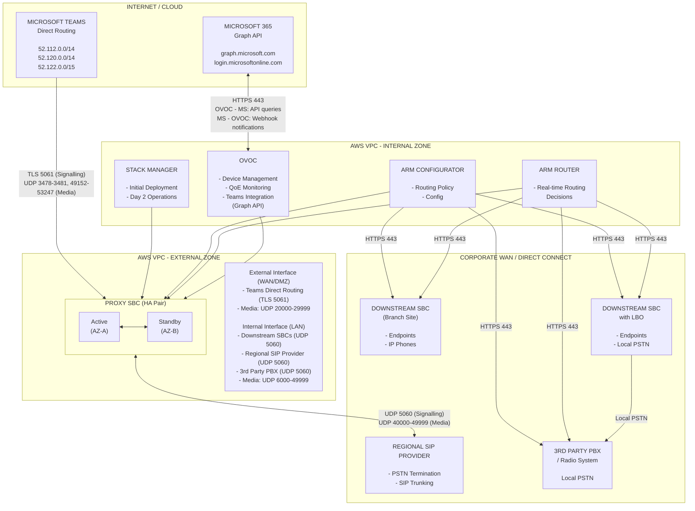
```mermaid
flowchart TB
    subgraph Internet["INTERNET / CLOUD"]
        Teams["MICROSOFT TEAMS<br/>Direct Routing<br/><br/>52.112.0.0/14<br/>52.120.0.0/14<br/>52.122.0.0/15"]
        M365["MICROSOFT 365<br/>Graph API<br/><br/>graph.microsoft.com<br/>login.microsoftonline.com"]
    end

    subgraph ExternalZone["AWS VPC - EXTERNAL ZONE"]
        subgraph ProxySBC["PROXY SBC (HA Pair)"]
            Active["Active<br/>(AZ-A)"]
            Standby["Standby<br/>(AZ-B)"]
            Active <--> Standby
        end
        ProxySBCInfo["External Interface (WAN/DMZ)<br/>- Teams Direct Routing (TLS 5061)<br/>- Media: UDP 20000-29999<br/><br/>Internal Interface (LAN)<br/>- Downstream SBCs (UDP 5060)<br/>- Regional SIP Provider (UDP 5060)<br/>- 3rd Party PBX (UDP 5060)<br/>- Media: UDP 6000-49999"]
    end

    subgraph InternalZone["AWS VPC - INTERNAL ZONE"]
        StackMgr["STACK MANAGER<br/><br/>- Initial Deployment<br/>- Day 2 Operations"]
        ARMConfig["ARM CONFIGURATOR<br/><br/>- Routing Policy<br/>- Config"]
        ARMRouter["ARM ROUTER<br/><br/>- Real-time Routing<br/>  Decisions"]
        OVOC["OVOC<br/><br/>- Device Management<br/>- QoE Monitoring<br/>- Teams Integration<br/>  (Graph API)"]
    end

    subgraph CorpWAN["CORPORATE WAN / DIRECT CONNECT"]
        SIPProvider["REGIONAL SIP PROVIDER<br/><br/>- PSTN Termination<br/>- SIP Trunking"]
        DownstreamSBC1["DOWNSTREAM SBC<br/>(Branch Site)<br/><br/>- Endpoints<br/>- IP Phones"]
        DownstreamSBC2["DOWNSTREAM SBC<br/>with LBO<br/><br/>- Endpoints<br/>- Local PSTN"]
        ThirdPartyPBX["3RD PARTY PBX<br/>/ Radio System<br/><br/>Local PSTN"]
    end

    Teams -->|"TLS 5061 (Signalling)<br/>UDP 3478-3481, 49152-53247 (Media)"| ProxySBC
    M365 <-->|"HTTPS 443<br/>OVOC - MS: API queries<br/>MS - OVOC: Webhook notifications"| OVOC

    StackMgr --> ProxySBC
    ARMConfig --> ProxySBC
    ARMRouter --> ProxySBC
    OVOC --> ProxySBC

    ProxySBC <-->|"UDP 5060 (Signalling)<br/>UDP 40000-49999 (Media)"| SIPProvider

    ARMConfig -->|"HTTPS 443"| DownstreamSBC1
    ARMConfig -->|"HTTPS 443"| DownstreamSBC2
    ARMRouter -->|"HTTPS 443"| DownstreamSBC1
    ARMRouter -->|"HTTPS 443"| DownstreamSBC2
    ARMConfig -->|"HTTPS 443"| ThirdPartyPBX
    ARMRouter -->|"HTTPS 443"| ThirdPartyPBX

    DownstreamSBC2 -->|"Local PSTN"| ThirdPartyPBX
```

---

### D.2 SIP Signalling Flows

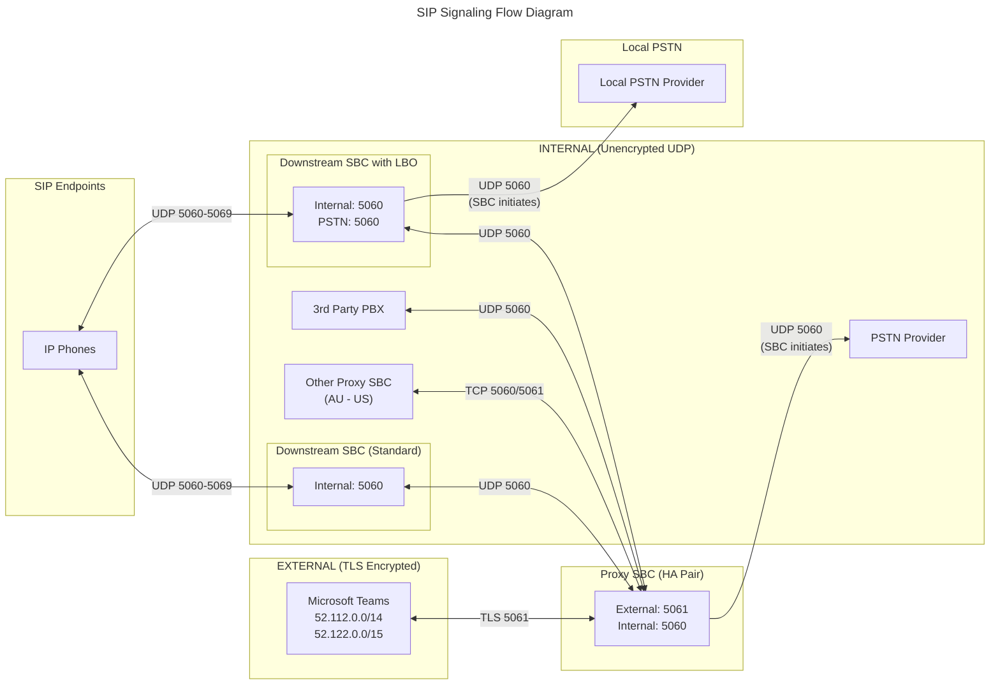
```mermaid
---
title: SIP Signaling Flow Diagram
---
flowchart LR
    subgraph external["EXTERNAL (TLS Encrypted)"]
        Teams["Microsoft Teams<br/>52.112.0.0/14<br/>52.122.0.0/15"]
    end

    subgraph proxy["Proxy SBC (HA Pair)"]
        ProxySBC["External: 5061<br/>Internal: 5060"]
    end

    subgraph internal["INTERNAL (Unencrypted UDP)"]
        PSTN["PSTN Provider"]
        PBX["3rd Party PBX"]
        OtherProxy["Other Proxy SBC<br/>(AU - US)"]

        subgraph downstream["Downstream SBC (Standard)"]
            DownstreamSBC["Internal: 5060"]
        end

        subgraph downstreamLBO["Downstream SBC with LBO"]
            DownstreamLBO["Internal: 5060<br/>PSTN: 5060"]
        end
    end

    subgraph endpoints["SIP Endpoints"]
        IPPhones["IP Phones"]
    end

    subgraph localPSTN["Local PSTN"]
        LocalProvider["Local PSTN Provider"]
    end

    %% External TLS - Bidirectional
    Teams <-->|"TLS 5061"| ProxySBC

    %% Internal UDP - Bidirectional
    DownstreamSBC <-->|"UDP 5060"| ProxySBC
    PBX <-->|"UDP 5060"| ProxySBC
    OtherProxy <-->|"TCP 5060/5061"| ProxySBC
    DownstreamLBO <-->|"UDP 5060"| ProxySBC

    %% Internal UDP - Unidirectional (SBC initiates)
    ProxySBC -->|"UDP 5060<br/>(SBC initiates)"| PSTN

    %% Downstream endpoints
    IPPhones <-->|"UDP 5060-5069"| DownstreamSBC
    IPPhones <-->|"UDP 5060-5069"| DownstreamLBO

    %% LBO to local PSTN
    DownstreamLBO -->|"UDP 5060<br/>(SBC initiates)"| LocalProvider
```

---

### D.3 Media (RTP/SRTP) Flows


```mermaid
flowchart TB
    subgraph LEGEND["Legend"]
        direction LR
        L1["SRTP = Encrypted Media"]
        L2["RTP = Unencrypted Media"]
    end

    subgraph PROXY["PROXY SBC"]
        direction TB

        subgraph EXT["EXTERNAL INTERFACE - WAN/DMZ"]
            M365["M365_Media_Realm<br/>UDP 20000-29999<br/>SRTP - Encrypted"]
        end

        subgraph INT["INTERNAL INTERFACE - LAN"]
            INTERNAL["Internal_Media_Realm<br/>UDP 6000-9999<br/>RTP - Unencrypted"]
            PSTN_PROXY["PSTN_Media_Realm<br/>UDP 40000-49999<br/>RTP - Unencrypted"]
            LMO["LMO_Media_Realm<br/>UDP 30000-39999<br/>RTP - Local Endpoints"]
        end
    end

    subgraph EXTERNAL_ENDPOINTS["EXTERNAL ENDPOINTS"]
        TEAMS["Microsoft Teams<br/>UDP 3478-3481<br/>UDP 49152-53247"]
        TEAMS_LMO["Teams LMO Endpoints<br/>UDP 3478-3481<br/>UDP 49152-53247"]
    end

    subgraph INTERNAL_ENDPOINTS["INTERNAL ENDPOINTS"]
        DS_SBC["Downstream SBCs"]
        PBX["3rd Party PBX"]
        OTHER_PROXY["Other Proxy SBC"]
        SIP_PROVIDER["Regional SIP Provider<br/>AU/US"]
        LMO_DEST["Teams Local Media<br/>Optimization"]
    end

    subgraph DOWNSTREAM["DOWNSTREAM SBC"]
        direction TB
        DS_INTERNAL["Internal_Media_Realm<br/>RTP - Unencrypted"]
        DS_PROXY_PORT["To Proxy SBC<br/>UDP 10000-19999"]
        DS_ENDPOINTS["To Registered Endpoints<br/>UDP 30000-39999"]
    end

    subgraph DOWNSTREAM_LBO["DOWNSTREAM SBC WITH LOCAL BREAKOUT"]
        direction TB
        LBO_INTERNAL["Internal_Media_Realm<br/>RTP - Unencrypted"]
        LBO_PROXY_PORT["To Proxy SBC<br/>UDP 10000-19999"]
        LBO_ENDPOINTS["To Registered Endpoints<br/>UDP 30000-39999"]
        LBO_PSTN["PSTN_Media_Realm<br/>RTP - Unencrypted"]
        LBO_PROVIDER["To Local PSTN Provider<br/>UDP 40000-49999"]
    end

    %% SRTP Encrypted Flows
    M365 <-->|"SRTP"| TEAMS
    M365 <-->|"SRTP"| TEAMS_LMO

    %% RTP Unencrypted Flows from Proxy SBC
    INTERNAL -->|"RTP"| DS_SBC
    INTERNAL -->|"RTP"| PBX
    INTERNAL -->|"RTP"| OTHER_PROXY
    PSTN_PROXY -->|"RTP"| SIP_PROVIDER
    LMO -->|"RTP"| LMO_DEST

    %% Downstream SBC Flows
    DS_INTERNAL --> DS_PROXY_PORT
    DS_INTERNAL --> DS_ENDPOINTS

    %% Downstream SBC with LBO Flows
    LBO_INTERNAL --> LBO_PROXY_PORT
    LBO_INTERNAL --> LBO_ENDPOINTS
    LBO_PSTN --> LBO_PROVIDER

    %% Styling
    classDef encrypted fill:#2d5a27,stroke:#1a3518,color:#fff
    classDef unencrypted fill:#8b4513,stroke:#5c2d0e,color:#fff
    classDef external fill:#1e3a5f,stroke:#0d1f33,color:#fff
    classDef sbc fill:#4a4a4a,stroke:#2d2d2d,color:#fff

    class M365 encrypted
    class INTERNAL,PSTN_PROXY,LMO,DS_INTERNAL,LBO_INTERNAL,LBO_PSTN unencrypted
    class TEAMS,TEAMS_LMO external
    class PROXY,DOWNSTREAM,DOWNSTREAM_LBO sbc
```

---

### D.4 Management & Monitoring Flows

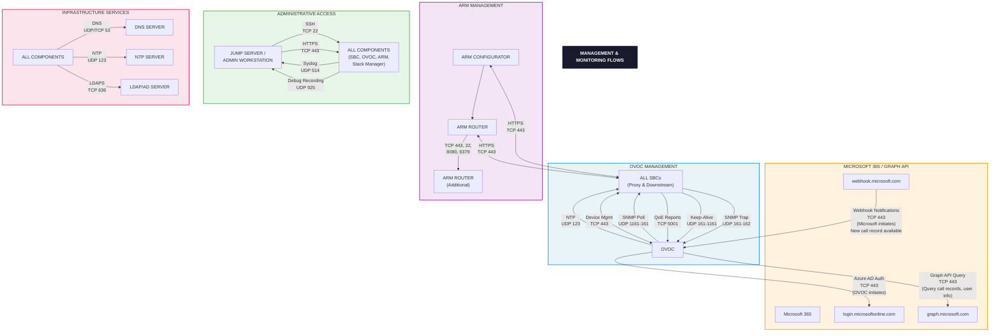
```mermaid
flowchart TB
    subgraph title[" "]
        direction TB
        titleText["MANAGEMENT & MONITORING FLOWS"]
    end

    subgraph ovocMgmt["OVOC MANAGEMENT"]
        direction LR
        SBCs["ALL SBCs<br/>(Proxy & Downstream)"]
        OVOC["OVOC"]
    end

    subgraph msGraph["MICROSOFT 365 / GRAPH API"]
        direction TB
        M365["Microsoft 365"]
        LoginMS["login.microsoftonline.com"]
        GraphMS["graph.microsoft.com"]
        WebhookMS["webhook.microsoft.com"]
    end

    subgraph armMgmt["ARM MANAGEMENT"]
        direction TB
        ARMConfig["ARM CONFIGURATOR"]
        ARMRouter["ARM ROUTER"]
        ARMRouterAdd["ARM ROUTER<br/>(Additional)"]
    end

    subgraph adminAccess["ADMINISTRATIVE ACCESS"]
        direction LR
        JumpServer["JUMP SERVER /<br/>ADMIN WORKSTATION"]
        AllComponents["ALL COMPONENTS<br/>(SBC, OVOC, ARM,<br/>Stack Manager)"]
    end

    subgraph infraServices["INFRASTRUCTURE SERVICES"]
        direction LR
        Components["ALL COMPONENTS"]
        DNS["DNS SERVER"]
        NTP["NTP SERVER"]
        LDAP["LDAP/AD SERVER"]
    end

    %% OVOC Management Flows
    SBCs -->|"SNMP Trap<br/>UDP 161-162"| OVOC
    OVOC -->|"SNMP Poll<br/>UDP 1161-161"| SBCs
    SBCs -->|"Keep-Alive<br/>UDP 161-1161"| OVOC
    SBCs -->|"QoE Reports<br/>TCP 5001"| OVOC
    OVOC <-->|"Device Mgmt<br/>TCP 443"| SBCs
    OVOC -->|"NTP<br/>UDP 123"| SBCs

    %% Microsoft Graph API Flows (Bidirectional)
    OVOC -->|"Azure AD Auth<br/>TCP 443<br/>(OVOC initiates)"| LoginMS
    OVOC -->|"Graph API Query<br/>TCP 443<br/>(Query call records, user info)"| GraphMS
    WebhookMS -->|"Webhook Notifications<br/>TCP 443<br/>(Microsoft initiates)<br/>New call record available"| OVOC

    %% ARM Management Flows
    ARMConfig <-->|"HTTPS<br/>TCP 443"| SBCs
    ARMRouter <-->|"HTTPS<br/>TCP 443"| SBCs
    ARMConfig --> ARMRouter
    ARMRouter -->|"TCP 443, 22,<br/>8080, 6379"| ARMRouterAdd

    %% Administrative Access Flows
    JumpServer -->|"SSH<br/>TCP 22"| AllComponents
    JumpServer -->|"HTTPS<br/>TCP 443"| AllComponents
    AllComponents -->|"Syslog<br/>UDP 514"| JumpServer
    AllComponents -->|"Debug Recording<br/>UDP 925"| JumpServer

    %% Infrastructure Services Flows
    Components -->|"DNS<br/>UDP/TCP 53"| DNS
    Components -->|"NTP<br/>UDP 123"| NTP
    Components -->|"LDAPS<br/>TCP 636"| LDAP

    %% Styling
    style title fill:none,stroke:none
    style titleText fill:#1a1a2e,stroke:#1a1a2e,color:#fff,font-weight:bold
    style ovocMgmt fill:#e8f4f8,stroke:#2196F3,stroke-width:2px
    style msGraph fill:#fff3e0,stroke:#FF9800,stroke-width:2px
    style armMgmt fill:#f3e5f5,stroke:#9C27B0,stroke-width:2px
    style adminAccess fill:#e8f5e9,stroke:#4CAF50,stroke-width:2px
    style infraServices fill:#fce4ec,stroke:#E91E63,stroke-width:2px
```

> **IMPORTANT:** OVOC must be reachable from Microsoft 365 IPs on TCP 443 for webhooks

---

### D.5 Call Flow Examples

#### Example 1: Teams User to PSTN (via Proxy SBC)

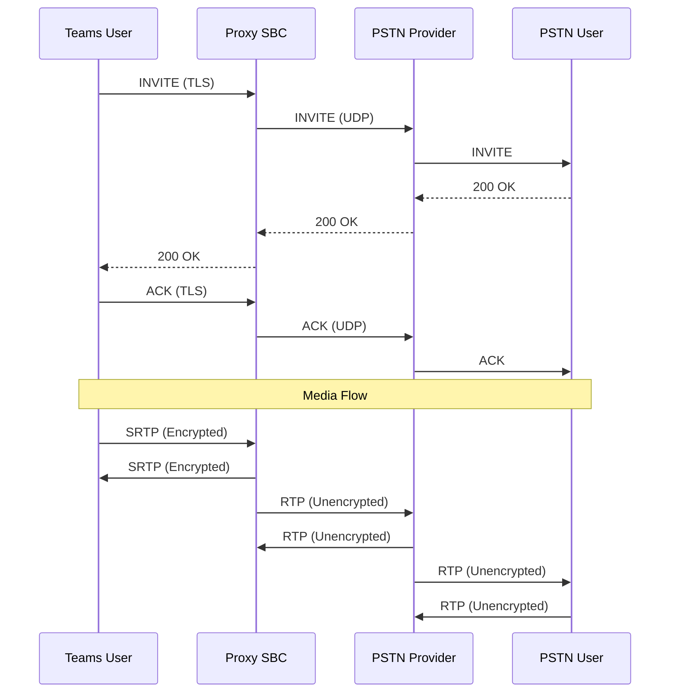
```mermaid
sequenceDiagram
    participant TU as Teams User
    participant PS as Proxy SBC
    participant PP as PSTN Provider
    participant PU as PSTN User

    TU->>PS: INVITE (TLS)
    PS->>PP: INVITE (UDP)
    PP->>PU: INVITE
    PU-->>PP: 200 OK
    PP-->>PS: 200 OK
    PS-->>TU: 200 OK
    TU->>PS: ACK (TLS)
    PS->>PP: ACK (UDP)
    PP->>PU: ACK

    Note over TU,PU: Media Flow
    TU->>PS: SRTP (Encrypted)
    PS->>TU: SRTP (Encrypted)
    PS->>PP: RTP (Unencrypted)
    PP->>PS: RTP (Unencrypted)
    PP->>PU: RTP (Unencrypted)
    PU->>PP: RTP (Unencrypted)
```

#### Example 2: PSTN to Downstream SBC Endpoint

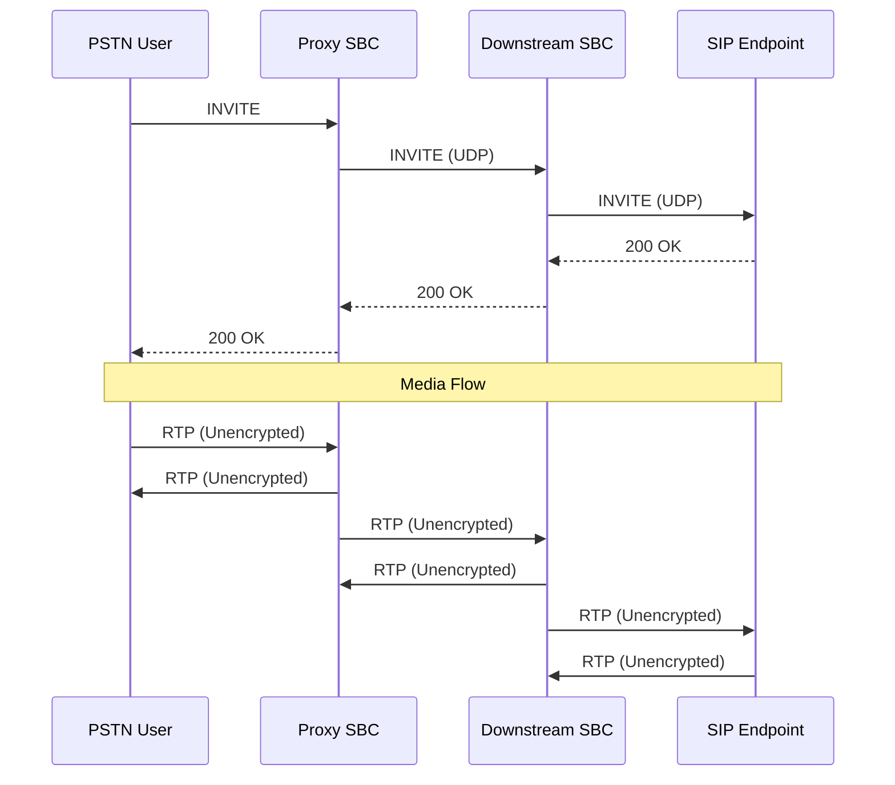
```mermaid
sequenceDiagram
    participant PU as PSTN User
    participant PS as Proxy SBC
    participant DS as Downstream SBC
    participant SE as SIP Endpoint

    PU->>PS: INVITE
    PS->>DS: INVITE (UDP)
    DS->>SE: INVITE (UDP)
    SE-->>DS: 200 OK
    DS-->>PS: 200 OK
    PS-->>PU: 200 OK

    Note over PU,SE: Media Flow
    PU->>PS: RTP (Unencrypted)
    PS->>PU: RTP (Unencrypted)
    PS->>DS: RTP (Unencrypted)
    DS->>PS: RTP (Unencrypted)
    DS->>SE: RTP (Unencrypted)
    SE->>DS: RTP (Unencrypted)
```

---

### D.6 Port Summary Quick Reference

| Flow Type | Source | Destination | Protocol | Ports | Encryption |
|-----------|--------|-------------|----------|-------|------------|
| **Signalling** |
| Teams → Proxy SBC | Microsoft 365 | Proxy SBC (WAN) | TCP | 5061 | TLS |
| Proxy SBC → Teams | Proxy SBC (WAN) | Microsoft 365 | TCP | 5061 | TLS |
| Internal SIP | Any Internal | Proxy SBC (LAN) | UDP | 5060 | None |
| Endpoint SIP | Endpoints | Downstream SBC | UDP | 5060-5069 | None |
| **Media** |
| Teams Media | Microsoft 365 | Proxy SBC (WAN) | UDP | 20000-29999 | SRTP |
| LMO Media | Teams Endpoints | SBC | UDP | 30000-39999 | RTP |
| Internal Media | Downstream SBC | Proxy SBC | UDP | 10000-19999 | RTP |
| PSTN Media | SBC | PSTN Provider | UDP | 40000-49999 | RTP |
| 3rd Party PBX Media | Internal Systems | Proxy SBC | UDP | 6000-9999 | RTP |
| **Management** |
| SNMP Traps | SBC | OVOC | UDP | 162 | None |
| QoE Reports | SBC | OVOC | TCP | 5001 | TLS |
| Device Mgmt | OVOC/ARM | SBC | TCP | 443 | HTTPS |
| SSH | Admin | All Components | TCP | 22 | SSH |
| Graph API (queries) | OVOC | Microsoft | TCP | 443 | HTTPS |
| Graph API (webhooks) | Microsoft | OVOC | TCP | 443 | HTTPS |

> **Note:** Graph API traffic is bidirectional. OVOC initiates outbound queries to graph.microsoft.com, while Microsoft sends inbound webhook notifications to OVOC when new call records are available. OVOC must be reachable from Microsoft 365 IPs.

---

### D.7 Microsoft Teams IP Ranges Quick Reference

| Range | CIDR | Purpose |
|-------|------|---------|
| 52.112.0.0/14 | 52.112.0.0 - 52.115.255.255 | Teams Signalling & Media |
| 52.120.0.0/14 | 52.120.0.0 - 52.123.255.255 | Teams Media Relays |
| 52.122.0.0/15 | 52.122.0.0 - 52.123.255.255 | Teams Signalling |
| 13.107.64.0/18 | 13.107.64.0 - 13.107.127.255 | Teams STUN/TURN |

> **Note:** Always verify current IP ranges at: https://learn.microsoft.com/en-us/microsoft-365/enterprise/urls-and-ip-address-ranges

---

### D.8 Comprehensive Interface Mapping - All Appliances

This section provides detailed low-level interface mappings for all AudioCodes appliances in the solution, showing physical ports, ethernet groups, IP interfaces, media realms, and SIP interface bindings.

#### D.8.1 Proxy SBC (AWS) - Complete Interface Architecture

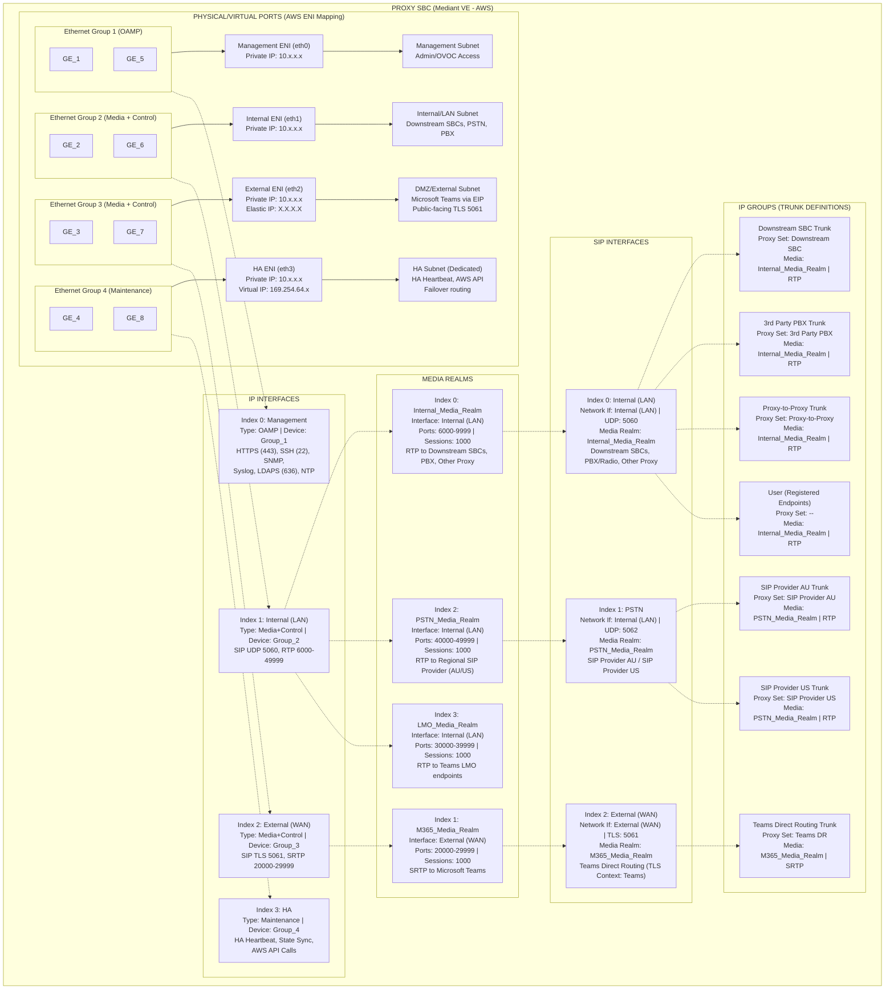
```mermaid
flowchart TB
    subgraph PROXY_SBC["PROXY SBC (Mediant VE - AWS)<br/>Instance Type: m5n.large"]

        subgraph PORTS["PHYSICAL/VIRTUAL PORTS (AWS ENI Mapping)"]
            subgraph EG1["Ethernet Group 1 (OAMP)"]
                GE1["GE_1"]
                GE5["GE_5"]
            end
            subgraph EG2["Ethernet Group 2 (Media + Control)"]
                GE2["GE_2"]
                GE6["GE_6"]
            end
            subgraph EG3["Ethernet Group 3 (Media + Control)"]
                GE3["GE_3"]
                GE7["GE_7"]
            end
            subgraph EG4["Ethernet Group 4 (Maintenance)"]
                GE4["GE_4"]
                GE8["GE_8"]
            end

            EG1 --> ENI0["Management ENI (eth0)<br/>Private IP: 10.x.x.x"]
            EG2 --> ENI1["Internal ENI (eth1)<br/>Private IP: 10.x.x.x"]
            EG3 --> ENI2["External ENI (eth2)<br/>Private IP: 10.x.x.x<br/>Elastic IP: X.X.X.X"]
            EG4 --> ENI3["HA ENI (eth3)<br/>Private IP: 10.x.x.x<br/>Virtual IP: 169.254.64.x"]

            ENI0 --> SUB0["Management Subnet<br/>Admin/OVOC Access"]
            ENI1 --> SUB1["Internal/LAN Subnet<br/>Downstream SBCs, PSTN, PBX"]
            ENI2 --> SUB2["DMZ/External Subnet<br/>Microsoft Teams via EIP<br/>Public-facing TLS 5061"]
            ENI3 --> SUB3["HA Subnet (Dedicated)<br/>HA Heartbeat, AWS API<br/>Failover routing"]
        end

        subgraph IP_INTERFACES["IP INTERFACES"]
            IPIF0["Index 0: Management<br/>Type: OAMP | Device: Group_1<br/>HTTPS (443), SSH (22), SNMP,<br/>Syslog, LDAPS (636), NTP"]
            IPIF1["Index 1: Internal (LAN)<br/>Type: Media+Control | Device: Group_2<br/>SIP UDP 5060, RTP 6000-49999"]
            IPIF2["Index 2: External (WAN)<br/>Type: Media+Control | Device: Group_3<br/>SIP TLS 5061, SRTP 20000-29999"]
            IPIF3["Index 3: HA<br/>Type: Maintenance | Device: Group_4<br/>HA Heartbeat, State Sync,<br/>AWS API Calls"]
        end

        subgraph MEDIA_REALMS["MEDIA REALMS"]
            MR0["Index 0: Internal_Media_Realm<br/>Interface: Internal (LAN)<br/>Ports: 6000-9999 | Sessions: 1000<br/>RTP to Downstream SBCs, PBX, Other Proxy"]
            MR1["Index 1: M365_Media_Realm<br/>Interface: External (WAN)<br/>Ports: 20000-29999 | Sessions: 1000<br/>SRTP to Microsoft Teams"]
            MR2["Index 2: PSTN_Media_Realm<br/>Interface: Internal (LAN)<br/>Ports: 40000-49999 | Sessions: 1000<br/>RTP to Regional SIP Provider (AU/US)"]
            MR3["Index 3: LMO_Media_Realm<br/>Interface: Internal (LAN)<br/>Ports: 30000-39999 | Sessions: 1000<br/>RTP to Teams LMO endpoints"]
        end

        subgraph SIP_INTERFACES["SIP INTERFACES"]
            SIP0["Index 0: Internal (LAN)<br/>Network If: Internal (LAN) | UDP: 5060<br/>Media Realm: Internal_Media_Realm<br/>Downstream SBCs, PBX/Radio, Other Proxy"]
            SIP1["Index 1: PSTN<br/>Network If: Internal (LAN) | UDP: 5062<br/>Media Realm: PSTN_Media_Realm<br/>SIP Provider AU / SIP Provider US"]
            SIP2["Index 2: External (WAN)<br/>Network If: External (WAN) | TLS: 5061<br/>Media Realm: M365_Media_Realm<br/>Teams Direct Routing (TLS Context: Teams)"]
        end

        subgraph IP_GROUPS["IP GROUPS (TRUNK DEFINITIONS)"]
            IPG1["Teams Direct Routing Trunk<br/>Proxy Set: Teams DR<br/>Media: M365_Media_Realm | SRTP"]
            IPG2["Downstream SBC Trunk<br/>Proxy Set: Downstream SBC<br/>Media: Internal_Media_Realm | RTP"]
            IPG3["3rd Party PBX Trunk<br/>Proxy Set: 3rd Party PBX<br/>Media: Internal_Media_Realm | RTP"]
            IPG4["SIP Provider AU Trunk<br/>Proxy Set: SIP Provider AU<br/>Media: PSTN_Media_Realm | RTP"]
            IPG5["SIP Provider US Trunk<br/>Proxy Set: SIP Provider US<br/>Media: PSTN_Media_Realm | RTP"]
            IPG6["Proxy-to-Proxy Trunk<br/>Proxy Set: Proxy-to-Proxy<br/>Media: Internal_Media_Realm | RTP"]
            IPG7["User (Registered Endpoints)<br/>Proxy Set: --<br/>Media: Internal_Media_Realm | RTP"]
        end
    end

    %% Relationships between layers
    EG1 -.-> IPIF0
    EG2 -.-> IPIF1
    EG3 -.-> IPIF2
    EG4 -.-> IPIF3

    IPIF1 -.-> MR0
    IPIF2 -.-> MR1
    IPIF1 -.-> MR2
    IPIF1 -.-> MR3

    MR0 -.-> SIP0
    MR2 -.-> SIP1
    MR1 -.-> SIP2

    SIP2 -.-> IPG1
    SIP0 -.-> IPG2
    SIP0 -.-> IPG3
    SIP1 -.-> IPG4
    SIP1 -.-> IPG5
    SIP0 -.-> IPG6
    SIP0 -.-> IPG7
```

#### D.8.2 Downstream SBC (On-Premises Mediant 800) - Complete Interface Architecture

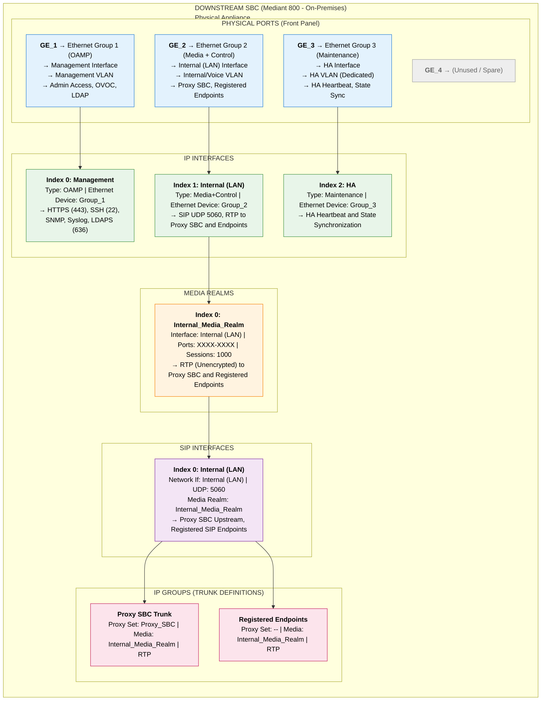
```mermaid
%%{init: {'theme': 'default'}}%%
%% D.8.2 - Downstream SBC (On-Premises Mediant 800) - Complete Interface Architecture

flowchart TB
    subgraph MainBox["DOWNSTREAM SBC (Mediant 800 - On-Premises)<br/>Physical Appliance"]
        direction TB

        subgraph PhysicalPorts["PHYSICAL PORTS (Front Panel)"]
            direction TB
            GE1["<b>GE_1</b> → Ethernet Group 1 (OAMP)<br/>→ Management Interface<br/>→ Management VLAN<br/>→ Admin Access, OVOC, LDAP"]
            GE2["<b>GE_2</b> → Ethernet Group 2 (Media + Control)<br/>→ Internal (LAN) Interface<br/>→ Internal/Voice VLAN<br/>→ Proxy SBC, Registered Endpoints"]
            GE3["<b>GE_3</b> → Ethernet Group 3 (Maintenance)<br/>→ HA Interface<br/>→ HA VLAN (Dedicated)<br/>→ HA Heartbeat, State Sync"]
            GE4["<b>GE_4</b> → (Unused / Spare)"]
        end

        subgraph IPInterfaces["IP INTERFACES"]
            direction TB
            IP0["<b>Index 0: Management</b><br/>Type: OAMP | Ethernet Device: Group_1<br/>→ HTTPS (443), SSH (22), SNMP, Syslog, LDAPS (636)"]
            IP1["<b>Index 1: Internal (LAN)</b><br/>Type: Media+Control | Ethernet Device: Group_2<br/>→ SIP UDP 5060, RTP to Proxy SBC and Endpoints"]
            IP2["<b>Index 2: HA</b><br/>Type: Maintenance | Ethernet Device: Group_3<br/>→ HA Heartbeat and State Synchronization"]
        end

        subgraph MediaRealms["MEDIA REALMS"]
            direction TB
            MR0["<b>Index 0: Internal_Media_Realm</b><br/>Interface: Internal (LAN) | Ports: XXXX-XXXX | Sessions: 1000<br/>→ RTP (Unencrypted) to Proxy SBC and Registered Endpoints"]
        end

        subgraph SIPInterfaces["SIP INTERFACES"]
            direction TB
            SIP0["<b>Index 0: Internal (LAN)</b><br/>Network If: Internal (LAN) | UDP: 5060<br/>Media Realm: Internal_Media_Realm<br/>→ Proxy SBC Upstream, Registered SIP Endpoints"]
        end

        subgraph IPGroups["IP GROUPS (TRUNK DEFINITIONS)"]
            direction TB
            IPG1["<b>Proxy SBC Trunk</b><br/>Proxy Set: Proxy_SBC | Media: Internal_Media_Realm | RTP"]
            IPG2["<b>Registered Endpoints</b><br/>Proxy Set: -- | Media: Internal_Media_Realm | RTP"]
        end
    end

    %% Connections showing logical flow
    GE1 --> IP0
    GE2 --> IP1
    GE3 --> IP2

    IP1 --> MR0
    MR0 --> SIP0
    SIP0 --> IPG1
    SIP0 --> IPG2

    %% Styling
    classDef header fill:#ff9800,stroke:#e65100,color:#000,font-weight:bold
    classDef ports fill:#e3f2fd,stroke:#1976d2,color:#000
    classDef interfaces fill:#e8f5e9,stroke:#388e3c,color:#000
    classDef realms fill:#fff3e0,stroke:#f57c00,color:#000
    classDef sipif fill:#f3e5f5,stroke:#7b1fa2,color:#000
    classDef groups fill:#fce4ec,stroke:#c2185b,color:#000
    classDef unused fill:#eeeeee,stroke:#9e9e9e,color:#666

    class GE1,GE2,GE3 ports
    class GE4 unused
    class IP0,IP1,IP2 interfaces
    class MR0 realms
    class SIP0 sipif
    class IPG1,IPG2 groups
```

#### D.8.3 Downstream SBC with Local Breakout (LBO) - Complete Interface Architecture

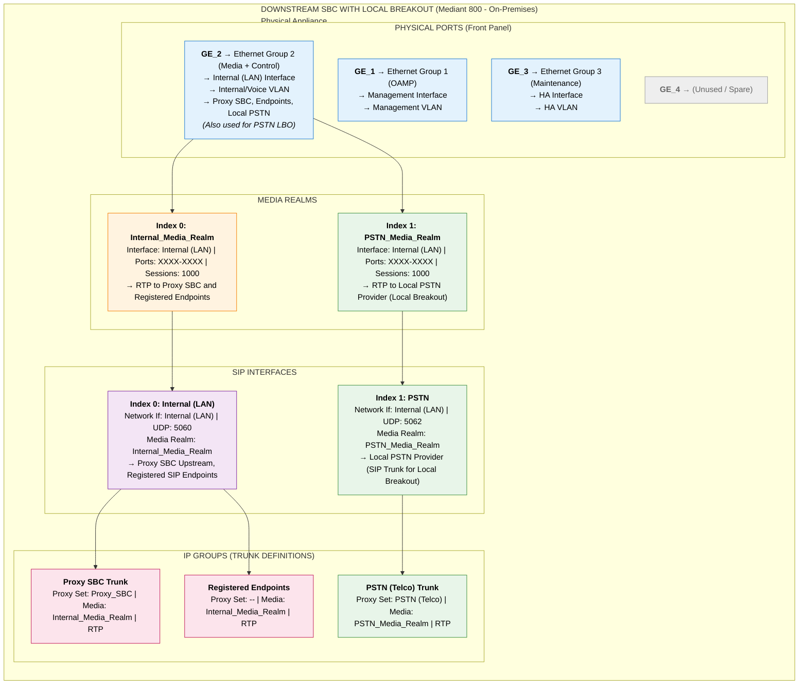
```mermaid
%%{init: {'theme': 'default'}}%%
%% D.8.3 - Downstream SBC with Local Breakout (LBO) - Complete Interface Architecture

flowchart TB
    subgraph MainBox["DOWNSTREAM SBC WITH LOCAL BREAKOUT (Mediant 800 - On-Premises)<br/>Physical Appliance"]
        direction TB

        subgraph PhysicalPorts["PHYSICAL PORTS (Front Panel)"]
            direction TB
            GE1["<b>GE_1</b> → Ethernet Group 1 (OAMP)<br/>→ Management Interface<br/>→ Management VLAN"]
            GE2["<b>GE_2</b> → Ethernet Group 2 (Media + Control)<br/>→ Internal (LAN) Interface<br/>→ Internal/Voice VLAN<br/>→ Proxy SBC, Endpoints, Local PSTN<br/><i>(Also used for PSTN LBO)</i>"]
            GE3["<b>GE_3</b> → Ethernet Group 3 (Maintenance)<br/>→ HA Interface<br/>→ HA VLAN"]
            GE4["<b>GE_4</b> → (Unused / Spare)"]
        end

        subgraph MediaRealms["MEDIA REALMS"]
            direction TB
            MR0["<b>Index 0: Internal_Media_Realm</b><br/>Interface: Internal (LAN) | Ports: XXXX-XXXX | Sessions: 1000<br/>→ RTP to Proxy SBC and Registered Endpoints"]
            MR1["<b>Index 1: PSTN_Media_Realm</b><br/>Interface: Internal (LAN) | Ports: XXXX-XXXX | Sessions: 1000<br/>→ RTP to Local PSTN Provider (Local Breakout)"]
        end

        subgraph SIPInterfaces["SIP INTERFACES"]
            direction TB
            SIP0["<b>Index 0: Internal (LAN)</b><br/>Network If: Internal (LAN) | UDP: 5060<br/>Media Realm: Internal_Media_Realm<br/>→ Proxy SBC Upstream, Registered SIP Endpoints"]
            SIP1["<b>Index 1: PSTN</b><br/>Network If: Internal (LAN) | UDP: 5062<br/>Media Realm: PSTN_Media_Realm<br/>→ Local PSTN Provider (SIP Trunk for Local Breakout)"]
        end

        subgraph IPGroups["IP GROUPS (TRUNK DEFINITIONS)"]
            direction TB
            IPG1["<b>Proxy SBC Trunk</b><br/>Proxy Set: Proxy_SBC | Media: Internal_Media_Realm | RTP"]
            IPG2["<b>Registered Endpoints</b><br/>Proxy Set: -- | Media: Internal_Media_Realm | RTP"]
            IPG3["<b>PSTN (Telco) Trunk</b><br/>Proxy Set: PSTN (Telco) | Media: PSTN_Media_Realm | RTP"]
        end
    end

    %% Connections showing logical flow
    GE2 --> MR0
    GE2 --> MR1

    MR0 --> SIP0
    MR1 --> SIP1

    SIP0 --> IPG1
    SIP0 --> IPG2
    SIP1 --> IPG3

    %% Styling
    classDef header fill:#ff9800,stroke:#e65100,color:#000,font-weight:bold
    classDef ports fill:#e3f2fd,stroke:#1976d2,color:#000
    classDef realms fill:#fff3e0,stroke:#f57c00,color:#000
    classDef sipif fill:#f3e5f5,stroke:#7b1fa2,color:#000
    classDef groups fill:#fce4ec,stroke:#c2185b,color:#000
    classDef unused fill:#eeeeee,stroke:#9e9e9e,color:#666
    classDef pstn fill:#e8f5e9,stroke:#388e3c,color:#000

    class GE1,GE2,GE3 ports
    class GE4 unused
    class MR0 realms
    class MR1 pstn
    class SIP0 sipif
    class SIP1 pstn
    class IPG1,IPG2 groups
    class IPG3 pstn
```

#### D.8.4 OVOC - Interface Architecture

```mermaid
flowchart TB
    subgraph OVOC["OVOC (One Voice Operations Center)<br/>AWS Instance: m5.4xlarge"]
        subgraph ENI["Network Interface (AWS ENI)"]
            eth0["eth0 - Primary ENI<br/>Management/Internal Subnet<br/>IP: X.X.X.X"]
        end

        subgraph Inbound["Inbound Services"]
            HTTPS["TCP 443: HTTPS Web UI<br/>(Admin Access)"]
            SSH["TCP 22: SSH<br/>(Admin Access via Jump Server)"]
            SNMP_Trap["UDP 162: SNMP Traps<br/>(from SBCs)"]
            SNMP_KA["UDP 1161: SNMP Keep-Alive<br/>(from SBCs)"]
            QoE["TCP 5001: QoE Reports TLS<br/>(from SBCs)"]
            DevMgr["TCP 443: Device Manager<br/>(Endpoints)"]
            Webhooks["TCP 443: Graph API Webhooks<br/>(from Microsoft 365)"]
        end

        subgraph Outbound["Outbound Services"]
            SBC_Mgmt["TCP 443: SBC Management<br/>(HTTPS to all SBCs)"]
            SNMP_Query["UDP 161: SNMP Queries<br/>(to SBCs)"]
            AzureAD["TCP 443: Azure AD<br/>(login.microsoftonline.com)"]
            GraphAPI["TCP 443: Graph API<br/>(graph.microsoft.com)"]
            Firmware["TCP 443: Firmware Downloads<br/>(docs.sharefile.com)"]
            DNS["UDP/TCP 53: DNS Server"]
            NTP["UDP 123: NTP Server"]
            LDAP["TCP 636: LDAP Server<br/>(LDAPS Authentication)"]
            Syslog["UDP 514: Syslog Server"]
            Mail["TCP 25: Mail Server<br/>(Email Alerts)"]
        end

        subgraph GraphIntegration["Microsoft Graph API Integration (Bidirectional)"]
            subgraph GraphOut["Outbound (OVOC to Microsoft)"]
                OAuth["OAuth Token Acquisition<br/>(login.microsoftonline.com)"]
                CallRecords["CallRecords API Queries<br/>(graph.microsoft.com/v1.0/communications/callRecords)"]
                UserInfo["User Information Queries<br/>(graph.microsoft.com/v1.0/users)"]
            end
            subgraph GraphIn["Inbound (Microsoft to OVOC)"]
                WebhookNotif["Webhook Notifications<br/>(Change notifications for new call records)"]
                M365Reqs["Requirements:<br/>- Reachable from Microsoft 365 IPs on TCP 443<br/>- Valid PUBLIC CA certificate required"]
            end
        end
    end

    %% External connections
    AdminUsers(("Admin Users")) -->|TCP 443/22| Inbound
    SBCs(("SBCs")) -->|"UDP 162/1161<br/>TCP 5001"| Inbound
    Endpoints(("Endpoints")) -->|TCP 443| DevMgr
    Microsoft365(("Microsoft 365")) <-->|TCP 443| GraphIntegration

    Outbound -->|TCP 443/UDP 161| SBCsOut(("SBCs"))
    Outbound -->|TCP 443| MicrosoftCloud(("Microsoft Cloud"))
    Outbound -->|UDP/TCP 53| DNSServer(("DNS"))
    Outbound -->|UDP 123| NTPServer(("NTP"))
    Outbound -->|TCP 636| LDAPServer(("LDAP"))
    Outbound -->|UDP 514/TCP 25| LogMail(("Syslog/Mail"))
```

#### D.8.5 ARM (AudioCodes Routing Manager) - Interface Architecture

```mermaid
---
title: ARM Configurator - Interface Architecture (AWS Instance: m4.xlarge)
---
flowchart TB
    subgraph cfg["ARM CONFIGURATOR"]
        subgraph cfg_net["NETWORK INTERFACE (Single ENI)"]
            cfg_eth["eth0 → Primary ENI → Management/Internal Subnet<br/>IP: X.X.X.X"]
        end

        subgraph cfg_svc["SERVICES"]
            subgraph cfg_in["Inbound"]
                cfg_in_https["TCP 443 - HTTPS Web UI<br/>(Admin Access with OAuth)"]
                cfg_in_ssh["TCP 22 - SSH<br/>(Admin Access)"]
                cfg_in_api["TCP 443 - REST API<br/>(Service-to-Service Auth)"]
                cfg_in_router["TCP 443 - ARM Router Registration"]
            end

            subgraph cfg_out["Outbound"]
                cfg_out_sbc["TCP 443 - SBC Configuration Push<br/>(HTTPS to all SBCs)"]
                cfg_out_router["TCP 443 - ARM Router Communication"]
                cfg_out_oauth["TCP 443 - login.microsoftonline.com<br/>(OAuth)"]
                cfg_out_graph["TCP 443 - graph.microsoft.com<br/>(User/Group info for RBAC)"]
                cfg_out_ldap["TCP 636 - LDAP Server<br/>(if using LDAP authentication)"]
            end
        end
    end

    %% External connections - Inbound
    cfg_admin(["Admin Users"]) --> cfg_in_https
    cfg_admin --> cfg_in_ssh
    cfg_ext_svc(["External Services"]) --> cfg_in_api
    cfg_arm_router(["ARM Router"]) --> cfg_in_router

    %% External connections - Outbound
    cfg_out_sbc --> cfg_sbc_dev(["SBC Devices"])
    cfg_out_router --> cfg_arm_rtr_out(["ARM Router"])
    cfg_out_oauth --> cfg_ms_login(["Microsoft Login"])
    cfg_out_graph --> cfg_ms_graph(["Microsoft Graph"])
    cfg_out_ldap --> cfg_ldap_srv(["LDAP Server"])

    %% Styling
    classDef headerStyle fill:#1a5276,stroke:#154360,color:#fff
    classDef networkStyle fill:#2e86ab,stroke:#1a5276,color:#fff
    classDef inboundStyle fill:#27ae60,stroke:#1e8449,color:#fff
    classDef outboundStyle fill:#e67e22,stroke:#d35400,color:#fff
    classDef externalStyle fill:#7f8c8d,stroke:#566573,color:#fff

    class cfg headerStyle
    class cfg_net,cfg_eth networkStyle
    class cfg_in,cfg_in_https,cfg_in_ssh,cfg_in_api,cfg_in_router inboundStyle
    class cfg_out,cfg_out_sbc,cfg_out_router,cfg_out_oauth,cfg_out_graph,cfg_out_ldap outboundStyle
    class cfg_admin,cfg_ext_svc,cfg_arm_router,cfg_sbc_dev,cfg_arm_rtr_out,cfg_ms_login,cfg_ms_graph,cfg_ldap_srv externalStyle
```

```mermaid
---
title: ARM Router - Interface Architecture (AWS Instance: m4.large, One per Region)
---
flowchart TB
    subgraph rtr["ARM ROUTER"]
        subgraph rtr_net["NETWORK INTERFACE (Single ENI)"]
            rtr_eth["eth0 → Primary ENI → Management/Internal Subnet<br/>IP: X.X.X.X"]
        end

        subgraph rtr_svc["SERVICES"]
            subgraph rtr_in["Inbound"]
                rtr_in_sbc["TCP 443 - SBC Routing Queries<br/>(Real-time routing decisions)"]
                rtr_in_ssh["TCP 22 - SSH<br/>(Admin Access)"]
                rtr_in_config["TCP 443 - ARM Configurator Sync"]
            end

            subgraph rtr_out["Outbound"]
                rtr_out_config["TCP 443 - ARM Configurator<br/>(Policy sync, registration)"]
                rtr_out_sbc["TCP 443 - SBC Query Response"]
                rtr_out_redis["TCP 6379 - Other ARM Routers<br/>(if clustered - Redis)"]
                rtr_out_inter["TCP 8080 - Inter-Router Communication"]
            end
        end
    end

    %% External connections - Inbound
    rtr_sbc_dev(["SBC Devices"]) --> rtr_in_sbc
    rtr_admin(["Admin Users"]) --> rtr_in_ssh
    rtr_cfg_in(["ARM Configurator"]) --> rtr_in_config

    %% External connections - Outbound
    rtr_out_config --> rtr_cfg_out(["ARM Configurator"])
    rtr_out_sbc --> rtr_sbc_resp(["SBC Devices"])
    rtr_out_redis --> rtr_other(["Other ARM Routers"])
    rtr_out_inter --> rtr_cluster(["Router Cluster"])

    %% Styling
    classDef headerStyle fill:#1a5276,stroke:#154360,color:#fff
    classDef networkStyle fill:#2e86ab,stroke:#1a5276,color:#fff
    classDef inboundStyle fill:#27ae60,stroke:#1e8449,color:#fff
    classDef outboundStyle fill:#e67e22,stroke:#d35400,color:#fff
    classDef externalStyle fill:#7f8c8d,stroke:#566573,color:#fff

    class rtr headerStyle
    class rtr_net,rtr_eth networkStyle
    class rtr_in,rtr_in_sbc,rtr_in_ssh,rtr_in_config inboundStyle
    class rtr_out,rtr_out_config,rtr_out_sbc,rtr_out_redis,rtr_out_inter outboundStyle
    class rtr_admin,rtr_sbc_dev,rtr_cfg_in,rtr_cfg_out,rtr_sbc_resp,rtr_other,rtr_cluster externalStyle
```

#### D.8.6 Stack Manager - Interface Architecture

```mermaid
flowchart TB
    subgraph SM["STACK MANAGER<br/>AWS Instance: t3.medium"]
        subgraph NET["NETWORK INTERFACE (Single ENI)"]
            ETH0["eth0 → Primary ENI → Management Subnet<br/>IP: X.X.X.X (Private, NAT Gateway for egress)"]
        end

        subgraph SERVICES["SERVICES"]
            subgraph INBOUND["Inbound"]
                HTTPS["TCP 443 ← HTTPS Web UI (Admin Access)"]
                SSH["TCP 22 ← SSH (Admin Access via Jump Server)"]
            end

            subgraph OUTBOUND["Outbound (AWS API Access via NAT Gateway)"]
                EC2API["TCP 443 → AWS EC2 API (ec2.amazonaws.com)"]
                CFAPI["TCP 443 → AWS CloudFormation API (cloudformation.amazonaws.com)"]
                IAMAPI["TCP 443 → AWS IAM API (iam.amazonaws.com)"]
                ELBAPI["TCP 443 → AWS ELB API (elasticloadbalancing.amazonaws.com) - if using NLB"]
                VPCCIDR["All → VPC CIDR (Communication with SBC instances during deployment)"]
            end
        end

        subgraph IAM["IAM ROLE PERMISSIONS"]
            EC2PERM["ec2:* → Create/modify EC2 instances, ENIs, security groups, route tables"]
            CFPERM["cloudformation:* → Create and manage CloudFormation stacks"]
            CWPUT["cloudwatch:PutMetricAlarm → Configure monitoring alarms"]
            CWDEL["cloudwatch:DeleteAlarms → Remove old alarms"]
            IAMPASS["iam:PassRole → Assign IAM roles to SBC instances"]
            IAMLIST["iam:ListInstanceProfiles → Enumerate available instance profiles"]
            IAMCREATE["iam:CreateServiceLinkedRole → Create service-linked roles for ELB"]
        end
    end

    NOTE["NOTE: Stack Manager does NOT participate in active HA failover<br/>SBCs call AWS APIs directly"]

    SM -.-> NOTE

    style SM fill:#e1f5fe,stroke:#01579b
    style NET fill:#fff3e0,stroke:#e65100
    style SERVICES fill:#f3e5f5,stroke:#7b1fa2
    style INBOUND fill:#e8f5e9,stroke:#2e7d32
    style OUTBOUND fill:#fce4ec,stroke:#c2185b
    style IAM fill:#fff8e1,stroke:#ff8f00
    style NOTE fill:#ffebee,stroke:#c62828,stroke-dasharray: 5 5
```

#### D.8.7 Complete Solution - End-to-End Connectivity Map

**How Traffic Flows Through the SBC**

The diagram below shows the SBC as a "gateway" device. Think of it like a security checkpoint at an airport - calls enter on one side, get inspected and processed, then exit on the other side to reach their destination.

```mermaid
%%{init: {'theme': 'default'}}%%
%% D.8.7 - Layman-Friendly View: SBC as a Gateway Device
%% Traffic flows LEFT to RIGHT: External → SBC → Internal

flowchart LR
    %% === EXTERNAL WORLD (Left Side - Untrusted) ===
    subgraph External["☁️ EXTERNAL (Internet)"]
        direction TB
        Teams["Microsoft<br/>Teams"]
        SIPProvider["SIP Carrier<br/>(Phone Company)"]
    end

    %% === THE SBC DEVICE (Center - The Gateway) ===
    subgraph SBC["🔶 PROXY SBC - The Gateway"]
        direction TB

        subgraph ExtPort["External Interface"]
            WAN["🔴 eth2 - WAN<br/>─────────────<br/>SIP Interface: External<br/>+ PSTN<br/>─────────────<br/>Media: M365 + PSTN"]
        end

        subgraph Core["Call Processing Engine"]
            direction TB
            Process["Inspect & Route Calls<br/>• Validate caller<br/>• Apply policies<br/>• Convert protocols"]
        end

        subgraph IntPort["Internal Interface"]
            LAN["🟢 eth1 - LAN<br/>─────────────<br/>SIP Interface: Internal<br/>─────────────<br/>Media: Internal + LMO"]
        end

        subgraph MgmtPort["Management"]
            MGMT["⚪ eth0 - OAMP<br/>Admin Access"]
        end

        subgraph HAPort["HA Interface"]
            HA["🔵 eth3 - HA<br/>Sync to Standby"]
        end
    end

    %% === STANDBY SBC (Backup) ===
    subgraph Standby["🔵 STANDBY SBC"]
        Backup["Ready to<br/>Take Over"]
    end

    %% === INTERNAL NETWORK (Right Side - Trusted) ===
    subgraph Internal["🏢 INTERNAL (Your Network)"]
        direction TB
        Downstream["Branch<br/>SBCs"]
        Phones["IP Phones &<br/>Softphones"]
    end

    %% === TRAFFIC FLOWS ===

    %% External to SBC (Teams = bidirectional, SIP Provider = outbound)
    Teams <-->|"TLS 5061<br/>Bidirectional"| WAN
    WAN -->|"SBC Registers<br/>OUTBOUND"| SIPProvider

    %% Through the SBC (WAN → Processing → LAN)
    WAN -->|"IN"| Process
    Process -->|"OUT"| LAN

    %% SBC to Internal (exits LAN port)
    LAN <-->|"Voice<br/>Traffic"| Downstream
    Downstream --> Phones

    %% HA Sync
    HA <-.->|"Keep in Sync"| Backup

    %% === STYLING ===
    classDef external fill:#ef5350,stroke:#c62828,color:#fff
    classDef sbc fill:#ff9800,stroke:#e65100,color:#000
    classDef internal fill:#4caf50,stroke:#2e7d32,color:#fff
    classDef wan fill:#ef5350,stroke:#c62828,color:#fff
    classDef lan fill:#4caf50,stroke:#2e7d32,color:#fff
    classDef ha fill:#2196f3,stroke:#1565c0,color:#fff
    classDef mgmt fill:#9e9e9e,stroke:#616161,color:#fff
    classDef process fill:#fff3e0,stroke:#ff9800,color:#000

    class Teams,SIPProvider external
    class WAN wan
    class LAN lan
    class HA,Backup ha
    class MGMT mgmt
    class Process process
    class Downstream,Phones internal
```

**Interface Summary (from D.8.8 Matrix):**

| Interface | Port | IP Interface | SIP Interface(s) | Media Realm(s) | Connects To |
|-----------|------|--------------|------------------|----------------|-------------|
| **eth0** | GE_1 | OAMP | N/A | N/A | OVOC, Stack Manager (management only) |
| **eth1** | GE_2 | LAN | Internal | Internal, LMO | Downstream SBCs, IP Phones |
| **eth2** | GE_3 | WAN | External, PSTN | M365, PSTN | Teams (bidirectional), SIP Provider (outbound) |
| **eth3** | GE_4 | HA | N/A | N/A | Standby SBC (heartbeat & state sync) |

**Key Concepts:**
- **eth2 (WAN)** - The external interface handles TWO types of traffic:
  - **Microsoft Teams**: Bidirectional (Teams calls in, your calls out to Teams)
  - **SIP Provider**: Outbound only (SBC registers with carrier; carrier sends calls back on same connection)
- **eth1 (LAN)** - Internal interface for your branch offices and phones
- **eth0 (OAMP)** - Management interface for admin access (not call traffic)
- **eth3 (HA)** - Dedicated link to keep the Standby SBC synchronized

---

**Detailed Technical View: AWS Infrastructure & HA Failover**

```mermaid
%%{init: {'theme': 'default'}}%%
%% D.8.7 - Technical View: AWS Subnets and HA Mechanism

flowchart TB
    %% === EXTERNAL SERVICES ===
    subgraph ExtServices["☁️ External Services"]
        direction LR
        Teams["Microsoft Teams<br/>Direct Routing"]
        M365["Microsoft 365<br/>Graph API"]
        SIP["SIP Provider<br/>(PSTN Carrier)"]
    end

    %% === AWS VPC ===
    subgraph AWS["🔶 AWS VPC"]
        direction TB

        %% WAN Subnet
        subgraph WANSubnet["WAN Subnet (Public) - External Interface"]
            EIP["Elastic IP<br/>(Public Address)"]
        end

        %% The two SBCs with detailed interface labels
        subgraph HAPair["HA Pair"]
            direction LR
            subgraph Active["🟢 Active SBC"]
                A_MGMT["eth0 OAMP"]
                A_WAN["eth2 WAN<br/>SIP: External+PSTN<br/>Media: M365+PSTN"]
                A_Core["Call<br/>Engine"]
                A_LAN["eth1 LAN<br/>SIP: Internal<br/>Media: Internal+LMO"]
                A_HA["eth3 HA"]
            end
            subgraph Stand["🔵 Standby SBC"]
                S_MGMT["eth0"]
                S_WAN["eth2"]
                S_Core["Call<br/>Engine"]
                S_LAN["eth1"]
                S_HA["eth3"]
            end
        end

        %% HA Mechanism
        subgraph HAMech["HA Failover Mechanism"]
            VIP["Virtual IP<br/>169.254.64.x"]
            RT["AWS Route Table<br/>VIP → Active ENI"]
        end

        %% LAN Subnet
        subgraph LANSubnet["LAN Subnet (Private) - Internal Interface"]
            LANgw["Gateway to<br/>On-Premises"]
        end

        %% Management Subnet
        subgraph MgmtSubnet["Management Subnet - OAMP Interface"]
            OVOC["OVOC"]
            StackMgr["Stack Manager"]
        end
    end

    %% === ON-PREM ===
    subgraph OnPrem["🏢 On-Premises"]
        DS["Downstream SBCs"]
        EP["Endpoints"]
    end

    %% === CONNECTIONS ===

    %% Teams: Bidirectional via WAN
    Teams <-->|"TLS 5061<br/>Bidirectional"| EIP

    %% SIP Provider: OUTBOUND from WAN (SBC registers with carrier)
    EIP -->|"UDP 5060<br/>OUTBOUND<br/>Registration"| SIP

    %% Management traffic
    M365 <-->|"HTTPS"| OVOC
    OVOC --> A_MGMT
    StackMgr --> A_MGMT

    %% EIP to WAN interface
    EIP --- A_WAN

    %% Through Active SBC (traffic flow)
    A_WAN -->|"Inbound<br/>Calls"| A_Core
    A_Core -->|"Routed<br/>Calls"| A_LAN
    A_LAN --- LANgw

    %% To On-Prem
    LANgw <--> DS
    DS --> EP

    %% HA Sync between SBCs
    A_HA <-->|"Heartbeat<br/>State Sync"| S_HA
    A_HA --- VIP
    S_HA --- VIP

    %% Route Table points to Active
    VIP ---|"Routes to"| RT
    RT -.->|"Points to<br/>Active ENI"| A_Core

    %% On failover, Standby calls AWS API
    S_Core -.->|"On Failover:<br/>Update Route"| RT

    %% === STYLING ===
    classDef cloud fill:#1a73e8,stroke:#0d47a1,color:#fff
    classDef sip fill:#e91e63,stroke:#c2185b,color:#fff
    classDef active fill:#4caf50,stroke:#2e7d32,color:#fff
    classDef standby fill:#2196f3,stroke:#1565c0,color:#fff
    classDef ha fill:#9c27b0,stroke:#6a1b9a,color:#fff
    classDef subnet fill:#fff3e0,stroke:#ff9800,color:#000
    classDef onprem fill:#616161,stroke:#424242,color:#fff
    classDef mgmt fill:#9e9e9e,stroke:#616161,color:#fff

    class Teams,M365 cloud
    class SIP sip
    class A_WAN,A_Core,A_LAN,A_HA active
    class A_MGMT,S_MGMT mgmt
    class S_WAN,S_Core,S_LAN,S_HA,Stand standby
    class VIP,RT ha
    class EIP,LANgw subnet
    class DS,EP onprem
```

**How HA Failover Works:**
1. Both SBCs share a **Virtual IP (VIP)** address on the HA subnet
2. The **AWS Route Table** has a route pointing the VIP to the Active SBC's network interface
3. If the Active SBC fails, the Standby SBC calls the **AWS EC2 API** to update the route table
4. Traffic now flows to the Standby (which becomes the new Active) - no IP changes needed for external parties

#### D.8.8 Interface Summary Matrix

| Appliance | Physical Ports | Ethernet Groups | IP Interfaces | Media Realms | SIP Interfaces | External Connectivity |
|-----------|---------------|-----------------|---------------|--------------|----------------|----------------------|
| **Proxy SBC (AWS)** | GE_1-GE_8 (Virtual) | 4 (Mgmt, Internal, External, HA) | 4 (OAMP, LAN, WAN, HA) | 4 (Internal, M365, PSTN, LMO) | 3 (Internal, PSTN, External) | Teams, SIP Provider AU/US, Downstream SBCs |
| **Downstream SBC** | GE_1-GE_4 | 3 (Mgmt, Internal, HA) | 3 (OAMP, LAN, HA) | 1 (Internal) | 1 (Internal) | Proxy SBC, Registered Endpoints |
| **Downstream SBC (LBO)** | GE_1-GE_4 | 3 (Mgmt, Internal, HA) | 3 (OAMP, LAN, HA) | 2 (Internal, PSTN) | 2 (Internal, PSTN) | Proxy SBC, Registered Endpoints, Local PSTN |
| **OVOC** | eth0 (ENI) | 1 | 1 | N/A | N/A | SBCs, Microsoft Graph API, Endpoints |
| **ARM Configurator** | eth0 (ENI) | 1 | 1 | N/A | N/A | SBCs, ARM Routers, Microsoft Graph |
| **ARM Router** | eth0 (ENI) | 1 | 1 | N/A | N/A | ARM Configurator, SBCs |
| **Stack Manager** | eth0 (ENI) | 1 | 1 | N/A | N/A | AWS APIs, SBCs (during deployment) |

---

## Document Control

| Version | Date | Author | Changes |
|---------|------|--------|---------|
| 1.0 | February 2026 | KS | Initial release - Unified deployment guide consolidating AWS deployment and SBC configuration documentation |
| 1.1 | February 2026 | KS | Clarified Stack Manager role (deployment only, not active failover); Added SBC IAM requirements for HA failover; Added Cyber Security Variation section; Updated failover mechanism documentation; Stack Manager retained for Day 2 operations |
| 1.2 | February 2026 | KS | Added Section 10.4 SBC Management Authentication documenting split identity model: Proxy SBC uses Microsoft Entra ID (OAuth 2.0), Downstream SBCs use on-premises Active Directory (LDAPS); Added SBC Management app registration to Section 6; Added cross-references from Section 10.1 |
| 1.3 | February 2026 | KS | Added Section 19.1 SIP Trunk Connectivity in HA documenting how PSTN/ISP SIP trunks connect to the HA Proxy SBC pair via Virtual IP; explained failover behavior for external parties; added HA connectivity architecture diagram showing internal vs external entity connections |
| 1.4 | February 2026 | KS | Updated Appendix D diagrams to clarify bidirectional Graph API traffic: OVOC initiates outbound queries to Microsoft, Microsoft sends inbound webhook notifications to OVOC for call records; added note in quick reference table |
| 1.5 | February 2026 | KS | Added Voice Recording Considerations subsection to Section 19 documenting SRTP encryption impact on existing voice recorders; covered SIPREC integration option, selective encryption, and decision matrix for recording solutions |
| 1.6 | February 2026 | KS | Removed Cisco Webex DI references; Added regional SIP providers (SIP Provider AU, SIP Provider US) for PSTN breakout per region; Enhanced SBC IAM role documentation with CRITICAL callout and Prerequisites checklist in Section 19; Updated firewall rules for regional SIP providers |
| 1.7 | February 2026 | KS | Added comprehensive interface mapping diagrams (Appendix D.8) showing all physical ports, ethernet groups, IP interfaces, media realms, SIP interfaces, and IP groups for all appliances: Proxy SBC (AWS), Downstream SBC, Downstream SBC with LBO, OVOC, ARM Configurator, ARM Router, and Stack Manager; Added end-to-end connectivity map showing complete solution architecture across AU and US regions |
| 1.8 | February 2026 | KS | Comprehensive review and correction pass: Fixed 4 broken mermaid diagrams (D.1 arrow directions, D.2 orphaned nodes, D.5 invalid bidirectional arrows, D.8.5 duplicate node IDs); Resolved Stack Manager role contradiction across 7 locations (does not manage active HA failover); Fixed QoE port inconsistency (5000→5001); Corrected network interface mapping from 2-ENI to 4-ENI; Standardised TLS Context name to "Teams"; Fixed firewall protocol TCP→UDP for internal SIP signalling; Updated OVOC storage from GP2 to GP3; Added SIP Provider node to D.1 diagram; Updated certificate notes (Baltimore CyberTrust Root expiry, DigiCert G3 clarification, EKU enforcement timeline); Added previous-generation instance notes for r4/m4 families; Fixed revertive-mode description; Standardised spelling to British/Australian English; Aligned Appendix C storage sizes with main document; Fixed formatting inconsistencies |

---

**End of Document**
