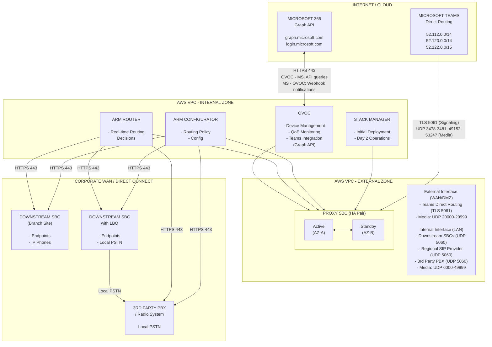
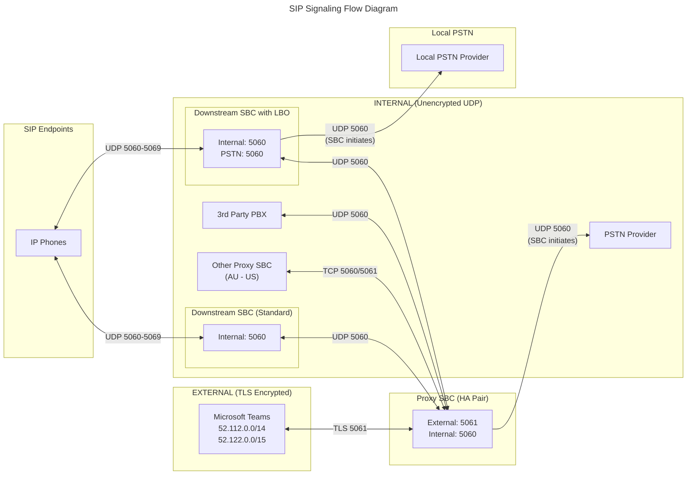
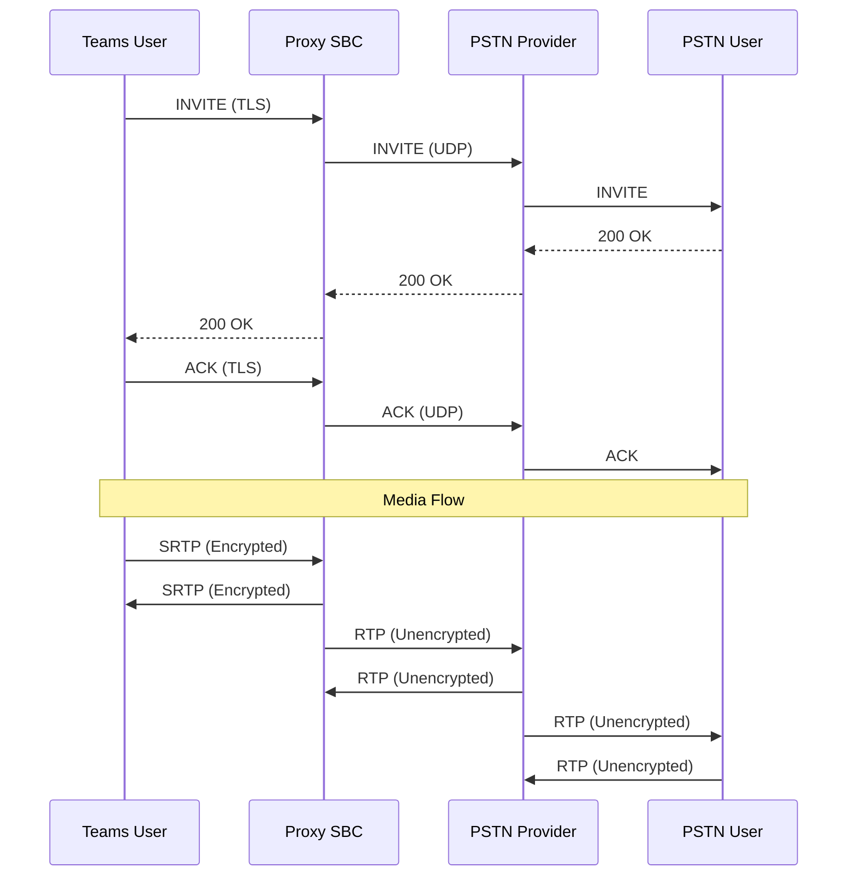
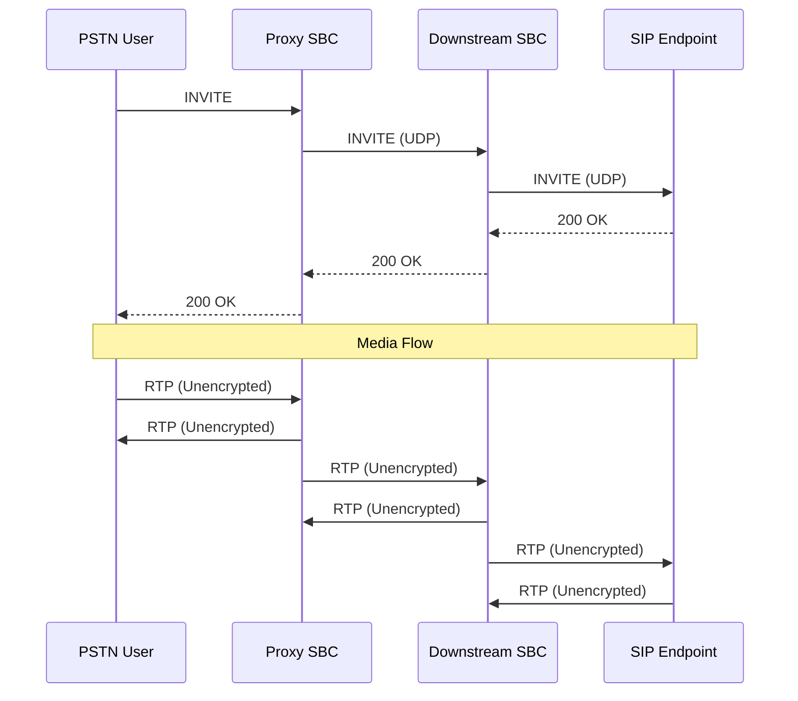

# Mermaid Diagram Review

## Summary

**Total mermaid diagrams found in main document:** 26
**Total mermaid diagrams in /home/kevin/public/diagrams/:** 2
**Grand total:** 28

**Diagrams with issues:** 4
**Diagrams without issues:** 24

---

## Issues Found

### Issue 1: D.1 High-Level Architecture Overview - Incorrect connection direction (ProxySBC --> management components)

- **File:** `/home/kevin/public/AudioCodes-AWS-Deployment-Guide.md`
- **Lines:** 3316-3319
- **Diagram:** D.1 High-Level Architecture Overview (starts line 3284)
- **Problem:** The arrows `ProxySBC --> StackMgr`, `ProxySBC --> ARMConfig`, `ProxySBC --> ARMRouter`, and `ProxySBC --> OVOC` imply that the Proxy SBC initiates connections to these management components. In reality, these management components connect TO the SBC (OVOC manages SBCs, ARM pushes config to SBCs, Stack Manager deploys/manages SBCs). The arrow directions are reversed. Additionally, the Stack Manager label says "HA Failover / Route Table Updates" which contradicts the document's own critical finding that the Stack Manager does NOT participate in active HA failover (Section 2 clearly states "The Stack Manager does not participate in active HA switchover").
- **Fix:**



---

### Issue 2: D.2 SIP Signaling Flows - Duplicate subgraph name collision and orphaned nodes

- **File:** `/home/kevin/public/AudioCodes-AWS-Deployment-Guide.md`
- **Lines:** 3335-3387
- **Diagram:** D.2 SIP Signaling Flow Diagram (starts line 3335)
- **Problem:** There are multiple issues with this diagram:
  1. The subgraph `downstream` at line 3366 has the label `"Downstream SBC"` which is the same text as the node `DownstreamSBC` at line 3345. While the node IDs differ, having a subgraph with the same display label as an earlier node is confusing.
  2. `ProxySBC2` (line 3374) and `ProxySBC3` (line 3385) are standalone nodes defined with label `"Proxy SBC"` that are disconnected from the main `ProxySBC` node defined at line 3352. These create redundant "Proxy SBC" boxes in the rendered diagram that are not inside the `proxy` subgraph. This makes the diagram render with three separate "Proxy SBC" elements, which is misleading -- there is only one Proxy SBC (HA pair).
  3. The `downstream` subgraph (line 3366), `endpoints` subgraph (line 3370), `downstreamLBO` subgraph (line 3377), and `localPSTN` subgraph (line 3381) are all disconnected fragments floating separately from the main diagram flow. They appear to be showing downstream detail views but are not connected to the main proxy subgraph in a coherent way.
- **Fix:** Consolidate into a single coherent diagram. Either remove the disconnected fragments or properly connect them to the main flow using the same `ProxySBC` node:



---

### Issue 3: Non-Production Architecture - Incorrect Stack Manager label

- **File:** `/home/kevin/public/AudioCodes-AWS-Deployment-Guide.md`
- **Lines:** 170-196 (specifically line 179)
- **Diagram:** Non-Production Environment architecture (starts line 170)
- **Problem:** The Stack Manager node label says `"Manages HA failover"` but the document repeatedly states (Section 2, Section 4, Section 19) that the Stack Manager does NOT participate in active HA failover. The SBCs handle failover directly. The label should reflect the Stack Manager's actual role: initial deployment and Day 2 operations.
- **Fix:** Change line 179 from:
  ```
  SM_NP["Stack Manager<br/>(t3.medium)<br/>Manages HA failover"]
  ```
  to:
  ```
  SM_NP["Stack Manager<br/>(t3.medium)<br/>HA Deployment & Day 2 Ops"]
  ```

The same issue exists in the Production diagram at line 215:
```
SM_AUS["Stack Manager<br/>(t3.medium)<br/>Manages HA failover"]
```
should be:
```
SM_AUS["Stack Manager<br/>(t3.medium)<br/>HA Deployment & Day 2 Ops"]
```

---

### Issue 4: D.5 Call Flow Example 1 - Incomplete sequence (missing ACK from PSTN leg)

- **File:** `/home/kevin/public/AudioCodes-AWS-Deployment-Guide.md`
- **Lines:** 3570-3591
- **Diagram:** D.5 Example 1: Teams User to PSTN (starts line 3570)
- **Problem:** The sequence diagram shows the PSTN User (PU) receiving an INVITE from PP and returning 200 OK, but the media flow section uses `<-->` syntax which is not valid in Mermaid sequence diagrams. Mermaid sequence diagrams do not support the `<-->` bidirectional arrow syntax for messages. The valid syntaxes are `->`, `-->`, `->>`, `-->>`, `-x`, `--x`, `-)`, and `--)`. The lines `TU<-->PS: SRTP (Encrypted)`, `PS<-->PP: RTP (Unencrypted)`, and `PP<-->PU: RTP (Unencrypted)` will fail to render or produce unexpected results. The same issue exists in Example 2 (lines 3595-3613) with `PU<-->PS`, `PS<-->DS`, and `DS<-->SE`.
- **Fix for Example 1:**



**Fix for Example 2:**



---

## Diagrams Without Issues

The following 24 diagrams have valid mermaid syntax and accurately represent the surrounding text:

1. **Line 97 - Failover Mechanism** (flowchart TB): HA failover architecture showing SBCs calling AWS API. Syntax valid, content matches Section 2.
2. **Line 206 - Production Environment** (flowchart TB): Production AU+US architecture. Syntax valid, accurate VM counts. (Note: Stack Manager label has same minor issue as Issue 3 above but is listed there.)
3. **Line 405 - Subnet Design** (flowchart TB): VPC subnet layout with AZs. Syntax valid, matches Section 5 text.
4. **Line 992 - Authentication Architecture** (flowchart TB): Split identity model for SBC management. Syntax valid, matches Section 10.4 description.
5. **Line 2276 - 8-Phase Deployment Sequence** (flowchart TB): Deployment phases 1-8. Syntax valid, comprehensive and logically ordered.
6. **Line 2458 - SBC Outbound Registration** (flowchart LR): SBC registration to SIP provider. Syntax valid with frontmatter title, content accurate.
7. **Line 2478 - VIP Failover Mechanism** (flowchart TB): VIP and route table failover. Syntax valid with frontmatter title, content accurate.
8. **Line 2542 - HA Connectivity Architecture** (flowchart TB): External vs internal connectivity. Syntax valid with frontmatter title, comprehensive and accurate.
9. **Line 2646 - Voice Recording Option 1** (flowchart LR): RTP internal with port mirroring. Syntax valid, content matches Section 19 text.
10. **Line 2693 - Voice Recording Option 2** (flowchart LR): SIPREC recording with full SRTP. Syntax valid, content matches description.
11. **Line 3393 - D.3 Media Flows** (flowchart TB): RTP/SRTP flow diagram. Syntax valid, port ranges and encryption types accurate.
12. **Line 3480 - D.4 Management & Monitoring** (flowchart TB): Management flows. Syntax valid, port numbers and protocols correct.
13. **Line 3663 - D.8.1 Proxy SBC Interface Architecture** (flowchart TB): Complete interface mapping. Syntax valid, comprehensive and matches Section 11 configuration.
14. **Line 3753 - D.8.2 Downstream SBC Interface Architecture** (flowchart TB): On-prem Mediant 800 interfaces. Syntax valid, init directive correct.
15. **Line 3822 - D.8.3 Downstream SBC with LBO** (flowchart TB): LBO interface architecture. Syntax valid, init directive correct.
16. **Line 3890 - D.8.4 OVOC Interface Architecture** (flowchart TB): OVOC services and ports. Syntax valid, comprehensive.
17. **Line 3949 - D.8.5 ARM Configurator Interface** (flowchart TB): ARM Configurator services. Syntax valid with frontmatter title.
18. **Line 4006 - D.8.5 ARM Router Interface** (flowchart TB): ARM Router services. Syntax valid with frontmatter title.
19. **Line 4061 - D.8.6 Stack Manager Interface** (flowchart TB): Stack Manager services and IAM role. Syntax valid, content correctly notes Stack Manager does not participate in HA failover.
20. **Line 4113 - D.8.7 Layman-Friendly Gateway View** (flowchart LR): SBC as gateway device. Syntax valid with init directive, content educational and accurate.
21. **Line 4221 - D.8.7 Technical AWS View** (flowchart TB): AWS subnets and HA mechanism. Syntax valid with init directive, content accurate.
22. **diagrams/d8-7-complete-solution.mmd**: Complete end-to-end connectivity map. Syntax valid with init theme config, comprehensive node definitions, class assignments, and connections. Content accurate.
23. **diagrams/d8-7-simplified.mmd**: Simplified architecture overview. Syntax valid with init directive, clean and readable. Content accurate.
24. **Line 170 - Non-Production Environment** (flowchart TB): Non-prod architecture. Syntax valid. (Label issue covered in Issue 3.)
