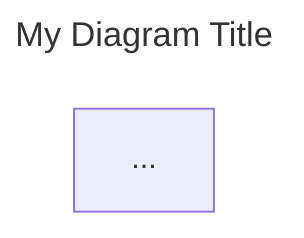
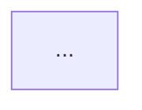

# Mermaid Diagram GitHub Rendering Issue Report

**File:** `/home/kevin/public/AudioCodes-AWS-Deployment-Guide.md`
**Date:** 2026-02-10
**Total mermaid blocks found:** 26

---

## Summary of Issues Found

| Issue Type | Occurrences | Severity |
|------------|-------------|----------|
| `<-->` bidirectional arrows | 18 diagrams (35+ instances) | **CRITICAL** - Primary cause of GitHub render failure |
| `---` / `title:` frontmatter blocks | 6 diagrams | **CRITICAL** - Known GitHub mermaid renderer failure |
| `%%{init:` directives | 4 diagrams | **MODERATE** - Generally supported but can fail |
| `<b>`, `<i>` HTML tags in labels | 3 diagrams | **MODERATE** - May not render on GitHub |
| Emoji characters in labels | 2 diagrams | **LOW** - Usually works but can cause encoding issues |
| `<-.->` bidirectional dotted arrows | 1 diagram | **CRITICAL** - Same class of issue as `<-->` |
| Diagram complexity / size | 3 diagrams | **MODERATE** - May exceed GitHub render limits |
| Unicode special characters (arrows, lines) | 1 diagram | **LOW** - May cause rendering issues |
| Unquoted label with special chars | 1 diagram | **MODERATE** - Can confuse parser |

---

## Diagram-by-Diagram Analysis

---

### Diagram 1: HA Failover Mechanism
- **Line:** 97
- **Section:** "How the Failover Mechanism Works" (Section 3 area)
- **Type:** `flowchart TB`
- **Lines:** 97-135 (39 lines)

**Issues Found:**
1. **CRITICAL - `<-->` arrow (line 108):** `SBC_Active <-->|"HA Subnet"| SBC_Standby` - Bidirectional arrow not supported by GitHub's Mermaid renderer (requires Mermaid v10+, GitHub uses v9.x). This will cause the entire diagram to fail to render.
2. **MODERATE - `<b>` HTML tags (lines 101, 105):** `SBC_Active["<b>Mediant VE SBC (Active)</b><br/>..."]` - HTML bold tags inside node labels may not be processed correctly by GitHub's renderer.
3. **LOW - Unicode arrows in labels (lines 115-117):** Uses `→` and `↓` characters inside quoted labels - generally safe since they are in quoted strings.

**Frontmatter `---` block:** No
**`<-->` arrows:** Yes (line 108)
**`%%{init:` directives:** No

---

### Diagram 2: Non-Production Environment Architecture (RECENTLY EDITED)
- **Line:** 170
- **Section:** "Non-Production Environment (Australia Region Only)" (Section 3)
- **Type:** `flowchart TB`
- **Lines:** 170-196 (27 lines)

**Issues Found:**
1. **CRITICAL - `<-->` arrow (line 177):** `SBC1_NP <--> SBC2_NP` - Bidirectional arrow will cause render failure on GitHub.

**Frontmatter `---` block:** No
**`<-->` arrows:** Yes (line 177)
**`%%{init:` directives:** No

---

### Diagram 3: Production Environment Architecture (RECENTLY EDITED)
- **Line:** 206
- **Section:** "Production Environment" (Section 3)
- **Type:** `flowchart TB`
- **Lines:** 206-249 (44 lines)

**Issues Found:**
1. **CRITICAL - `<-->` arrows (lines 213, 226):** `SBC1_AUS <--> SBC2_AUS` and `SBC1_US <--> SBC2_US` - Two bidirectional arrows will cause render failure.

**Frontmatter `---` block:** No
**`<-->` arrows:** Yes (lines 213, 226)
**`%%{init:` directives:** No

---

### Diagram 4: Subnet Design
- **Line:** 408
- **Section:** "Subnet Design" (Section 5)
- **Type:** `flowchart TB`
- **Lines:** 408-448 (41 lines)

**Issues Found:**
- No critical issues detected. This diagram uses only standard `-->` and `-.->` arrows with quoted labels.

**Frontmatter `---` block:** No
**`<-->` arrows:** No
**`%%{init:` directives:** No

---

### Diagram 5: Authentication Architecture Overview
- **Line:** 995
- **Section:** "Authentication Architecture Overview" (Section 8)
- **Type:** `flowchart TB`
- **Lines:** 995-1021 (27 lines)

**Issues Found:**
1. **CRITICAL - `<-->` arrows (lines 1003, 1012, 1015):** Three bidirectional arrows: `proxy <-->|"OAuth"| entra`, `downstream <-->|"LDAPS"| ad`, `proxy <-->|"Direct Connect"| downstream`. All will cause render failure.
2. **MODERATE - `style` inside subgraph (lines 998, 1007):** The `style cloud` and `style onprem` declarations appear inside their respective subgraph blocks. While usually valid, some renderers can be picky about this placement.

**Frontmatter `---` block:** No
**`<-->` arrows:** Yes (lines 1003, 1012, 1015)
**`%%{init:` directives:** No

---

### Diagram 6: 8-Phase Deployment Sequence
- **Line:** 2282
- **Section:** "8-Phase Deployment Sequence" (Section 18)
- **Type:** `flowchart TB`
- **Lines:** 2282-2373 (92 lines)

**Issues Found:**
1. **MODERATE - Diagram size/complexity:** 48 nodes across 8 subgraphs plus phase connections. This is a large diagram that may approach GitHub's rendering size limits. If it doesn't fail outright, it may render very slowly or with truncation.
2. **MODERATE - `style` inside subgraph blocks (lines 2285, 2295, etc.):** Style declarations are placed as the first line inside each subgraph block (e.g., `style Phase1 fill:#e3f2fd,stroke:#1976d2` immediately after `subgraph Phase1[...]`). This pattern works but is unusual.

**Frontmatter `---` block:** No
**`<-->` arrows:** No
**`%%{init:` directives:** No

---

### Diagram 7: SBC Outbound Registration
- **Line:** 2464
- **Section:** "SBC HA Architecture" (Section 19)
- **Type:** `flowchart LR`
- **Lines:** 2464-2480 (17 lines)

**Issues Found:**
1. **CRITICAL - `---` frontmatter/title block (lines 2465-2467):**
   ```
   ---
   title: SBC Outbound Registration (AU/US Regions)
   ---
   ```
   This YAML frontmatter block inside a mermaid code fence is a known cause of GitHub rendering failures. GitHub's renderer can interpret `---` as a thematic break or frontmatter delimiter rather than as a Mermaid title directive.

**Frontmatter `---` block:** YES (lines 2465-2467)
**`<-->` arrows:** No
**`%%{init:` directives:** No

---

### Diagram 8: VIP and VPC Route Table Failover Mechanism
- **Line:** 2484
- **Section:** "How the VIP Works" (Section 19)
- **Type:** `flowchart TB`
- **Lines:** 2484-2503 (20 lines)

**Issues Found:**
1. **CRITICAL - `---` frontmatter/title block (lines 2485-2487):**
   ```
   ---
   title: VIP and VPC Route Table Failover Mechanism
   ---
   ```
   Same frontmatter issue as Diagram 7.

**Frontmatter `---` block:** YES (lines 2485-2487)
**`<-->` arrows:** No
**`%%{init:` directives:** No

---

### Diagram 9: HA Connectivity Architecture
- **Line:** 2548
- **Section:** "HA Connectivity Architecture Diagram" (Section 19)
- **Type:** `flowchart TB`
- **Lines:** 2548-2599 (52 lines)

**Issues Found:**
1. **CRITICAL - `---` frontmatter/title block (lines 2549-2551):**
   ```
   ---
   title: HA Connectivity Architecture - External vs Internal
   ---
   ```
   Same frontmatter issue.
2. **CRITICAL - `<-->` arrow (line 2570):** `SBC1 <-->|"HA Link<br/>Heartbeat"| SBC2`

**Frontmatter `---` block:** YES (lines 2549-2551)
**`<-->` arrows:** Yes (line 2570)
**`%%{init:` directives:** No

---

### Diagram 10: Voice Recording Option 1 (RTP/Unencrypted)
- **Line:** 2652
- **Section:** "Option 1: Keep Internal Media as RTP" (Section 13 area)
- **Type:** `flowchart LR`
- **Lines:** 2652-2685 (34 lines)

**Issues Found:**
1. **CRITICAL - `<-->` arrows (lines 2671-2673):** Three bidirectional arrows: `Teams <-->|"SRTP"| ProxySBC`, `ProxySBC <-->|"RTP"| DownstreamSBC`, `DownstreamSBC <-->|"RTP"| IPPhones`.

**Frontmatter `---` block:** No
**`<-->` arrows:** Yes (lines 2671-2673)
**`%%{init:` directives:** No

---

### Diagram 11: Voice Recording Option 2 (SIPREC)
- **Line:** 2699
- **Section:** "Option 2: SBC-Based Recording via SIPREC" (Section 13 area)
- **Type:** `flowchart LR`
- **Lines:** 2699-2726 (28 lines)

**Issues Found:**
1. **CRITICAL - `<-->` arrows (lines 2714-2716):** Three bidirectional arrows: `Teams <-->|"SRTP"| ProxySBC`, `ProxySBC <-->|"SRTP"| DownstreamSBC`, `DownstreamSBC <-->|"SRTP"| IPPhones`.

**Frontmatter `---` block:** No
**`<-->` arrows:** Yes (lines 2714-2716)
**`%%{init:` directives:** No

---

### Diagram 12: D.1 High-Level Architecture Overview (RECENTLY EDITED)
- **Line:** 3290
- **Section:** "D.1 High-Level Architecture Overview" (Appendix D)
- **Type:** `flowchart TB`
- **Lines:** 3290-3338 (49 lines)

**Issues Found:**
1. **CRITICAL - `<-->` arrows (lines 3301, 3321, 3328):**
   - `Active <--> Standby` (line 3301)
   - `M365 <-->|"HTTPS 443<br/>OVOC - MS: API queries<br/>MS - OVOC: Webhook notifications"| OVOC` (line 3321)
   - `ProxySBC <-->|"UDP 5060 (Signalling)<br/>UDP 40000-49999 (Media)"| SIPProvider` (line 3328)
2. **MODERATE - Very long label text (line 3303):** `ProxySBCInfo` node has an extremely long label with multiple `<br/>` tags spanning many lines of text. This can cause layout issues.
3. **MODERATE - Complexity:** 14 nodes with many cross-connections between subgroups.

**Frontmatter `---` block:** No
**`<-->` arrows:** Yes (lines 3301, 3321, 3328)
**`%%{init:` directives:** No

---

### Diagram 13: D.2 SIP Signalling Flows (RECENTLY EDITED)
- **Line:** 3344
- **Section:** "D.2 SIP Signalling Flows" (Appendix D)
- **Type:** `flowchart LR`
- **Lines:** 3344-3397 (54 lines)

**Issues Found:**
1. **CRITICAL - `---` frontmatter/title block (lines 3345-3347):**
   ```
   ---
   title: SIP Signaling Flow Diagram
   ---
   ```
2. **CRITICAL - `<-->` arrows (lines 3380, 3383-3386, 3392-3393):** Seven bidirectional arrows throughout the diagram.

**Frontmatter `---` block:** YES (lines 3345-3347)
**`<-->` arrows:** Yes (7 instances, lines 3380, 3383-3386, 3392-3393)
**`%%{init:` directives:** No

---

### Diagram 14: D.3 Media (RTP/SRTP) Flows
- **Line:** 3403
- **Section:** "D.3 Media (RTP/SRTP) Flows" (Appendix D)
- **Type:** `flowchart TB`
- **Lines:** 3403-3484 (82 lines)

**Issues Found:**
1. **CRITICAL - `<-->` arrows (lines 3455-3456):** `M365 <-->|"SRTP"| TEAMS` and `M365 <-->|"SRTP"| TEAMS_LMO`.
2. **MODERATE - Diagram complexity:** 19 nodes across 6 subgraphs with many connections. Large diagram that may be slow to render.

**Frontmatter `---` block:** No
**`<-->` arrows:** Yes (lines 3455-3456)
**`%%{init:` directives:** No

---

### Diagram 15: D.4 Management & Monitoring Flows
- **Line:** 3490
- **Section:** "D.4 Management & Monitoring Flows" (Appendix D)
- **Type:** `flowchart TB`
- **Lines:** 3490-3570 (81 lines)

**Issues Found:**
1. **CRITICAL - `<-->` arrows (lines 3537, 3546, 3547):** `OVOC <-->|"Device Mgmt<br/>TCP 443"| SBCs`, `ARMConfig <-->|"HTTPS<br/>TCP 443"| SBCs`, `ARMRouter <-->|"HTTPS<br/>TCP 443"| SBCs`.
2. **MODERATE - Empty subgraph label (line 3492):** `subgraph title[" "]` uses a space as a label, which is a workaround but can behave unexpectedly.
3. **MODERATE - Node ID `title` (line 3492):** The subgraph ID `title` could potentially conflict with reserved words or metadata in some renderers.

**Frontmatter `---` block:** No
**`<-->` arrows:** Yes (lines 3537, 3546, 3547)
**`%%{init:` directives:** No

---

### Diagram 16: D.5 Example 1 - Teams User to PSTN (RECENTLY EDITED)
- **Line:** 3580
- **Section:** "D.5 Call Flow Examples - Example 1" (Appendix D)
- **Type:** `sequenceDiagram`
- **Lines:** 3580-3604 (25 lines)

**Issues Found:**
- No critical issues detected. Sequence diagrams use `->>` and `-->>` arrows which are well-supported. No frontmatter, no bidirectional arrows, no init directives.

**Frontmatter `---` block:** No
**`<-->` arrows:** No (sequence diagrams use different arrow syntax)
**`%%{init:` directives:** No

---

### Diagram 17: D.5 Example 2 - PSTN to Downstream SBC (RECENTLY EDITED)
- **Line:** 3608
- **Section:** "D.5 Call Flow Examples - Example 2" (Appendix D)
- **Type:** `sequenceDiagram`
- **Lines:** 3608-3629 (22 lines)

**Issues Found:**
- No critical issues detected. Clean sequence diagram with standard syntax.

**Frontmatter `---` block:** No
**`<-->` arrows:** No
**`%%{init:` directives:** No

---

### Diagram 18: D.8.1 Proxy SBC - Complete Interface Architecture
- **Line:** 3679
- **Section:** "D.8.1 Proxy SBC (AWS) - Complete Interface Architecture" (Appendix D)
- **Type:** `flowchart TB`
- **Lines:** 3679-3765 (87 lines)

**Issues Found:**
1. **MODERATE - Diagram complexity/size:** 87 lines with approximately 35+ nodes across 7 nested subgraphs plus extensive relationship mappings. This is one of the largest diagrams in the document and may exceed GitHub's rendering size limits or timeout.
2. **MODERATE - Very long node labels:** Several nodes have extremely long text labels with multiple `<br/>` separators (e.g., lines 3720-3723 media realm definitions).

**Frontmatter `---` block:** No
**`<-->` arrows:** No
**`%%{init:` directives:** No

---

### Diagram 19: D.8.2 Downstream SBC - Complete Interface Architecture
- **Line:** 3769
- **Section:** "D.8.2 Downstream SBC (On-Premises Mediant 800)" (Appendix D)
- **Type:** `flowchart TB`
- **Lines:** 3769-3834 (66 lines)

**Issues Found:**
1. **MODERATE - `%%{init:` directive (line 3770):** `%%{init: {'theme': 'default'}}%%` - This is a basic theme directive and is generally supported by GitHub, but it adds a dependency on the renderer correctly parsing init blocks.
2. **MODERATE - `<b>` and HTML tags in labels:** Extensive use of `<b>` bold tags in node labels throughout (lines 3779-3805). GitHub's Mermaid renderer may strip or mishandle these.
3. **MODERATE - `<i>` tag (line 3849 - actually in D.8.3):** Present in related diagram.

**Frontmatter `---` block:** No
**`<-->` arrows:** No
**`%%{init:` directives:** YES (line 3770) - `{'theme': 'default'}`

---

### Diagram 20: D.8.3 Downstream SBC with LBO - Complete Interface Architecture
- **Line:** 3838
- **Section:** "D.8.3 Downstream SBC with Local Breakout (LBO)" (Appendix D)
- **Type:** `flowchart TB`
- **Lines:** 3838-3902 (65 lines)

**Issues Found:**
1. **MODERATE - `%%{init:` directive (line 3839):** `%%{init: {'theme': 'default'}}%%`
2. **MODERATE - `<b>` and `<i>` HTML tags in labels:** Extensive use of `<b>` tags, plus `<i>` tag on line 3849: `<i>(Also used for PSTN LBO)</i>`.
3. **MODERATE - Parentheses in labels:** `PSTN (Telco)` appears in node labels (line 3870). While quoted, nested parentheses can sometimes confuse the parser.

**Frontmatter `---` block:** No
**`<-->` arrows:** No
**`%%{init:` directives:** YES (line 3839) - `{'theme': 'default'}`

---

### Diagram 21: D.8.4 OVOC - Interface Architecture
- **Line:** 3906
- **Section:** "D.8.4 OVOC - Interface Architecture" (Appendix D)
- **Type:** `flowchart TB`
- **Lines:** 3906-3961 (56 lines)

**Issues Found:**
1. **CRITICAL - `<-->` arrow (line 3953):** `Microsoft365(("Microsoft 365")) <-->|TCP 443| GraphIntegration`
2. **MODERATE - Unquoted label with special characters (line 3953):** The edge label `TCP 443` is not quoted (uses `|TCP 443|` instead of `|"TCP 443"|`). While often works, unquoted labels with spaces and numbers can be fragile.
3. **MODERATE - Circle node shapes with parentheses in names (lines 3950-3960):** Uses `(("..."))` double-parenthesis syntax for circle nodes, which is valid but less commonly tested on GitHub.
4. **MODERATE - Diagram complexity:** Deeply nested subgraphs (4 levels: OVOC > GraphIntegration > GraphOut/GraphIn).

**Frontmatter `---` block:** No
**`<-->` arrows:** Yes (line 3953)
**`%%{init:` directives:** No

---

### Diagram 22: D.8.5 ARM Configurator - Interface Architecture (RECENTLY EDITED)
- **Line:** 3965
- **Section:** "D.8.5 ARM (AudioCodes Routing Manager) - Interface Architecture" (Appendix D)
- **Type:** `flowchart TB`
- **Lines:** 3965-4018 (54 lines)

**Issues Found:**
1. **CRITICAL - `---` frontmatter/title block (lines 3966-3968):**
   ```
   ---
   title: ARM Configurator - Interface Architecture (AWS Instance: m4.xlarge)
   ---
   ```
   This is a known cause of GitHub rendering failures. The `---` delimiters can be misinterpreted.
2. **MODERATE - Stadium-shaped nodes `([...])` (lines 3994-4004):** Uses `(["Admin Users"])` syntax for stadium/pill-shaped nodes. This is valid Mermaid syntax but less commonly tested on GitHub.

**Frontmatter `---` block:** YES (lines 3966-3968)
**`<-->` arrows:** No
**`%%{init:` directives:** No

---

### Diagram 23: D.8.5 ARM Router - Interface Architecture (RECENTLY EDITED)
- **Line:** 4020
- **Section:** "D.8.5 ARM (AudioCodes Routing Manager) - Interface Architecture" (Appendix D, second diagram)
- **Type:** `flowchart TB`
- **Lines:** 4020-4069 (50 lines)

**Issues Found:**
1. **CRITICAL - `---` frontmatter/title block (lines 4021-4023):**
   ```
   ---
   title: ARM Router - Interface Architecture (AWS Instance: m4.large, One per Region)
   ---
   ```
2. **MODERATE - Stadium-shaped nodes `([...])` (lines 4047-4055):** Same as Diagram 22.

**Frontmatter `---` block:** YES (lines 4021-4023)
**`<-->` arrows:** No
**`%%{init:` directives:** No

---

### Diagram 24: D.8.6 Stack Manager - Interface Architecture
- **Line:** 4073
- **Section:** "D.8.6 Stack Manager - Interface Architecture" (Appendix D)
- **Type:** `flowchart TB`
- **Lines:** 4073-4117 (45 lines)

**Issues Found:**
- No critical issues detected. Uses standard arrows (`-->`, `-.->`) with quoted labels. No frontmatter, no bidirectional arrows, no init directives.
- **LOW - `stroke-dasharray` style (line 4116):** `style NOTE fill:#ffebee,stroke:#c62828,stroke-dasharray: 5 5` - This is valid SVG/Mermaid syntax but `stroke-dasharray` is less commonly tested on GitHub.

**Frontmatter `---` block:** No
**`<-->` arrows:** No
**`%%{init:` directives:** No

---

### Diagram 25: D.8.7 Complete Solution - Layman-Friendly View
- **Line:** 4125
- **Section:** "D.8.7 Complete Solution - End-to-End Connectivity Map" (Appendix D)
- **Type:** `flowchart LR`
- **Lines:** 4125-4210 (86 lines)

**Issues Found:**
1. **MODERATE - `%%{init:` directive (line 4126):** `%%{init: {'theme': 'default'}}%%`
2. **CRITICAL - `<-->` arrows (lines 4179, 4187):** `Teams <-->|"TLS 5061<br/>Bidirectional"| WAN` and `LAN <-->|"Voice<br/>Traffic"| Downstream`.
3. **CRITICAL - `<-.->` bidirectional dotted arrow (line 4191):** `HA <-.->|"Keep in Sync"| Backup` - This is the same class of issue as `<-->` (requires Mermaid v10+).
4. **LOW - Emoji characters in labels (lines 4132, 4139, 4143, 4152, 4156, 4160, 4165, 4170):** Uses cloud emoji, colored circle emojis, building emoji, and diamond emoji in subgraph and node labels. These generally render but can cause encoding issues.
5. **LOW - Unicode box-drawing characters (lines 4143, 4152):** Uses `─────────────` (unicode em-dash lines) in node labels for visual separation.

**Frontmatter `---` block:** No
**`<-->` arrows:** Yes (lines 4179, 4187)
**`<-.->` arrows:** Yes (line 4191)
**`%%{init:` directives:** YES (line 4126) - `{'theme': 'default'}`

---

### Diagram 26: D.8.7 Complete Solution - Technical View
- **Line:** 4233
- **Section:** "D.8.7 Complete Solution - Detailed Technical View" (Appendix D)
- **Type:** `flowchart TB`
- **Lines:** 4233-4353 (121 lines)

**Issues Found:**
1. **MODERATE - `%%{init:` directive (line 4234):** `%%{init: {'theme': 'default'}}%%`
2. **CRITICAL - `<-->` arrows (lines 4301, 4307, 4320, 4324):** Four bidirectional arrows:
   - `Teams <-->|"TLS 5061<br/>Bidirectional"| EIP`
   - `M365 <-->|"HTTPS"| OVOC`
   - `LANgw <--> DS`
   - `A_HA <-->|"Heartbeat<br/>State Sync"| S_HA`
3. **LOW - Emoji characters in labels (lines 4239, 4247, 4258, 4265, 4293):** Same emoji usage as Diagram 25.
4. **MODERATE - Diagram complexity/size:** 121 lines, the largest diagram in the document. Contains 25+ nodes, 7 subgraphs, and many cross-connections. High risk of exceeding GitHub's render timeout.
5. **MODERATE - `---` linkStyle shorthand (line 4312):** `EIP --- A_WAN` uses triple-dash link which could potentially be misinterpreted, though this is inside the diagram body (not at the start) so it is less likely to cause issues.

**Frontmatter `---` block:** No
**`<-->` arrows:** Yes (lines 4301, 4307, 4320, 4324)
**`%%{init:` directives:** YES (line 4234) - `{'theme': 'default'}`

---

## Focus Area: Recently Edited Diagrams

### D.1 High-Level Architecture Overview (Diagram 12, line 3290)
- **Status: WILL FAIL** - Contains 3 `<-->` bidirectional arrows (lines 3301, 3321, 3328)
- **Fix:** Replace `<-->` with two separate arrows (e.g., `A --> B` and `B --> A`) or use `A --- B` for undirected connections

### D.2 SIP Signalling Flows (Diagram 13, line 3344)
- **Status: WILL FAIL** - Contains `---`/`title:` frontmatter block (lines 3345-3347) AND 7 `<-->` arrows
- **Fix:** Remove the `---`/`title:` block (use a comment or subgraph title instead), replace all `<-->` arrows

### D.5 Call Flow Examples (Diagrams 16-17, lines 3580 and 3608)
- **Status: OK** - Both sequence diagrams use standard syntax with no known issues

### D.8.5 ARM Interface Architecture (Diagrams 22-23, lines 3965 and 4020)
- **Status: WILL FAIL** - Both diagrams contain `---`/`title:` frontmatter blocks (lines 3966-3968 and 4021-4023)
- **Fix:** Remove the `---`/`title:` blocks

### Non-Prod Architecture (Diagram 2, line 170)
- **Status: WILL FAIL** - Contains `<-->` arrow (line 177)
- **Fix:** Replace `SBC1_NP <--> SBC2_NP` with two directed arrows or a plain link

### Prod Architecture (Diagram 3, line 206)
- **Status: WILL FAIL** - Contains 2 `<-->` arrows (lines 213, 226)
- **Fix:** Replace both bidirectional arrows

---

## Complete Issue Index by Line Number

| Line | Diagram | Issue | Severity |
|------|---------|-------|----------|
| 108 | Diagram 1 (HA Failover) | `<-->` arrow | CRITICAL |
| 101, 105 | Diagram 1 (HA Failover) | `<b>` HTML tags | MODERATE |
| 177 | Diagram 2 (Non-Prod Arch) | `<-->` arrow | CRITICAL |
| 213, 226 | Diagram 3 (Prod Arch) | `<-->` arrows (x2) | CRITICAL |
| 1003, 1012, 1015 | Diagram 5 (Auth Arch) | `<-->` arrows (x3) | CRITICAL |
| 2465-2467 | Diagram 7 (SBC Registration) | `---`/`title:` frontmatter | CRITICAL |
| 2485-2487 | Diagram 8 (VIP Failover) | `---`/`title:` frontmatter | CRITICAL |
| 2549-2551 | Diagram 9 (HA Connectivity) | `---`/`title:` frontmatter | CRITICAL |
| 2570 | Diagram 9 (HA Connectivity) | `<-->` arrow | CRITICAL |
| 2671-2673 | Diagram 10 (Recording Opt 1) | `<-->` arrows (x3) | CRITICAL |
| 2714-2716 | Diagram 11 (Recording Opt 2) | `<-->` arrows (x3) | CRITICAL |
| 3301, 3321, 3328 | Diagram 12 (D.1 Overview) | `<-->` arrows (x3) | CRITICAL |
| 3345-3347 | Diagram 13 (D.2 SIP Flows) | `---`/`title:` frontmatter | CRITICAL |
| 3380, 3383-3386, 3392-3393 | Diagram 13 (D.2 SIP Flows) | `<-->` arrows (x7) | CRITICAL |
| 3455-3456 | Diagram 14 (D.3 Media) | `<-->` arrows (x2) | CRITICAL |
| 3537, 3546, 3547 | Diagram 15 (D.4 Mgmt) | `<-->` arrows (x3) | CRITICAL |
| 3770 | Diagram 19 (D.8.2) | `%%{init:` directive | MODERATE |
| 3779-3805 | Diagram 19 (D.8.2) | `<b>` HTML tags | MODERATE |
| 3839 | Diagram 20 (D.8.3) | `%%{init:` directive | MODERATE |
| 3848-3870 | Diagram 20 (D.8.3) | `<b>`/`<i>` HTML tags | MODERATE |
| 3953 | Diagram 21 (D.8.4 OVOC) | `<-->` arrow | CRITICAL |
| 3966-3968 | Diagram 22 (D.8.5 ARM Cfg) | `---`/`title:` frontmatter | CRITICAL |
| 4021-4023 | Diagram 23 (D.8.5 ARM Rtr) | `---`/`title:` frontmatter | CRITICAL |
| 4126 | Diagram 25 (D.8.7 Layman) | `%%{init:` directive | MODERATE |
| 4179, 4187 | Diagram 25 (D.8.7 Layman) | `<-->` arrows (x2) | CRITICAL |
| 4191 | Diagram 25 (D.8.7 Layman) | `<-.->` arrow | CRITICAL |
| 4234 | Diagram 26 (D.8.7 Technical) | `%%{init:` directive | MODERATE |
| 4301, 4307, 4320, 4324 | Diagram 26 (D.8.7 Technical) | `<-->` arrows (x4) | CRITICAL |

---

## Recommended Fixes

### 1. Replace `<-->` bidirectional arrows (CRITICAL - 18 diagrams affected)

GitHub's Mermaid renderer (based on Mermaid v9.x) does not support the `<-->` bidirectional arrow syntax which was introduced in Mermaid v10. Replace with two separate unidirectional arrows:

**Before:**
```
A <-->|"label"| B
```

**After (option A - two arrows):**
```
A -->|"label"| B
B -->|"label"| A
```

**After (option B - undirected link, if bidirectionality is implied):**
```
A ---|"label"| B
```

### 2. Remove `---`/`title:` frontmatter blocks (CRITICAL - 6 diagrams affected)

Remove the `---` delimited title blocks entirely. Use a Mermaid comment or a preceding markdown heading instead.

**Before:**


**After:**


### 3. Replace `<-.->` bidirectional dotted arrows (CRITICAL - 1 diagram affected)

Same root cause as `<-->`. Replace with two dotted arrows:

**Before:**
```
A <-.->|"label"| B
```

**After:**
```
A -.->|"label"| B
B -.->|"label"| A
```

### 4. Replace `<b>`/`<i>` HTML tags (MODERATE - 3 diagrams affected)

GitHub's Mermaid renderer may not support inline HTML in node labels. Use plain text or uppercase for emphasis:

**Before:**
```
GE1["<b>GE_1</b> -> Description"]
```

**After:**
```
GE1["GE_1 -> Description"]
```

### 5. Consider removing `%%{init:` directives (MODERATE - 4 diagrams affected)

The `%%{init: {'theme': 'default'}}%%` directive is generally safe but adds unnecessary complexity since `default` is already the default theme. Consider removing if diagrams still fail after other fixes.

---

## Diagrams That Should Render Successfully (No Critical Issues)

| Diagram | Line | Section |
|---------|------|---------|
| Diagram 4 | 408 | Subnet Design |
| Diagram 6 | 2282 | 8-Phase Deployment Sequence |
| Diagram 16 | 3580 | D.5 Example 1 (sequenceDiagram) |
| Diagram 17 | 3608 | D.5 Example 2 (sequenceDiagram) |
| Diagram 18 | 3679 | D.8.1 Proxy SBC |
| Diagram 24 | 4073 | D.8.6 Stack Manager |

**6 out of 26 diagrams** are expected to render without issues on GitHub.
**20 out of 26 diagrams** have at least one issue that could cause GitHub rendering failure.
